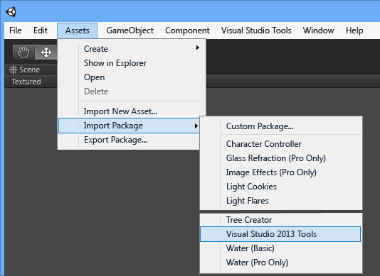
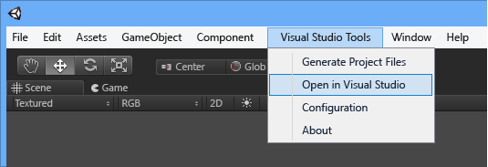

# Prise en main de Visual Studio Tools pour Unity
[!INCLUDE[vs2017banner](../code-quality/includes/vs2017banner.md)]

Dans cette section, vous allez apprendre à installer Visual Studio Tools pour Unity et à configurer votre projet Unity pour qu’il fonctionne avec Visual Studio.  
  
> [!IMPORTANT]
>  Unity 5.2 ajoute la prise en charge intégrée pour Visual Studio Tools pour Unity 2.1, ce qui simplifie la configuration de projet. Pour tirer parti de cette possibilité, vous avez besoin d’Unity version 5.2.0 ou ultérieure sur Windows et de Visual Studio Tools pour Unity version 2.1 ou ultérieure.  
  
## Conditions préalables  
 Pour utiliser Visual Studio Tools pour Unity, vous avez besoin des éléments suivants :  
  
-   Une version de **Visual Studio** qui prend en charge les extensions, telle que Visual Studio Community, Professional, Premium ou Enterprise. Vous pouvez télécharger gratuitement Visual Studio Community.  
  
     [Télécharger Visual Studio Community](http://www.visualstudio.com/downloads/download-visual-studio-vs)  
  
-   **Unity** version 4.0.0 ou ultérieure ; **Unity** version 5.2.0 ou ultérieure pour tirer parti de la prise en charge intégrée pour Visual Studio Tools pour Unity version 2.1 ou ultérieure.  
  
     [Télécharger Unity](https://unity3d.com/get-unity/download)  
  
## Installer Visual Studio Tools pour Unity  
 Téléchargez et installez Visual Studio Tools pour Unity à partir de la galerie Visual Studio. Vous devez installer le package approprié à votre version de Visual Studio. Assurez\-vous d’installer Visual Studio Tools pour Unity version 2.1 ou ultérieure pour tirer parti de la prise en charge intégrée pour VSTU dans Unity 5.2 ou ultérieure.  
  
-   Pour Visual Studio Community 2015, Visual Studio Professional 2015 ou Visual Studio Enterprise 2015 :  
  
     [Télécharger Visual Studio 2015 Tools pour Unity](https://visualstudiogallery.msdn.microsoft.com/8d26236e-4a64-4d64-8486-7df95156aba9)  
  
-   Pour Visual Studio Community 2013, Visual Studio Professional 2013 ou Visual Studio Premium 2013 :  
  
     [Télécharger Visual Studio 2013 Tools pour Unity](https://visualstudiogallery.msdn.microsoft.com/20b80b8c-659b-45ef-96c1-437828fe7cf2)  
  
-   Pour Visual Studio 2012 Professional ou Visual Studio 2012 Premium :  
  
     [Télécharger Visual Studio 2012 Tools pour Unity](https://visualstudiogallery.msdn.microsoft.com/7ab11d2a-f413-4ed6-b3de-ff1d05157714)  
  
-   Pour Visual Studio 2010 Professional ou Visual Studio 2010 Premium :  
  
     [Télécharger Visual Studio 2010 Tools pour Unity](https://visualstudiogallery.msdn.microsoft.com/6e536faa-ce73-494a-a746-6a14753015f1)  
  
> [!NOTE]
>  Les versions Express de Visual Studio ne prennent pas en charge les extensions telles que Visual Studio Tools pour Unity. Visual Studio Community est une version gratuite de Visual Studio qui prend en charge Visual Studio Tools pour Unity et d’autres extensions. Pour la plupart des utilisateurs, Visual Studio Community est un meilleur choix que la version Express.  
  
## Votre premier projet Unity avec Visual Studio Tools pour Unity  
 Maintenant que vous avez tout ce dont vous avez besoin, vous êtes prêt pour votre premier projet Unity avec Visual Studio. La configuration de votre projet Unity est différente selon les versions d’Unity et de Visual Studio Tools pour Unity installées. Suivez les étapes ci\-dessous pour la version d’Unity et de Visual Studio Tools pour Unity que vous avez installée.  
  
### Unity 5.2 et versions ultérieures \(nécessite VSTU 2.1 ou version ultérieure\)  
 Depuis Unity 5.2, vous ne devez plus importer le package Visual Studio Tools pour Unity dans vos projets. Si votre projet importe ce package, Unity 5.2 l’ignore et charge directement Visual Studio Tools pour Unity à partir de son emplacement d’installation.  
  
#### 1 \- Créer un projet Unity  
 Si vous êtes déjà familiarisé avec Unity, vous pouvez créer un projet ou charger l’un des vôtres. Si vous chargez un projet qui a importé le package Visual Studio Tools pour Unity pour utiliser Visual Studio Tools pour Unity avec une version précédente d’Unity, nous vous recommandons de le supprimer en supprimant le répertoire UnityVS.  
  
 Sinon, si vous débutez avec Unity, commencez avec un didacticiel de base. Visitez la page de découverte d’Unity pour rechercher des didacticiels sur les exemples de projets avec lesquels vous pouvez démarrer, ainsi que les leçons qui vous permettront d’apprendre à créer votre propre jeu avec Unity. La page de découverte d’Unity possède des didacticiels faciles à suivre pour plusieurs jeux différents.  
  
 [Didacticiels – page de découverte d’Unity](http://unity3d.com/learn/tutorials/modules)  
  
#### 2 \- Configurer l’éditeur Unity pour utiliser Visual Studio Tools pour Unity  
 Pour activer votre projet pour utiliser Visual Studio Tools pour Unity, définissez simplement Visual Studio comme éditeur de script externe. Dans l’éditeur Unity, dans le menu principal, sélectionnez **Modifier, Préférences** puis, dans la boîte de dialogue des **préférences Unity**, choisissez **Outils externes**. Ensuite, affectez à la propriété de l’**éditeur de script externe** la version de Visual Studio que vous souhaitez utiliser \(Visual Studio Tools pour Unity doit être installé pour cette version de Visual Studio\) et assurez\-vous que la propriété d’**attachement de l’éditeur** est définie.  
  
 Pour vérifier que la prise en charge intégrée pour Visual Studio Tools pour Unity est maintenant activée, consultez la boîte de dialogue **À propos d’Unity**. Dans l’éditeur Unity, dans le menu principal, sélectionnez **Aide, À propos d’Unity**. Si Visual Studio Tools pour Unity est installé et configuré correctement, vous verrez un message affiché dans le coin inférieur gauche de la boîte de dialogue **À propos d’Unity**.  
  
 Enfin, assurez\-vous que vous avez défini une cible de génération via la page **Paramètres de génération** et que **Débogage de script** est activé.  
  
   
  
#### 3 \- Lancer Visual Studio à partir de l’éditeur Unity  
 Depuis Unity 5.2, le menu de l’extension **Visual Studio Tools** n’est plus nécessaire pour lancer Visual Studio ni configurer Visual Studio Tools pour Unity. En revanche, une fois que Visual Studio est configuré comme éditeur de script externe, choisissez le fichier de script à partir de l’éditeur Unity et votre code sera ouvert dans Visual Studio.  
  
### Versions précédentes d’Unity \(avant 5.2\)  
 Avant Unity 5.2, il n’existait aucune prise en charge intégrée pour Visual Studio Tools pour Unity. Au lieu de cela, chaque projet devait importer le package Visual Studio Tools pour Unity et configurer d’autres paramètres de projet afin d’utiliser Visual Studio Tools pour Unity.  
  
#### 1 \- Créer un projet Unity  
 Si vous êtes déjà familiarisé avec Unity, vous pouvez créer un projet ou charger l’un des vôtres. Si vous démarrez un nouveau projet, importez le package Visual Studio Tools pour Unity lors de sa création.  
  
 Sinon, si vous débutez avec Unity, commencez avec un didacticiel de base. Visitez la page de découverte d’Unity pour rechercher des didacticiels sur les exemples de projets avec lesquels vous pouvez démarrer, ainsi que les leçons qui vous permettront d’apprendre à créer votre propre jeu avec Unity. La page de découverte d’Unity possède des didacticiels faciles à suivre pour plusieurs jeux différents.  
  
 [Didacticiels – page de découverte d’Unity](http://unity3d.com/learn/tutorials/modules)  
  
#### 2 \- Configurer l’éditeur Unity pour utiliser Visual Studio Tools pour Unity  
 Si vous commencez à partir d’un projet Unity existant ou que vous n’avez pas importé le package Visual Studio Tools pour Unity lors de la création du projet, vous devez l’importer maintenant. Dans l’éditeur Unity, dans le menu principal, choisissez **Composants, Importer un package, Visual Studio 2015 Tools** \(vous devez voir une option pour la version de Visual Studio que vous avez installée\).  
  
   
  
 Enfin, assurez\-vous que vous avez défini une cible de génération via la page **Paramètres de génération** et que **Débogage de script** est activé.  
  
   
  
#### 3 \- Lancer Visual Studio à partir de l’éditeur Unity  
 L’étape finale consiste à démarrer Visual Studio à partir d’Unity. Une solution Visual Studio est créée pour votre projet, et s’ouvre dans Visual Studio.  
  
 Dans l’éditeur Unity, dans le menu principal, sélectionnez **Visual Studio Tools, Ouvrir dans Visual Studio**.  
  
   
  
## Étapes suivantes  
 Pour savoir comment manipuler et déboguer votre projet Unity dans Visual Studio, consultez [Using Visual Studio Tools for Unity](../cross-platform/getting-started-with-visual-studio-tools-for-unity.md).  
  
## Voir aussi  
 [Page d’accueil d’Unity](http://unity3d.com)