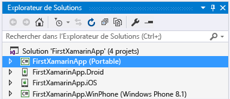
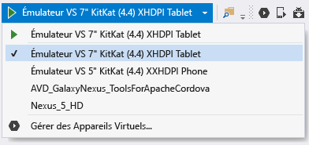
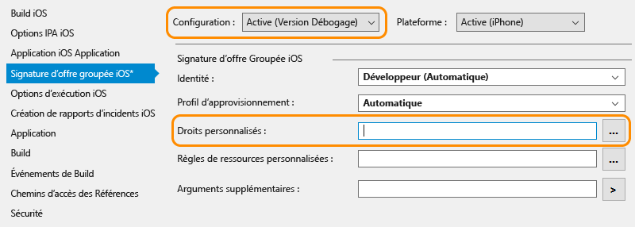

# Vérifier votre environnement Xamarin

Une fois les programmes d’installation terminés (voir [Setup and install](../cross-platform/setup-and-install.md)), passez quelques minutes à vérifier que tout est prêt pour expérimenter le développement Xamarin.  
  
 Quand vous avez terminé la vérification de l’installation, vous pouvez effectuer l’une des procédures pas à pas suivantes, ou les deux :  
  
-   [Principes fondamentaux de la création d’applications avec Xamarin.Forms dans Visual Studio](../cross-platform/learn-app-building-basics-with-xamarin-forms-in-visual-studio.md) pour générer une application Xamarin.Forms.
  
-   [Générer des applications Xamarin avec une interface utilisateur native dans Visual Studio](../cross-platform/build-apps-with-native-ui-using-xamarin-in-visual-studio.md) pour utiliser les interfaces utilisateur natives sur chaque plateforme, mais partager du code dans une bibliothèque .NET Standard.
  
## Toutes les plateformes 
 
Dans Visual Studio, sélectionnez d’abord **Outils > Extensions et mises à jour**, puis vérifiez si des composants Xamarin nécessitent des mises à jour.  
  
Créez ensuite une solution Xamarin.Forms dans Visual Studio en sélectionnant **Fichier > Nouveau projet**. Dans la boîte de dialogue, développez **Visual C# > Multiplateforme**, sélectionnez **Application mobile (Xamarin.Forms)**, puis cliquez sur OK. Dans la boîte de dialogue suivante, sélectionnez **Application vide**. Sous **Stratégie de partage de code**, sélectionnez **.NET Standard**. Cliquez sur OK.

Ces actions créent une solution avec quatre projets : un projet de bibliothèque .NET Standard 2.0 partagé et des projets d’application pour Android, iOS et la plateforme Windows universelle (UWP) :  
  
  
   
## Android  
  
1. Vérifiez que les derniers outils Android SDK sont installés en accédant à **Outils > Android > Android SDK Manager**. Installez la dernière version du composant Android SDK Tools ainsi que des outils de plateforme Android SDK et de génération Android SDK. Il n’est pas nécessaire de toujours installer le dernier niveau d’API Android. Le niveau d’API dont vous avez besoin dépend du niveau de plateforme à cibler. En général, l’installation de la plateforme Xamarin entraîne celle du niveau de plateforme Android nécessaire.  
  
2.  Vérifiez la génération et le débogage sur un appareil ou émulateur :  
  
    -   Cliquez avec le bouton droit sur le projet Android dans l’Explorateur de solutions et sélectionnez **Définir comme projet de démarrage**.  
  
    -   Dans la barre d’outils, vous devez voir un menu déroulant contenant une liste d’émulateurs et d’appareils Android disponibles. 
    
    Les appareils Android doivent être activés pour le débogage USB dans les options pour développeurs de la page des paramètres de l’appareil. L’appareil est alors attaché à l’ordinateur par un câble USB. 
    
    Les émulateurs sont également répertoriés. Sélectionnez l’un des appareils ou émulateurs Visual Studio :

    
  
  Pour plus d’informations, consultez [Introducing Visual Studio’s Emulator for Android](http://blogs.msdn.com/b/visualstudioalm/archive/2014/11/12/introducing-visual-studio-s-emulator-for-android.aspx) (blog ALM Visual Studio). Si vous avez des difficultés à faire fonctionner l’émulateur, consultez [Troubleshooting the Visual Studio Emulator for Android](../cross-platform/troubleshooting-the-visual-studio-emulator-for-android.md). Vous pouvez aussi créer des profils d’appareil pour l’émulateur en sélectionnant **Outils > Android > Gestionnaire d’émulateur Android**.  
  
3. Appuyez sur F5 pour compiler et déployer le programme sur l’émulateur ou l’appareil Android.
  
## Windows 
  
1.  Cliquez avec le bouton droit sur le projet Windows universel dans l’Explorateur de solutions et sélectionnez **Définir comme projet de démarrage**.  

2.  Dans la liste déroulante **Plateformes solution**, sélectionnez **x86** ou **x64**. Sélectionnez **Ordinateur local**.

3.  Appuyez sur F5 pour déployer le programme sur le bureau.
  
## iOS  
  
1.  Vérifiez que votre Mac est disponible sur le réseau et associé à Visual Studio, comme décrit dans [Connexion au Mac](/xamarin/ios/get-started/installation/windows/connecting-to-mac/).  
  
2.  Cliquez avec le bouton droit sur le projet iOS dans l’Explorateur de solutions et sélectionnez **Définir comme projet de démarrage**.  
  
3.  Sélectionnez la cible **iPhoneSimulator** dans la liste déroulante des builds de Visual Studio, comme illustré ci-dessous, ou la cible **iPhone** si un appareil est attaché au Mac.   
  
  

 Si aucun simulateur ne figure dans la liste, lancez Xcode sur votre Mac, sélectionnez **Xcode > Préférences**, puis cliquez sur **Télécharger**. Sous le titre **Composants**, vous devez voir les versions de simulateur qui sont disponibles en téléchargement. Vous trouverez des instructions supplémentaires pour le débogage dans la page [Débogage iOS](/xamarin/ios/deploy-test/debugging-in-xamarin-ios/?tabs=vsmac#Debugging_on_the_Simulator).
  
4.  Sélectionnez une cible d’appareil d’émulateur dans la liste déroulante Visual Studio :

 

5. Démarrez le débogueur en appuyant sur F5. Le simulateur est lancé sur le Mac où vous allez interagir avec l’application, alors que le débogage se déroule dans Visual Studio. Si vous avez un iPhone ou iPad physique connecté au Mac, il apparaît dans la liste et vous pouvez le sélectionner à la place. Si aucun appareil ni simulateur ne figure dans la liste, vérifiez la connexion au Mac. Consultez l’article lié à l’étape 1 ci-dessus ou accédez à **Outils > iOS > Coupler au Mac**  
  
6.  Si vous rencontrez des problèmes pour vous connecter au Mac, consultez [Résolution des problèmes de connexion](/xamarin/ios/get-started/installation/windows/connecting-to-mac/troubleshooting/).  
  
7.  Si vous recevez un message d’erreur indiquant qu’aucun profil de provisionnement installé ne correspond aux clés de signature iOS installées, essayez les suggestions suivantes :  
  
  - Vérifiez que votre compte ID Apple est ajouté à Xcode sur votre Mac, comme décrit dans [Adding Your Account to Xcode](https://developer.apple.com/library/content/documentation/IDEs/Conceptual/AppStoreDistributionTutorial/AddingYourAccounttoXcode/AddingYourAccounttoXcode.html#//apple_ref/doc/uid/TP40013839-CH40-SW1) (apple.com).  Si vous ajoutez votre compte, redémarrez ensuite Visual Studio et Xcode.  
    
  - Vérifiez que, dans les propriétés de votre projet iOS, sous l’onglet Signature d’ensemble d’applications iOS, le champ Droits personnalisés est vide pour la configuration Debug activée.  Remarque : Vous pouvez essayer de supprimer ce paramètre uniquement si vous avez rencontré le message d’erreur ci-dessus.  
  
    
