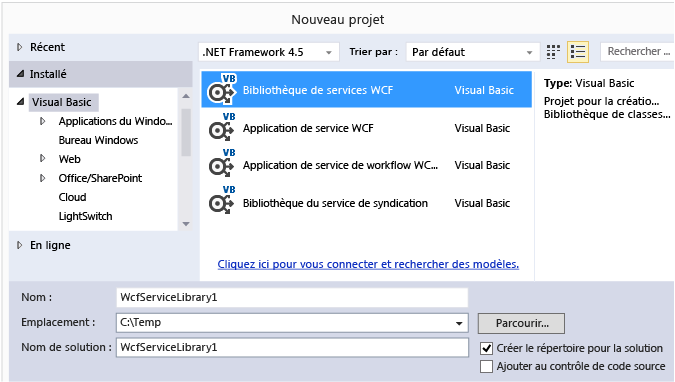
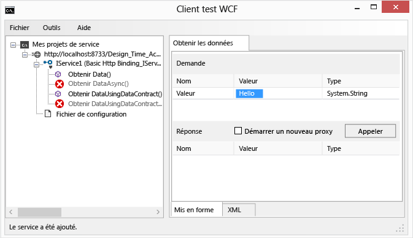
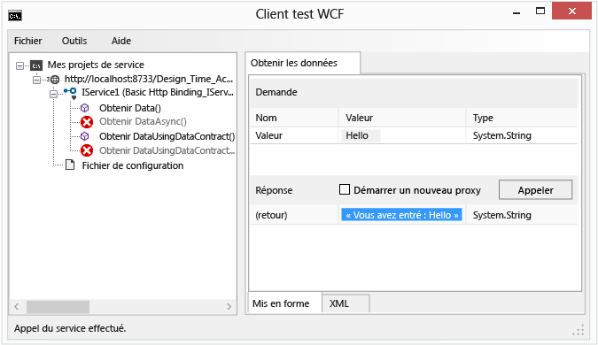
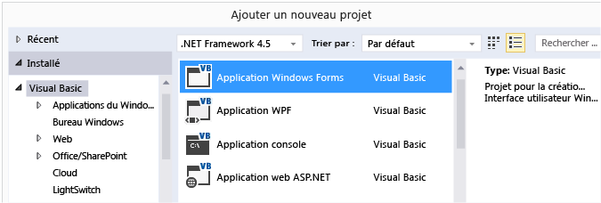
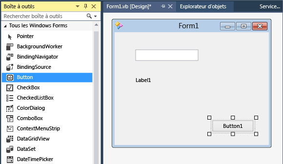

# Procédure pas à pas : Création d’un Service WCF simple dans les Windows Forms
Cette procédure pas à pas montre comment créer un simple service [!INCLUDE[vsindigo](../data-tools/includes/vsindigo_md.md)], le tester et y accéder à partir d'une application Windows Forms.  
  
[!INCLUDE[note_settings_general](../data-tools/includes/note_settings_general_md.md)]  
  
## Création du service  
  
#### Pour créer un service WCF  
  
1.  Dans le menu **Fichier** , pointez sur **Nouveau** , puis cliquez sur **Projet**.  
  
2.  Dans le **nouveau projet** boîte de dialogue, développez le **Visual Basic** ou **Visual C#** nœud et cliquez sur **WCF**, suivi par **WCF Bibliothèque de service**. Cliquez sur **OK** pour ouvrir le projet.  
  
       
  
    > [!NOTE]
    >  Un service actif est créé, qui peut être testé et est accessible. Les deux étapes suivantes montrent comment vous pouvez modifier la méthode par défaut pour utiliser un autre type de données. Dans une application réelle, vous ajouteriez également vos propres fonctions au service.  
  
3.    
  
     Dans **l’Explorateur de solutions**, double-cliquez sur IService1.vb ou IService1.cs et recherchez la ligne suivante :  
  
     [!code-csharp[WCFWalkthrough#4](../data-tools/codesnippet/CSharp/walkthrough-creating-a-simple-wcf-service-in-windows-forms_1.cs)]
     [!code-vb[WCFWalkthrough#4](../data-tools/codesnippet/VisualBasic/walkthrough-creating-a-simple-wcf-service-in-windows-forms_1.vb)]  
  
     Modifier le type de le `value` paramètre en chaîne :  
  
     [!code-csharp[WCFWalkthrough#1](../data-tools/codesnippet/CSharp/walkthrough-creating-a-simple-wcf-service-in-windows-forms_2.cs)]
     [!code-vb[WCFWalkthrough#1](../data-tools/codesnippet/VisualBasic/walkthrough-creating-a-simple-wcf-service-in-windows-forms_2.vb)]  
  
     Dans le code ci-dessus, notez les attributs `<OperationContract()>` ou `[OperationContract]`. Ces attributs sont obligatoires pour toute méthode exposée par le service.  
  
4.    
  
     Dans **l’Explorateur de solutions**, double-cliquez sur Service1.vb ou Service1.cs et recherchez la ligne suivante :  
  
     [!code-vb[WCFWalkthrough#5](../data-tools/codesnippet/VisualBasic/walkthrough-creating-a-simple-wcf-service-in-windows-forms_3.vb)]
     [!code-csharp[WCFWalkthrough#5](../data-tools/codesnippet/CSharp/walkthrough-creating-a-simple-wcf-service-in-windows-forms_3.cs)]  
  
     Modifier le type du paramètre value en chaîne :  
  
     [!code-csharp[WCFWalkthrough#2](../data-tools/codesnippet/CSharp/walkthrough-creating-a-simple-wcf-service-in-windows-forms_4.cs)]
     [!code-vb[WCFWalkthrough#2](../data-tools/codesnippet/VisualBasic/walkthrough-creating-a-simple-wcf-service-in-windows-forms_4.vb)]  
  
## Test du service  
  
#### Pour tester un service WCF  
  
1.  Appuyez sur **F5** pour exécuter le service. A **Client Test WCF** formulaire s’affiche et charge le service.  
  
2.  Dans le **Client Test WCF** formulaire, double-cliquez sur le **GetData()** méthode sous **IService1**. Le **GetData** onglet s’affiche.  
  
       
  
3.  Dans le **demande** boîte, sélectionnez le **valeur** champ et type `Hello`.  
  
       
  
4.  Cliquez sur le **Invoke** bouton. Si un **avertissement de sécurité** boîte de dialogue s’affiche, cliquez sur **OK**. Le résultat s’affichera dans le **réponse** boîte.  
  
       
  
5.  Sur le **fichier** menu, cliquez sur **Exit** pour fermer le formulaire de test.  
  
## Accès au service  
  
#### Pour faire référence à un service WCF  
  
1.  Sur le **fichier** menu, pointez sur **ajouter** puis cliquez sur **nouveau projet**.  
  
2.  Dans le **nouveau projet** boîte de dialogue, développez le **Visual Basic** ou **Visual C#** nœud et sélectionnez **Windows**, puis sélectionnez **Application Windows Forms**. Cliquez sur **OK** pour ouvrir le projet.  
  
       
  
3.  Avec le bouton droit **WindowsApplication1** et cliquez sur **ajouter une référence de Service**. Le **ajouter une référence de Service** boîte de dialogue s’affiche.  
  
4.  Dans le **ajouter une référence de Service** boîte de dialogue, cliquez sur **Discover**.  
  
       
  
     **Service1** s’affichera dans le **Services** volet.  
  
5.  Cliquez sur **OK** pour ajouter la référence de service.  
  
#### Pour générer une application cliente  
  
1.  Dans **l’Explorateur de solutions**, double-cliquez sur **Form1.vb** ou **Form1.cs** pour ouvrir le Concepteur Windows Forms s’il n’est pas déjà ouvert.  
  
2.  À partir de la **boîte à outils**, faites glisser un `TextBox` (contrôle), un `Label` (contrôle) et un `Button` contrôle vers le formulaire.  
  
       
  
3.  Double-cliquez sur le contrôle `Button`, puis ajoutez le code suivant au gestionnaire d'événements `Click` :  
  
     [!code-csharp[WCFWalkthrough#3](../data-tools/codesnippet/CSharp/walkthrough-creating-a-simple-wcf-service-in-windows-forms_5.cs)]
     [!code-vb[WCFWalkthrough#3](../data-tools/codesnippet/VisualBasic/walkthrough-creating-a-simple-wcf-service-in-windows-forms_5.vb)]  
  
4.  Dans **l’Explorateur de solutions**, avec le bouton droit **WindowsApplication1** et cliquez sur **définir comme projet de démarrage**.  
  
5.  Appuyez sur **F5** pour exécuter le projet. Entrez un texte et cliquez sur le bouton. Le message « Vous avez entré : » s'affichera, suivi du texte que vous avez entré.  
  
       
  
## Voir aussi  
 [Services Windows Communication Foundation et services de données WCF dans Visual Studio](../data-tools/windows-communication-foundation-services-and-wcf-data-services-in-visual-studio.md)