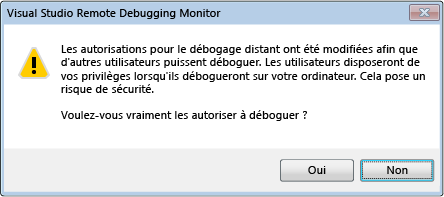

# Sécurité du débogueur
La possibilité de déboguer un autre processus vous donne des pouvoirs extrêmement larges que vous n'auriez pas autrement, surtout lors du débogage à distance. Un débogueur malveillant pourrait infliger des dommages étendus sur l'ordinateur qui est débogué.  
  
 Toutefois, beaucoup de développeurs ne se rendent pas compte que la menace sur la sécurité peut également se dérouler dans le sens opposé. Il est possible pour le code malveillant dans le processus du programme débogué de compromettre la sécurité de l'ordinateur de débogage : il existe plusieurs exploits de sécurité dont il faut se garder.  
  
## Meilleures pratiques de sécurité (Kit de développement Platform SDK)  
 Il existe une relation de confiance implicite entre le code que vous déboguez et le débogueur. Si vous êtes disposé à déboguer quelque chose, vous devez également être disposé à l'exécuter. Au final, vous devez être en mesure d'avoir confiance en ce que vous déboguez. Si vous n'avez pas cette confiance, vous ne devez pas déboguer, ou vous devez déboguer le code à partir d'un ordinateur dont vous pouvez vous permettre de compromettre la sécurité, et dans un environnement isolé.  
  
 Pour réduire la surface d'attaque potentielle, le débogage doit être désactivé sur les ordinateurs de production. Pour la même raison, le débogage ne doit jamais être activé indéfiniment.  
  
### Sécurité de débogage managé  
 Voici quelques recommandations générales à appliquer à tout débogage managé.  
  
-   Soyez prudent lors de l’attachement au processus d’un utilisateur non fiable : dans ce cas, vous supposez qu’il est digne de confiance. Quand vous tentez d’attacher un processus d’un utilisateur non approuvé, une boîte de dialogue d’avertissement de sécurité s’affiche pour vous demander de confirmer l’attachement du processus. Vous faites partie des « utilisateurs approuvés », de même que les utilisateurs standard habituellement définis sur les machines où .NET Framework est installé, comme **aspnet**, **localsystem**, **networkservice**et **localservice**. Pour plus d’informations, consultez [avertissement de sécurité : l’attachement à un processus appartenant à un utilisateur non fiable peut être dangereux. Si les informations ci-dessous semblent suspectes ou si vous n’êtes pas sûr, n’attachez pas ce processus](../debugger/security-warning-attaching-to-a-process-owned-by-an-untrusted-user-can-be-dangerous-if-the-following-information-looks-suspicious-or-you-are-unsure-do-not-attach-to-this-process.md).  
  
-   Soyez prudent lors du téléchargement d'un projet à partir d'Internet et de son chargement dans [!INCLUDE[vsprvs](../code-quality/includes/vsprvs_md.md)]. Il s'agit d'une opération très risquée sans débogage. Lorsque vous procédez ainsi, vous supposez que le projet et le code qu'il contient sont dignes de confiance.  
  
 Pour plus d'informations, consultez [Debugging Managed Code](../debugger/debugging-managed-code.md).  
  
### Sécurité du débogage à distance |  
 Le débogage local est généralement plus sûr que le débogage à distance. Le débogage distant augmente la zone de surface totale qui peut être sondée.  
  
 Visual Studio Remote Debugging Monitor (msvsmon.exe) est utilisé dans le débogage distant, et il existe plusieurs recommandations de sécurité pour le configurer. La façon par défaut de configurer le mode d'authentification est d'utiliser l'authentification Windows, parce que le mode Aucune Authentication n'est pas sécurisé.  
  
   
  
 Lorsque vous utilisez le mode Authentification Windows, sachez qu'accorder une autorisation utilisateur non fiable pour se connecter à msvsmon est dangereux, car l'utilisateur reçoit toutes vos autorisations sur l'ordinateur.  
  
 Ne déboguez pas un processus inconnu sur un ordinateur distant : il existe des exploits potentiels qui peuvent affecter l'ordinateur exécutant le débogueur, ou cela peut compromettre msvsmon.exe, le Visual Studio Remote Debugging Monitor. Si vous devez absolument déboguer un processus inconnu, essayez de le déboguer localement et utilisez un pare-feu pour que toutes les menaces potentielles restent localisées.  
  
 Pour plus d’informations, consultez [débogage distant](../debugger/remote-debugging.md).  
  
### Sécurité de débogage Web Services  
 Il est plus sûr de déboguer localement, mais puisque [!INCLUDE[vsprvs](../code-quality/includes/vsprvs_md.md)] n'est probablement pas installé sur le serveur web, le débogage local peut ne pas être pratique. En général, le débogage de services web s'effectue à distance, sauf pendant le développement, ce qui fait que les recommandations pour la sécurité de débogage distant s'appliquent également au débogage de services web. Voici quelques meilleures pratiques supplémentaires. Pour plus d'informations, consultez [Debugging XML Web Services](http://msdn.microsoft.com/en-us/c900b137-9fbd-4f59-91b5-9c2c6ce06f00).  
  
-   N’activez pas le débogage sur un serveur web qui a été compromis.  
  
-   Assurez-vous que le serveur web est sécurisé avant de le déboguer. Si vous n'êtes pas sûr qu'il le soit, ne le déboguez pas.  
  
-   Soyez particulièrement prudent si vous déboguez un service web qui est exposé sur Internet.  
  
### Composants externes  
 Déterminez l'état de confiance des composants externes avec lesquels votre programme interagit, surtout si vous n'avez pas écrit le code. Déterminez également les composants que [!INCLUDE[vsprvs](../code-quality/includes/vsprvs_md.md)] ou le débogueur peut utiliser.  
  
### Symboles et code source  
 Deux outils [!INCLUDE[vsprvs](../code-quality/includes/vsprvs_md.md)] qui requièrent une réflexion à propos de la sécurité sont les éléments suivants :  
  
-   Le serveur source, qui fournit des versions de code source d'un référentiel de code source. Ceci est utile lorsque vous n'avez pas la version actuelle du code source d'un programme. [Security Warning: Debugger Must Execute Untrusted Command](../debugger/security-warning-debugger-must-execute-untrusted-command.md).  
  
-   Le serveur de symboles, qui est utilisé pour fournir les symboles nécessaires pour déboguer un incident pendant un appel système.  
  
 Consultez [spécifier les symboles (.pdb) et les fichiers sources](../debugger/specify-symbol-dot-pdb-and-source-files-in-the-visual-studio-debugger.md)  
  
## Voir aussi  
 [Paramètres et préparation du débogueur](../debugger/debugger-settings-and-preparation.md)   
 [Principes de base du débogueur](../debugger/debugger-basics.md)   
 [Avertissement de sécurité : L’attachement à un processus appartenant à un utilisateur non approuvé peut être dangereux. Si les informations ci-dessous semblent suspectes ou si vous n’êtes pas sûr, n’attachez pas ce processus](../debugger/security-warning-attaching-to-a-process-owned-by-an-untrusted-user-can-be-dangerous-if-the-following-information-looks-suspicious-or-you-are-unsure-do-not-attach-to-this-process.md)   
 [Avertissement de sécurité : Le débogueur doit exécuter une commande non approuvée](../debugger/security-warning-debugger-must-execute-untrusted-command.md)