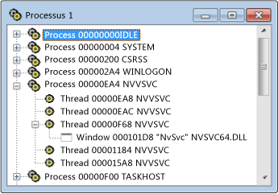

# Vue Processus
La vue processus affiche une arborescence de tous les processus actifs sur votre système. Le nom du module et les ID de processus sont affichés. Utilisez la vue processus si vous souhaitez examiner un processus système particulier, qui correspond généralement à un programme en cours d’exécution. Les processus sont identifiés par des noms de module, ou elles sont désignées « processus système. »  
  
 Microsoft Windows prend en charge plusieurs processus. Chaque processus peut avoir un ou plusieurs threads et chaque thread peut avoir une ou plusieurs associés des fenêtres de niveau supérieur. Chaque fenêtre de niveau supérieur peut posséder une série de windows. Un symbole + indique qu’un niveau est réduit. L’affichage réduit se compose d’une ligne par processus. Cliquez sur le symbole + pour développer le niveau.  
  
 Utilisez la vue processus si vous souhaitez examiner un processus système particulier, qui correspond généralement à un programme en cours d’exécution. Les processus sont identifiés par des noms de module, ou elles sont désignées « processus système. » Pour rechercher un processus, réduisez l’arborescence et rechercher dans la liste.  
  
## Procédures  
  
#### Pour ouvrir la vue processus  
  
1.  À partir de la **Spy** menu, choisissez **processus**.  
  
   
Vue Processus Spy++  
  
 La figure ci-dessus illustre la vue processus avec le développement des nœuds de processus et de thread.  
  
### Dans cette section  
 [Recherche d’un processus dans la vue processus](../debugger/how-to-search-for-a-process-in-processes-view.md)  
 Explique comment rechercher un processus spécifique dans la vue processus.  
  
 [Affichage des propriétés de processus](../debugger/how-to-display-process-properties.md)  
 Explique comment afficher des informations supplémentaires sur un message.  
  
### Rubriques connexes  
 [Vues Spy++](../debugger/spy-increment-views.md)  
 Explique les arborescences Spy ++ de windows, les messages, les processus et les threads.  
  
 [Utilisation de Spy++](../debugger/using-spy-increment.md)  
 Présente l’outil Spy ++ et explique comment elle peut être utilisée.  
  
 [Recherche d’un processus, boîte de dialogue](../debugger/process-search-dialog-box.md)  
 Utilisé pour rechercher le nœud d’un processus spécifique dans la vue processus.  
  
 [Propriétés du processus, boîte de dialogue](../debugger/process-properties-dialog-box.md)  
 Affiche les propriétés d’un processus sélectionné dans la vue processus.  
  
 [Informations de référence sur Spy++](../debugger/spy-increment-reference.md)  
 Inclut des sections décrivant chaque Spy ++ menu et boîte de dialogue.