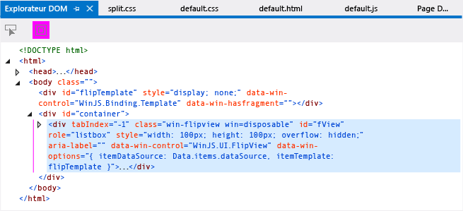
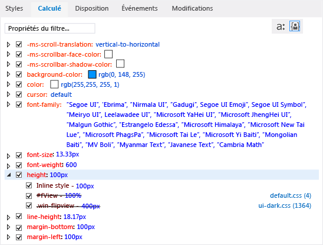
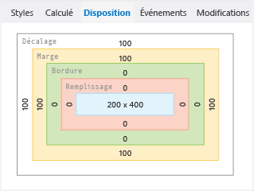

# D&#233;marrage rapide&#160;: d&#233;boguer du code HTML et CSS
[!INCLUDE[vs2017banner](../code-quality/includes/vs2017banner.md)]

  
  
 Pour les applications JavaScript, Visual Studio fournit une expérience de débogage complète qui inclut des fonctionnalités familières aux développeurs Internet Explorer et Visual Studio. Ces fonctionnalités sont prises en charge par les applications [!INCLUDE[win8_appname_long](../debugger/includes/win8_appname_long_md.md)], les applications Windows Phone Store et les applications créées avec Visual Studio Tools pour Apache Cordova.  
  
 Grâce au modèle de débogage interactif fourni par les outils d’inspection DOM, vous pouvez afficher et modifier le rendu du code HTML et CSS. Et cela, sans avoir à arrêter ni redémarrer le débogueur.  
  
 Dans cette rubrique :  
  
-   [Examen du modèle DOM en direct](#InspectingDOM)  
  
-   [Sélection d’éléments](#SelectingElements)  
  
 Pour obtenir des informations supplémentaires sur l’utilisation de l’explorateur DOM, consultez les rubriques suivantes :  
  
-   [Déboguer les styles CSS avec l’explorateur DOM](../debugger/debug-css-styles-using-dom-explorer.md)  
  
-   [Déboguer la disposition avec l’Explorateur DOM](../debugger/debug-layout-using-dom-explorer.md)  
  
-   [Afficher les écouteurs d'événements DOM](../debugger/view-dom-event-listeners.md)  
  
-   [Actualiser une application \(JavaScript\)](../debugger/refresh-an-app-javascript.md)  
  
-   [Déboguer un contrôle WebView](../debugger/debug-a-webview-control.md)  
  
 Pour plus d’informations sur d’autres fonctionnalités de débogage JavaScript, telles que l’utilisation de la fenêtre de la console JavaScript et la définition de points d’arrêt, consultez les rubriques [Démarrage rapide : déboguer du code JavaScript](../debugger/quickstart-debug-javascript-using-the-console.md) et [Déboguer des applications dans Visual Studio](../debugger/debug-store-apps-in-visual-studio.md).  
  
##  <a name="InspectingDOM"></a> Examen du modèle DOM en direct  
 L’explorateur DOM affiche une vue de la page rendue ; utilisez l’explorateur DOM pour modifier des valeurs et afficher immédiatement les résultats. Cela vous permet de tester les modifications sans arrêter et redémarrer le débogueur. Le code source de votre projet ne change pas quand vous interagissez avec la page à l’aide de cette méthode. Ainsi, quand vous trouvez les corrections de code souhaitées, vous modifiez votre code source.  
  
> [!TIP]
>  Pour éviter d’avoir à arrêter et redémarrer le débogueur quand vous modifiez votre code source, vous pouvez actualiser votre application à l’aide du bouton **Actualiser l’application Windows** dans la barre d’outils Déboguer \(ou en appuyant sur F4\). Pour plus d’informations, consultez [Actualiser une application \(JavaScript\)](../debugger/refresh-an-app-javascript.md).  
  
 Vous pouvez utiliser l’explorateur DOM pour effectuer les tâches suivantes :  
  
-   Parcourir la sous\-arborescence des éléments DOM et inspecter le rendu du code HTML, CSS et JavaScript.  
  
-   Modifier de manière dynamique les attributs et les styles CSS pour les éléments rendus et afficher immédiatement les résultats.  
  
-   Inspecter la façon dont les styles CSS ont été appliqués aux éléments de page et effectuer un suivi des règles qui ont été appliquées.  
  
 Lorsque vous déboguez des applications, vous devez souvent sélectionner des éléments dans l’explorateur DOM. Quand vous sélectionnez un élément, les valeurs qui s’affichent sous les onglets dans la partie droite de l’explorateur DOM sont automatiquement mises à jour pour refléter l’élément sélectionné dans l’explorateur DOM. Ces onglets sont les suivants : **Styles**, **Calculé**, **Disposition**. Les applications Windows Store prennent également en charge les onglets **Événements** et **Modifications**. Pour plus d’informations sur la sélection des éléments, consultez [Sélection d’éléments](#SelectingElements).  
  
> [!TIP]
>  Si la fenêtre de l’explorateur DOM est fermée, sélectionnez **Déboguer** \> **Fenêtres** \> **Explorateur DOM** pour la rouvrir. La fenêtre s’ouvre uniquement pendant une session de débogage de script.  
  
 Dans la procédure qui suit, nous examinerons le processus de débogage interactif d’une application à l’aide de l’explorateur DOM. Nous créerons une application qui utilise un contrôle `FlipView`, puis nous la déboguerons. L’application contient plusieurs erreurs.  
  
> [!WARNING]
>  L’exemple d’application suivant est une application Windows Store. Les mêmes fonctionnalités sont prises en charge par Cordova, mais l’application serait différente.  
  
#### Pour déboguer en examinant le modèle DOM en direct  
  
1.  Créez une solution dans Visual Studio en sélectionnant **Fichier** \> **Nouveau projet**.  
  
2.  Choisissez **JavaScript** \> **Store**, puis **Applications Windows** ou **Applications Windows Phone**, puis sélectionnez **Application vide**.  
  
3.  Tapez un nom pour le projet, comme `FlipViewApp`, puis choisissez **OK** pour créer l’application.  
  
4.  Dans l’élément BODY du fichier default.html, ajoutez le code suivant :  
  
    ```html  
    <div id="flipTemplate" data-win-control="WinJS.Binding.Template" style="display:none"> <div class="fixedItem" >  </div> </div> <div id="fView" style="width:100px;height:100px" data-win-control="WinJS.UI.FlipView" data-win-options="{ itemDataSource: Data.items.dataSource, itemTemplate: flipTemplate }"> </div>  
    ```  
  
5.  Ouvrez default.css et ajoutez le CSS suivant :  
  
    ```css  
    #fView { background-color:#0094ff; height: 100%; width: 100%; margin: 25%; }  
    ```  
  
6.  Remplacez le code dans default.js par le code suivant :  
  
    ```javascript  
    (function () { "use strict"; var app = WinJS.Application; var activation = Windows.ApplicationModel.Activation; var myData = []; for (var x = 0; x < 4; x++) { myData[x] = { flipImg: "/images/logo.png" } }; var pages = new WinJS.Binding.List(myData, { proxy: true }); app.onactivated = function (args) { if (args.detail.kind === activation.ActivationKind.launch) { if (args.detail.previousExecutionState !== activation.ApplicationExecutionState.terminated) { // TODO: . . . } else { // TODO: . . . } args.setPromise(WinJS.UI.processAll()); updateImages(); } }; function updateImages() { pages.setAt(0, { flipImg: "http://go.microsoft.com/fwlink/?LinkID=223195" }); pages.setAt(1, { flipImg: "http://go.microsoft.com/fwlink/?LinkID=223196" }); pages.setAt(2, { flipImg: "http://go.microsoft.com/fwlink/?LinkID=223197" }); }; app.oncheckpoint = function (args) { }; app.start(); var publicMembers = { items: pages }; WinJS.Namespace.define("Data", publicMembers); })();  
    ```  
  
     L’illustration suivante montre le résultat attendu si cette application est exécutée dans Windows Phone Emulator \(même apparence dans le simulateur\). Toutefois, avant de parvenir à ce résultat, il nous faudra corriger un certain nombre de bogues.  
  
       
  
7.  Sélectionnez **Simulateur** ou **Emulator 8.1 WVGA 512 Mo** dans la liste déroulante située en regard du bouton **Démarrer le débogage** dans la barre d’outils **Déboguer** :  
  
       
  
8.  Sélectionnez **Déboguer** \> **Démarrer le débogage**, ou appuyez sur F5, pour exécuter votre application en mode débogage.  
  
     L’application est ainsi exécutée dans le simulateur ou l’émulateur Windows Phone, mais l’écran affiché est en grande partie vide parce que le style contient quelques erreurs. La première image `FlipView` apparaît dans un petit carré non loin du milieu de l’écran.  
  
9. Si vous exécutez l’application dans le simulateur, choisissez la commande de la barre d’outils **Modifier la résolution** à droite du simulateur pour configurer une résolution d’écran de 1280 x 800. Cela permettra d’afficher les valeurs dans les étapes suivantes telles que vous les voyez dans le simulateur.  
  
10. Basculez vers Visual Studio et sélectionnez l’onglet **Explorateur DOM**.  
  
    > [!TIP]
    >  Appuyez sur Alt\+Tab, ou F12, pour basculer entre Visual Studio et l’application en cours d’exécution.  
  
11. Dans la fenêtre de l’explorateur DOM, sélectionnez l’élément DIV de la section associée à l’ID `"fView"`. Utilisez les touches de direction pour afficher et sélectionner l’élément DIV approprié. \(La touche de direction droite vous permet d’afficher les enfants d’un élément.\)  
  
       
  
    > [!TIP]
    >  Vous pouvez aussi sélectionner l’élément DIV en bas à gauche de la fenêtre de la console JavaScript en tapant `select(fView)` à l’invite de commandes \>\> et en appuyant sur Entrée.  
  
     Les valeurs qui s’affichent sous les onglets à droite de la fenêtre de l’explorateur DOM sont automatiquement mises à jour pour refléter l’élément en cours dans l’explorateur DOM.  
  
12. Sélectionnez l’onglet **Calculé** sur la droite.  
  
     Cet onglet affiche la valeur calculée ou finale de chaque propriété de l’élément DOM sélectionné.  
  
13. Ouvrez la règle CSS de hauteur. Notez qu’il existe un style intraligne défini sur 100px, qui est incohérent avec la valeur de hauteur de 100 % définie pour le sélecteur CSS `#fView`. Le texte barré sur sélecteur `#fView` indique que le style intraligne est prioritaire sur ce style.  
  
     L’illustration suivante montre l’onglet **Calculé**.  
  
       
  
14. Dans la fenêtre principale de l’explorateur DOM, double\-cliquez sur le style intraligne pour la hauteur et la largeur de l’élément DIV `fView`. Vous pouvez maintenant modifier les valeurs ici. Dans ce scénario, il est convenu de les supprimer complètement.  
  
15. Sélectionnez `width: 100px;height: 100px;`, appuyez sur la touche Suppr, puis sur Entrée. Dès que vous appuyez sur Entrée, les nouvelles valeurs sont immédiatement répercutées dans le simulateur ou l’émulateur Windows Phone, même si vous n’avez pas arrêté votre session de débogage.  
  
    > [!IMPORTANT]
    >  Comme vous pouvez mettre à jour les attributs dans la fenêtre de l’explorateur DOM, vous pouvez également mettre à jour les valeurs affichées sous les onglets **Styles**, **Calculé** et **Disposition**. Pour plus d’informations, consultez [Déboguer les styles CSS avec l’explorateur DOM](../debugger/debug-css-styles-using-dom-explorer.md) et [Déboguer la disposition avec l’Explorateur DOM](../debugger/debug-layout-using-dom-explorer.md).  
  
16. Basculez vers l’application en sélectionnant le simulateur ou l’émulateur Windows Phone, ou en utilisant les touches Alt\+Tab.  
  
     À présent, le contrôle `FlipView` est plus grand que la taille de l’écran du simulateur ou de l’émulateur Windows Phone. Ce n’est pas le résultat souhaité. Pour faire une recherche, revenez à Visual Studio.  
  
17. Dans l’explorateur DOM, sélectionnez à nouveau l’onglet **Calculé** et ouvrez la règle de hauteur. L’élément fView affiche toujours une valeur de 100 %, comme attendu par le CSS, mais la valeur calculée est égale à la hauteur de l’écran du simulateur \(par exemple, 800px ou 667.67px\), ce qui ne correspond pas à la valeur souhaitée pour cette application. Pour examiner ce résultat, vous pouvez supprimer la hauteur et la largeur de l’élément DIV `fView`.  
  
18. Sous l’onglet **Styles**, désactivez les propriétés de hauteur et de largeur du sélecteur CSS `#fView`.  
  
     L’onglet **Calculé** affiche maintenant une hauteur de 400px. Les informations indiquent que cette valeur provient du sélecteur .win\-flipview spécifié dans ui\-dark.css, qui est un fichier CSS de plateforme.  
  
19. Rebasculez vers l’application.  
  
     Les choses se sont améliorées. Toutefois, il reste un problème de plus à corriger : les marges sont trop grandes.  
  
20. Pour en comprendre la raison, basculez vers Visual Studio et sélectionnez l’onglet **Disposition** pour examiner le modèle de boîte de l’élément.  
  
     Sous l’onglet **Disposition**, les valeurs suivantes s’affichent :  
  
    -   pour le simulateur, 320 px \(Décalage\) et 320 px \(Marge\) ;  
  
    -   pour l’émulateur Windows Phone, 100 px \(Décalage\) et 100 px \(Marge\).  
  
     L’illustration suivante montre l’apparence de l’onglet **Disposition** si vous utilisez l’émulateur Windows Phone \(décalage et marge à 100 px\).  
  
       
  
     Cela ne semble pas correct. L’onglet **Calculé** indique aussi des valeurs de marge identiques.  
  
21. Sélectionnez l’onglet **Styles**, et recherchez le sélecteur CSS `#fView`. Vous voyez ici une valeur de 25 % pour la propriété **marge**.  
  
22. Sélectionnez 25 %, remplacez\-le par 25px, puis appuyez sur Entrée.  
  
23. Toujours sous l’onglet **Styles**, sélectionnez la règle de hauteur pour le sélecteur .win\-flipview, remplacez 400 px par 500 px, puis appuyez sur Entrée.  
  
24. Rebasculez vers l’application. Vous constatez que le positionnement des éléments semble correct. Pour créer des correctifs de la source et actualiser l’application sans arrêter et redémarrer le débogueur, consultez la procédure suivante.  
  
#### Pour actualiser votre application pendant le débogage  
  
1.  Quand l’application est en cours d’exécution, passez dans Visual Studio.  
  
2.  Ouvrez le fichier default.html et modifiez votre code source en définissant la hauteur et la largeur de l’élément DIV `"fView"` sur la valeur 100 %.  
  
3.  Sélectionnez le bouton **Actualiser l’application Windows** dans la barre d’outils Déboguer \(ou appuyez sur F4\). Le bouton présente l’aspect suivant : .  
  
     Les pages d’application sont rechargées et le simulateur ou l’émulateur Windows Phone s’affiche au premier plan.  
  
     Pour plus d’informations sur la fonction Actualiser, consultez [Actualiser une application \(JavaScript\)](../debugger/refresh-an-app-javascript.md).  
  
##  <a name="SelectingElements"></a> Sélection d’éléments  
 Il existe trois façons de sélectionner des éléments DOM lors du débogage d’une application :  
  
-   Cliquez sur les éléments directement dans la fenêtre de l’explorateur DOM \(ou utilisez les touches de direction\).  
  
-   Utilisez le bouton **Sélectionner un élément** \(Ctrl\+B\).  
  
-   Utilisez la commande `select`, qui est l’une des [Commandes de la console JavaScript](../debugger/javascript-console-commands.md).  
  
 Quand vous utilisez la fenêtre de l’explorateur DOM pour sélectionner des éléments et placez le pointeur de la souris sur un élément, l’élément correspondant est mis en surbrillance dans l’application en cours d’exécution. Vous devez cliquer sur l’élément dans l’explorateur DOM pour le sélectionner, ou vous pouvez utiliser les touches de direction pour mettre en surbrillance et sélectionner des éléments. Vous pouvez également sélectionner des éléments dans l’explorateur DOM à l’aide du bouton **Sélectionner un élément**. L’illustration suivante présente le bouton **Sélectionner un élément**.  
  
   
  
 Lorsque vous cliquez sur **Sélectionner un élément** \(ou appuyez sur Ctrl\+B\), le mode de sélection est modifié pour vous permettre de sélectionner un élément dans l’explorateur DOM en cliquant dessus dans l’application en cours d’exécution. Après un clic, le mode de sélection normale est restauré. Lorsque vous cliquez sur **Sélectionner un élément**, l’application s’affiche au premier plan et le curseur change pour refléter le nouveau mode de sélection. Quand vous cliquez sur l’élément encadré, l’explorateur DOM s’affiche au premier plan avec l’élément spécifié sélectionné.  
  
 Avant de choisir **Sélectionner un élément**, spécifiez si les éléments doivent être mis en surbrillance dans l’application en cours d’exécution en activant le bouton **Afficher les zones de surlignement de la page web pour l’élément sélectionné dans l’arborescence DOM**. Voici une illustration de ce bouton. Les zones de surlignement sont affichées par défaut.  
  
   
  
 Quand vous choisissez de mettre en surbrillance des éléments, les éléments pointés dans le simulateur sont mis en surbrillance. Les couleurs des éléments mis en surbrillance correspondent au modèle de boîte qui apparaît sous l’onglet **Disposition** de l’explorateur DOM.  
  
> [!NOTE]
>  La mise en surbrillance d’éléments par pointage n’est que partiellement prise en charge dans l’émulateur Windows Phone.  
  
 Pour obtenir un exemple illustrant le mode de sélection des éléments à l’aide du bouton **Sélectionner un élément**, consultez [Déboguer les styles CSS avec l’explorateur DOM](../debugger/debug-css-styles-using-dom-explorer.md).  
  
##  <a name="BrowserSupport"></a> Navigateurs et plateformes pris en charge  
 Les outils Visual Studio pour JavaScript, l’explorateur DOM et la fenêtre de la console JavaScript sont pris en charge sur les plateformes suivantes :  
  
-   Applications [!INCLUDE[win8_appname_long](../debugger/includes/win8_appname_long_md.md)] et Windows Phone Store en JavaScript et HTML  
  
-   Internet Explorer 11 s’exécutant sur [!INCLUDE[win81](../debugger/includes/win81_md.md)]  
  
-   Internet Explorer 10 s’exécutant sur [!INCLUDE[win8](../debugger/includes/win8_md.md)]  
  
 Allez [ici](http://go.microsoft.com/fwlink/?LinkID=232448) pour télécharger [!INCLUDE[win8](../debugger/includes/win8_md.md)] et Visual Studio.  
  
## Voir aussi  
 [Déboguer des applications dans Visual Studio](../debugger/debug-store-apps-in-visual-studio.md)   
 [Déboguer les styles CSS avec l’explorateur DOM](../debugger/debug-css-styles-using-dom-explorer.md)   
 [Déboguer la disposition avec l’Explorateur DOM](../debugger/debug-layout-using-dom-explorer.md)   
 [Afficher les écouteurs d'événements DOM](../debugger/view-dom-event-listeners.md)   
 [Actualiser une application \(JavaScript\)](../debugger/refresh-an-app-javascript.md)   
 [Déboguer un contrôle WebView](../debugger/debug-a-webview-control.md)   
 [Raccourcis clavier](../debugger/keyboard-shortcuts-html-and-javascript.md)   
 [Commandes de la console JavaScript](../debugger/javascript-console-commands.md)   
 [Déboguer un exemple de code HTML, CSS et JavaScript](../debugger/debug-html-css-and-javascript-sample-code.md)   
 [Support technique et accessibilité](http://msdn.microsoft.com/library/tzbxw1af\(VS.120\).aspx)