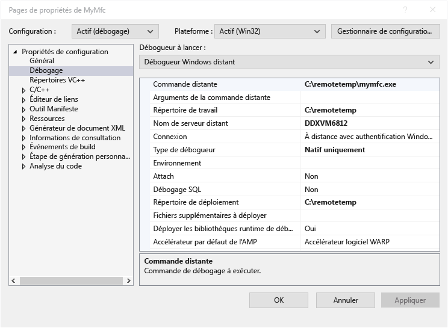

# Un projet Visual C++ dans Visual Studio de débogage à distance
Pour déboguer une application de Visual Studio sur un autre ordinateur, installer et exécuter les outils à distance sur l’ordinateur où vous allez déployer votre application, configurez votre projet pour vous connecter à l’ordinateur distant à partir de Visual Studio, puis déployer et exécuter votre application.

Pour plus d’informations sur le débogage des applications de Windows universelle (UWP) à distance, consultez [déboguer un Package d’application installé](debug-installed-app-package.md).

## Configuration requise

Le débogueur distant est pris en charge sur Windows 7 et versions ultérieures (pas de téléphone) et les versions de Windows Server depuis Windows Server 2008 Service Pack 2. Pour obtenir une liste complète des exigences, consultez [exigences](../debugger/remote-debugging.md#requirements_msvsmon).

> [!NOTE]
> Débogage entre deux ordinateurs connectés via un proxy n’est pas pris en charge. Débogage sur une latence élevée ou faible bande passante, telles que la numérotation Internet, ou via Internet entre les pays n’est pas recommandé et peut échouer ou être trop faibles.
  
## Téléchargez et installez les outils à distance

[!INCLUDE [remote-debugger-download](../debugger/includes/remote-debugger-download.md)]
  
> [!TIP]
> Dans certains scénarios, il peut être plus efficace d’exécuter le débogueur distant à partir d’un partage de fichiers. Pour plus d’informations, consultez [exécuter le débogueur distant à partir d’un partage de fichiers](../debugger/remote-debugging.md#fileshare_msvsmon).
  
##  Configurer le débogueur distant

[!INCLUDE [remote-debugger-configuration](../debugger/includes/remote-debugger-configuration.md)]

> [!NOTE]
> Si vous avez besoin pour ajouter des autorisations pour les utilisateurs supplémentaires, modifiez le mode d’authentification, ou le numéro de port pour le débogueur distant, consultez [configurer le débogueur distant](../debugger/remote-debugging.md#configure_msvsmon).

##  Débogage distant d’un projet Visual C++  
 Dans la procédure suivante, le nom et le chemin d’accès du projet est C:\remotetemp\MyMfc, et le nom de l’ordinateur distant est **MJO-DL**.  
  
1.  Créer une application MFC nommée **mymfc.**  
  
2.  Définissez un point d’arrêt quelque part dans l’application qui est facilement accessible, par exemple dans **MainFrm.cpp**, au début de `CMainFrame::OnCreate`.  
  
3.  Dans l’Explorateur de solutions, cliquez sur le projet, puis sélectionnez **propriétés**. Ouvrez le **débogage** onglet.  
  
4.  Définir le **débogueur à lancer** à **débogueur Windows distant**.  
  
       
  
5.  Appliquez les modifications suivantes aux propriétés :  
  
    |Paramètre|Value|
    |-|-|  
    |Commande distante|C:\remotetemp\mymfc.exe|  
    |Répertoire de travail|C:\remotetemp|  
    |Nom de serveur distant|DL-MJO :*numéro_port*|  
    |Connexion|À distance avec authentification Windows|  
    |Type de débogueur|Natif uniquement|  
    |Répertoire de déploiement|C:\remotetemp.|  
    |Fichiers supplémentaires à déployer|C:\data\mymfcdata.txt.|  
  
     Si vous déployez des fichiers supplémentaires (facultatifs), le dossier doit exister sur les deux ordinateurs.  
  
6.  Dans l’Explorateur de solutions, cliquez sur la solution et choisissez **Configuration Manager**.  
  
7.  Pour le **déboguer** configuration, sélectionnez le **déployer** case à cocher.  
  
       
  
8.  Démarrer le débogage (**Déboguer > Démarrer le débogage**, ou **F5**).  
  
9. Le fichier exécutable est déployé automatiquement sur l’ordinateur distant.  
  
10. Si vous y êtes invité, entrez les informations d’identification réseau pour vous connecter à l’ordinateur distant.  
  
     Les informations d’identification requises sont spécifiques à la configuration de la sécurité de votre réseau. Par exemple, sur un ordinateur de domaine, vous pourrez choisir un certificat de sécurité ou entrez votre nom de domaine et le mot de passe. Sur un ordinateur n’appartenant pas au domaine, vous pouvez entrer le nom de l’ordinateur et un nom de compte d’utilisateur valide, comme **MJO-DL\name@something.com**, ainsi que le mot de passe correct.  
  
11. Sur l’ordinateur Visual Studio, l’exécution doit être arrêtée au point d’arrêt.  
  
    > [!TIP]
    >  Le déploiement des fichiers peut également faire l’objet d’une autre étape. Dans le **l’Explorateur de solutions,** avec le bouton droit le **mymfc** nœud, puis choisissez **déployer**.  
  
 Si vous avez des fichiers autres que des fichiers de code qui doivent être utilisés par l’application, vous devez les inclure dans le projet Visual Studio. Créez un dossier de projet pour les fichiers supplémentaires (dans le **l’Explorateur de solutions**, cliquez sur **Ajouter > Nouveau dossier**.) Puis ajoutez les fichiers dans le dossier (dans le **l’Explorateur de solutions**, cliquez sur **Ajouter > élément existant**, puis sélectionnez les fichiers). Sur le **propriétés** pour chaque fichier, définissez **Copy to Output Directory** à **toujours copier**.
  
## Configurer le débogage avec des symboles distants 

[!INCLUDE [remote-debugger-symbols](../debugger/includes/remote-debugger-symbols.md)] 
  
## Voir aussi  
 [Débogage dans Visual Studio](../debugger/index.md)  
 [Visite guidée des fonctionnalités du débogueur](../debugger/debugger-feature-tour.md)   
 [Configurer le pare-feu Windows pour le débogage distant](../debugger/configure-the-windows-firewall-for-remote-debugging.md)   
 [Affectations de Port du débogueur distant](../debugger/remote-debugger-port-assignments.md)   
 [Débogage distant ASP.NET sur un ordinateur distant IIS](../debugger/remote-debugging-aspnet-on-a-remote-iis-computer.md)  
 [Erreurs et résolution des problèmes du débogage distant](../debugger/remote-debugging-errors-and-troubleshooting.md)