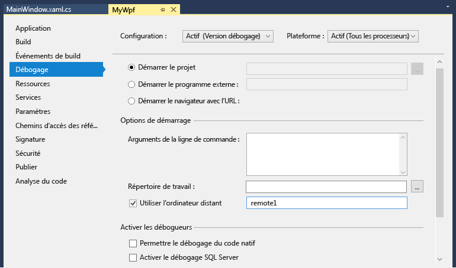

# Débogage d’un projet c# ou Visual Basic dans Visual Studio à distance
Pour déboguer une application Visual Studio qui a été déployée sur un autre ordinateur, installer et exécuter les outils à distance sur l’ordinateur où vous avez déployé votre application, configurez votre projet pour vous connecter à l’ordinateur distant à partir de Visual Studio, puis exécutez votre application.

  
Pour plus d’informations sur le débogage des applications Windows universelle (UWP) à distance, consultez [déboguer un Package d’application installé](debug-installed-app-package.md).

## Configuration requise

Le débogueur distant est pris en charge sur Windows 7 et versions ultérieures (pas de téléphone) et les versions de Windows Server depuis Windows Server 2008 Service Pack 2. Pour obtenir une liste complète des conditions requises, consultez [exigences](../debugger/remote-debugging.md#requirements_msvsmon).

> [!NOTE]
> Débogage entre deux ordinateurs connectés via un proxy n’est pas pris en charge. Débogage sur une latence élevée ou d’une connexion à faible bande passante, telles que les connexions à distance d’Internet, ou via Internet entre des pays n’est pas recommandé et peut échouer ou être trop faibles.
  
## Téléchargez et installez les outils à distance

[!INCLUDE [remote-debugger-download](../debugger/includes/remote-debugger-download.md)]

> [!TIP]
> Dans certains scénarios, il peut être plus efficace d’exécuter le débogueur distant à partir d’un partage de fichiers. Pour plus d’informations, consultez [exécuter le débogueur distant à partir d’un partage de fichiers](../debugger/remote-debugging.md#fileshare_msvsmon).
  
## Configurer le débogueur distant

[!INCLUDE [remote-debugger-configuration](../debugger/includes/remote-debugger-configuration.md)]

> [!NOTE]
> Si vous devez ajouter des autorisations pour les utilisateurs supplémentaires, modifier le mode d’authentification ou numéro de port pour le débogueur distant, consultez [configurer le débogueur distant](../debugger/remote-debugging.md#configure_msvsmon).
  
## Le projet de débogage distant
Le débogueur ne peut pas déployer d’applications de bureau Visual C# ou Visual Basic sur un ordinateur distant, mais vous pouvez toujours les déboguer à distance comme suit. La procédure suivante suppose que vous souhaitez déboguer sur un ordinateur nommé **MJO-DL**, comme indiqué dans l’illustration ci-dessous.
  
1.  Créez un projet WPF nommé **MyWpf**.  
  
2.  Définissez un point d’arrêt facilement accessible quelque part dans le code.  
  
     Par exemple, vous pouvez définir un point d’arrêt dans un gestionnaire de boutons. Pour ce faire, ouvrez MainWindow.xaml, ajoutez un contrôle bouton à partir de la boîte à outils, puis double-cliquez sur le bouton pour ouvrir son gestionnaire.
  
3.  Dans l’Explorateur de solutions, cliquez sur le projet et choisissez **propriétés**.  
  
4.  Sur le **propriétés** page, choisissez la **déboguer** onglet.  
  
       
  
5.  Assurez-vous que le **répertoire de travail** zone de texte est vide.  
  
6.  Choisissez **utiliser l’ordinateur distant**et le type **MJO-DL:4022** dans la zone de texte. (4022 est le numéro de port indiqué dans la fenêtre du débogueur distant. Le numéro de port incrémente 2 dans chaque version de Visual Studio).
  
7.  Assurez-vous que **activer le débogage de code natif** n’est pas sélectionnée.  
  
8.  Générez le projet.  
  
9. Créez un dossier sur l’ordinateur distant qui est le même chemin que le **déboguer** dossier sur votre ordinateur Visual Studio :  **\<chemin_source > \MyWPF\MyWPF\bin\Debug**.  
  
10. Copiez le fichier exécutable que vous venez de créer à partir de votre ordinateur Visual Studio dans le dossier nouvellement créé sur l’ordinateur distant.
  
    > [!CAUTION]
    >  Ne pas modifier le code ou la reconstruction (ou si vous devez répéter cette étape). Le fichier exécutable que vous avez copié sur l’ordinateur distant doit correspondre exactement à la source et aux symboles locaux.

    Vous pouvez copier le projet manuellement, utilisez Xcopy, Robocopy, Powershell ou autres options.
  
11. Assurez-vous que le débogueur distant est en cours d’exécution sur l’ordinateur cible (si elle n’est pas le cas, recherchez **débogueur distant** dans les **Démarrer** menu). Voici à quoi ressemble la fenêtre du débogueur distant.  
  
       
  
12. Dans Visual Studio, démarrez le débogage (**Déboguer > Démarrer le débogage**, ou **F5**).  
  
13. Si vous y êtes invité, entrez les informations d’identification réseau pour vous connecter à l’ordinateur distant.  
  
     Les informations d’identification requises varient en fonction de la configuration de la sécurité de votre réseau. Par exemple, sur un ordinateur de domaine, vous pouvez entrer votre nom de domaine et le mot de passe. Sur un ordinateur n’appartenant pas au domaine, vous pouvez entrer le nom de l’ordinateur et un nom de compte d’utilisateur valide, tel que  **MJO-DL\name@something.com** , ainsi que le mot de passe correct.

     Vous devez voir que la fenêtre principale de l’application WPF est ouverte sur l’ordinateur distant.
  
14. Si nécessaire, prendre des mesures pour atteindre le point d’arrêt. Il doit être actif. Si elle n’est pas le cas, les symboles de l’application ne l’avez pas chargé. Nouvelle tentative et si cela ne fonctionne pas, obtenir des informations sur le chargement de symboles et comment les résoudre à [paramètres de symboles de présentation des fichiers de symboles et de Visual Studio](http://blogs.msdn.com/b/visualstudioalm/archive/2015/01/05/understanding-symbol-files-and-visual-studio-s-symbol-settings.aspx).
  
15. Sur l’ordinateur Visual Studio, l’exécution doit être arrêtée au point d’arrêt.
  
 Si vous avez des fichiers autres que des fichiers de code qui doivent être utilisés par l’application, vous devez les inclure dans le projet Visual Studio. Créer un dossier de projet pour les fichiers supplémentaires (dans le **l’Explorateur de solutions**, cliquez sur **Ajouter > Nouveau dossier**). Puis ajoutez les fichiers dans le dossier (dans le **l’Explorateur de solutions**, cliquez sur **Ajouter > élément existant**, puis sélectionnez les fichiers). Sur le **propriétés** pour chaque fichier, définissez **copier dans le répertoire de sortie** à **toujours copier**.

## Configurer le débogage avec des symboles distants 

[!INCLUDE [remote-debugger-symbols](../debugger/includes/remote-debugger-symbols.md)]  
  
## Voir aussi  
 [Débogage dans Visual Studio](../debugger/index.md)  
 [Visite guidée des fonctionnalités du débogueur](../debugger/debugger-feature-tour.md)   
 [Configurer le pare-feu Windows pour le débogage distant](../debugger/configure-the-windows-firewall-for-remote-debugging.md)   
 [Affectations de Port du débogueur distant](../debugger/remote-debugger-port-assignments.md)   
 [Débogage distant ASP.NET sur un ordinateur distant IIS](../debugger/remote-debugging-aspnet-on-a-remote-iis-computer.md)  
 [Erreurs et résolution des problèmes du débogage distant](../debugger/remote-debugging-errors-and-troubleshooting.md)