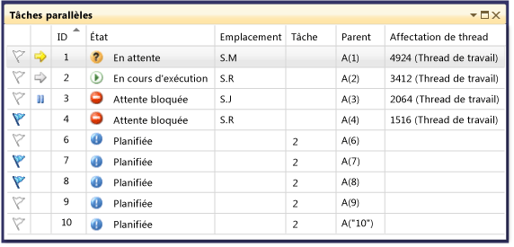
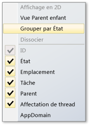
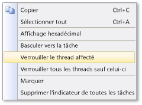

# Utilisation de la fen&#234;tre T&#226;ches
[!INCLUDE[vs2017banner](../code-quality/includes/vs2017banner.md)]

La fenêtre **Tâches** ressemble à la fenêtre **Threads**, excepté qu'elle affiche des informations sur les objets <xref:System.Threading.Tasks.Task?displayProperty=fullName>, [task\_handle](../Topic/task_group%20Class.md) ou [WinJS.Promise](http://msdn.microsoft.com/library/windows/apps/br211867.aspx), et non pas sur chaque thread.  Comme les threads, les tâches représentent des opérations asynchrones qui peuvent s'exécuter simultanément. Toutefois, plusieurs tâches peuvent s'exécuter sur le même thread.  Pour plus d'informations, consultez [Programmation asynchrone dans JavaScript \(Applications du Windows Store\)](http://msdn.microsoft.com/library/windows/apps/hh700330.aspx).  
  
 Le code managé vous permet d'utiliser la fenêtre **Tâches** lorsque vous travaillez avec des objets <xref:System.Threading.Tasks.Task?displayProperty=fullName> ou avec les mots clés **await** et **async** \(**Await** et **Asynchrone** en Visual Basic\).  Pour plus d'informations sur les tâches en code managé, consultez  [Parallel Programming](../Topic/Parallel%20Programming%20in%20the%20.NET%20Framework.md).  
  
 En code natif, vous pouvez utiliser la fenêtre **Tâches** lorsque vous travaillez avec des [groupes de tâches](/visual-cpp/parallel/concrt/task-parallelism-concurrency-runtime), des [algorithmes parallèles](/visual-cpp/parallel/concrt/parallel-algorithms), des [agents asynchrones](/visual-cpp/parallel/concrt/asynchronous-agents) et des [tâches légères](/visual-cpp/parallel/concrt/task-scheduler-concurrency-runtime).  Pour plus d'informations sur les tâches en code natif, consultez [Concurrency Runtime](/visual-cpp/parallel/concrt/concurrency-runtime).  
  
 En JavaScript, vous pouvez utiliser la fenêtre Tâches lorsque vous utilisez le code .then.  
  
 Vous pouvez utiliser la fenêtre **Tâches** chaque fois que l'exécution s'arrête dans le débogueur.  Pour y accéder, cliquez sur **Fenêtres** dans le menu **Déboguer**, puis cliquez sur **Tâches**.  L'illustration suivante présente la fenêtre **Tâches** dans son mode par défaut.  
  
   
  
> [!NOTE]
>  En code managé, <xref:System.Threading.Tasks.Task> qui a un état <xref:System.Threading.Tasks.TaskStatus>, <xref:System.Threading.Tasks.TaskStatus> ou <xref:System.Threading.Tasks.TaskStatus>, ne peut pas s'afficher dans la fenêtre Tâches lorsque les threads managés sont à l'état de veille ou à l'état de jonction.  
  
## Informations sur les colonnes de la fenêtre Tâches  
 Les colonnes de la fenêtre **Tâches** contiennent les informations suivantes.  
  
|Nom de la colonne|Description|  
|-----------------------|-----------------|  
|**Indicateurs**|Affiche les tâches avec indicateur et vous permet d'ajouter un indicateur à une tâche ou d'en supprimer un.|  
|**Icônes**|La flèche jaune indique la tâche actuelle.  La tâche actuelle est la tâche supérieure du thread actuel.   Une flèche blanche indique la tâche d'arrêt, autrement dit, celle qui était actuelle lorsque le débogueur a été appelé.   L'icône de pause indique une tâche gelée par l'utilisateur.  Vous pouvez geler et libérer une tâche en cliquant dessus avec le bouton droit dans la liste.|  
|**ID**|Numéro fourni par le système pour la tâche.  En code natif, il s'agit de l'adresse de la tâche.|  
|**État**|État actuel \(planifié, actif, bloqué, en attente ou terminé\) de la tâche.  Une tâche planifiée est une tâche qui n'a pas encore été exécutée et, par conséquent, qui de possède pas encore une pile d'appels, un thread assigné ou des informations connexes.   Une tâche active est une tâche qui était en train d'exécuter du code avant de s'arrêter dans le débogueur.   Une tâche en attente est une tâche bloquée qui attend le signal d'un événement, la libération d'un verrouillage ou la fin d'une autre tâche.   Une tâche bloquée est une tâche en attente dont le thread est bloqué par un autre thread.   Pointez sur la cellule **État** d'une tâche bloquée ou en attente pour obtenir plus d'informations sur le blocage. **Warning:**  La fenêtre **Tâches** signale les interblocages uniquement pour les tâches bloquées utilisant une primitive de synchronisation prise en charge par le parcours du type d'attente \(WCT\).  Par exemple, pour un objet <xref:System.Threading.Tasks.Task> bloqué qui utilise le WCT, le débogueur signale **Attente bloquée**.  Pour une tâche bloquée gérée par le runtime d'accès concurrentiel qui n'utilise pas Wait Chain Traversal, le débogueur signale **En attente**.  Pour plus d'informations sur WCT, consultez [Wait Chain Traversal](http://msdn.microsoft.com/library/ms681622\(VS.85\).aspx).|  
|**Heure de début**|Heure à laquelle la tâche est devenue active.|  
|**Durée**|Nombre de secondes durant lesquelles la tâche a été active.|  
|**Heure de fin**|Heure à laquelle la tâche s'est terminée.|  
|**Emplacement**|Emplacement actuel dans la pile d'appels de la tâche.  Pointez sur cette cellule pour visualiser l'ensemble de la pile des appels de la tâche.  Les tâches planifiées ne disposent pas de valeur dans cette colonne.|  
|**Tâche**|Méthode initiale et tous les arguments passés à la tâche lorsqu'elle a été créée.|  
|**Parent**|ID de la tâche qui a créé cette tâche.  Si rien n'est indiqué, la tâche n'a aucun parent.  Ceci s'applique uniquement aux programmes gérés.|  
|**Assignation de thread**|ID et nom du thread sur lequel la tâche s'exécute.|  
|**État de retour**|État de la tâche lorsqu'elle est terminée.  Les valeurs d'état de retour sont **Opération réussie**, **Annulé** et **Erreur**.|  
|**AppDomain**|Pour du code managé, domaine d'application dans lequel la tâche s'exécute.|  
|**task\_group**|Pour du code natif, adresse de l'objet [task\_group](../Topic/task_group%20Class.md) qui a planifié la tâche.  Pour les agents asynchrones et les tâches légères, cette colonne a la valeur 0.|  
|Processus|ID du processus que la tâche exécute.|  
|État asynchrone|En matière de code managé, état de la tâche.  Par défaut, cette colonne est masquée.  Pour afficher cette colonne, ouvrez le menu contextuel pour l'une des en\-têtes de colonnes.  Sélectionnez **Colonnes**, **AsyncState**.|  
  
 Vous pouvez ajouter des colonnes à la vue en cliquant avec le bouton droit sur un en\-tête de colonne et en sélectionnant ensuite les colonnes souhaitées.  \(Supprimez des colonnes en effaçant les sélections.\) Vous pouvez également réorganiser les colonnes en les faisant glisser à gauche ou à droite.  Le menu contextuel des colonnes est présenté dans l'illustration suivante.  
  
   
  
## Tri de tâches  
 Pour trier des tâches en fonction des critères de colonne, cliquez sur l'en\-tête d'une colonne.  Par exemple, si vous cliquez sur l'en\-tête de colonne **ID**, vous pouvez trier les tâches en fonction de leur ID : 1, 2, 3, 4, 5, etc.  Pour inverser l'ordre de tri, cliquez à nouveau sur l'en\-tête de la colonne.  La colonne et l'ordre de tri actuels sont indiqués par une flèche dans la colonne.  
  
## Regroupement de tâches  
 Vous pouvez regrouper des tâches en fonction d'une colonne de la vue Liste.  Ainsi, lorsque vous cliquez avec le bouton droit sur l'en\-tête de colonne **État** et que vous cliquez ensuite sur **Grouper par État**, vous pouvez regrouper toutes les tâches possédant le même état.  Par exemple, vous pouvez visualiser rapidement les tâches en attente afin de vous concentrer sur la raison de leur blocage.  Vous pouvez également réduire un groupe qui ne présente pas d'intérêt pour la session de débogage.  De la même manière, vous pouvez regrouper les tâches en fonction des autres colonnes.  Pour ajouter un indicateur à un groupe \(ou en supprimer un\), il suffit de cliquer sur le bouton en regard de l'en\-tête de groupe.  L'illustration suivante présente la fenêtre **Tâches** en mode regroupé.  
  
   
  
## Vue Parent enfant  
 \(cette vue est uniquement disponible pour le code managé\) En cliquant avec le bouton droit sur un en\-tête de colonne et en cliquant ensuite sur **Vue Parent enfant**, vous pouvez transformer la liste de tâches en une vue hiérarchique, au sein de laquelle chaque tâche enfant constitue un sous\-nœud qui peut être affiché ou masqué sous son parent.  L'illustration suivante présente les tâches au sein de la vue parent\-enfant.  
  
   
  
## Ajout d'indicateurs à des tâches  
 Vous pouvez marquer le thread sur lequel une tâche s'exécute en sélectionnant la tâche, puis en choisissant **Marquer** dans le menu contextuel, ou en cliquant sur l'icône d'indicateur dans la première colonne.  Si vous signalez plusieurs tâches, vous pouvez ensuite effectuer un tri sur la colonne d'indicateur pour déplacer toutes les tâches avec indicateur vers le haut afin de pouvoir vous concentrer uniquement sur celles\-ci.  Vous pouvez également utiliser la fenêtre **Piles parallèles** pour afficher uniquement les tâches avec indicateur.  Cela vous permet d'éliminer par filtrage les tâches qui ne vous intéressent pas pour le débogage.  Les indicateurs ne sont pas persistants entre les sessions de débogage.  
  
## Gel et libération des tâches  
 Vous pouvez geler le thread sur lequel une tâche s'exécute en cliquant avec le bouton droit sur la tâche, puis en cliquant sur **Verrouiller le thread affecté**.  \(Si une tâche est déjà gelée, la commande s'intitule **Libérer le thread affecté**.\) Lorsque vous gelez un thread, celui\-ci ne s'exécute pas lorsque vous parcourez le code après le point d'arrêt actuel.  La commande **Verrouiller tous les threads sauf celui\-ci** gèle tous les threads à l'exception de celui qui exécute la tâche.  
  
 L'illustration suivante présente les autres éléments de menu pour chaque tâche.  
  
   
  
## Voir aussi  
 [Principes de base du débogueur](../debugger/debugger-basics.md)   
 [Débogage du code managé](../debugger/debugging-managed-code.md)   
 [Parallel Programming](../Topic/Parallel%20Programming%20in%20the%20.NET%20Framework.md)   
 [Concurrency Runtime](/visual-cpp/parallel/concrt/concurrency-runtime)   
 [Utilisation de la fenêtre Piles parallèles](../debugger/using-the-parallel-stacks-window.md)   
 [Procédure pas à pas : débogage d'une application parallèle](../debugger/walkthrough-debugging-a-parallel-application.md)