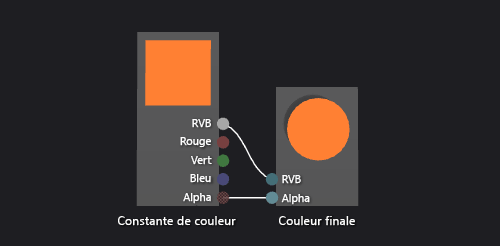

# Comment&#160;: cr&#233;er un nuanceur de couleur de base
[!INCLUDE[vs2017banner](../code-quality/includes/vs2017banner.md)]

Ce document montre comment utiliser le concepteur Shader et le langage DGSL \(Directed Graph Shader Language\) pour créer un nuanceur à deux dimensions de couleur.  Ce nuanceur définit la couleur finale sur une valeur de couleur RVB constante.  
  
 Ce document démontre les activités suivantes :  
  
-   Suppression des nœuds d'un graphique  
  
-   Ajout de nœuds dans un graphique  
  
-   Définition des propriétés du nœud  
  
-   Connexion de nœuds  
  
## Création d'un shader de couleurs à deux dimensions  
 Vous pouvez implémenter un nuanceur de couleur plat en écrivant la valeur de couleur d'une constante de couleur RVB dans la couleur finale de sortie.  
  
 Avant de commencer, assurez\-vous que la fenêtre **Propriétés** et le **Boîte à outils** sont affichés.  
  
#### Pour créer un shader de couleurs à deux dimensions  
  
1.  Créez un nuanceur de DGSL pour utiliser.  Pour plus d'informations sur l'ajout d'un nuanceur de DGSL à votre projet, consultez la section de Mise en route dans [Concepteur Shader](../designers/shader-designer.md).  
  
2.  Supprimez le nœud **Couleur du point**.  Utilisez l'outil **Sélectionner** pour sélectionner le nœud **Couleur du point**, puis dans la barre de menus, sélectionnez **Modifier**, **Supprimer**.  
  
3.  Ajoutez un nœud **Constante de couleur** au graphique.  Dans **Boîte à outils**, sous **Constantes**, sélectionnez **Constante de couleur** et faites glisser cette option sur l'aire de conception.  
  
4.  Spécifiez une valeur de couleur sur le nœud **Constante de couleur**.  Utilisez l'outil **Sélectionner** pour sélectionner le nœud **Constante de couleur**, puis dans la fenêtre **Propriétés**, dans la propriété **Sortie**, spécifiez une valeur de couleur.  Pour orange, spécifiez la valeur \(1,0, 0,5, 0,2, 1,0\).  
  
5.  Connectez la constante de couleur à la couleur finale.  Pour créer les connexions, déplacez le terminal **RVB** du nœud **Constante de couleur** vers le terminal **RVB** du nœud **Couleur finale**, puis déplacez le terminal **Alpha** du nœud **Constante de couleur** vers le terminal **Alpha** du nœud **Couleur finale**.  Ces connexions définissent la couleur finale sur la constante de couleur définie à l'étape précédente.  
  
 L'illustration suivante montre le graphique de nuanceur terminé et un aperçu du nuanceur appliqué à un cube.  
  
> [!NOTE]
>  Dans l'illustration, une couleur orange a été spécifiée pour mieux illustrer l'effet du nuanceur.  
  
   
  
 Certaines formes peuvent fournir de meilleurs aperçus pour certains nuanceurs.  Pour plus d'informations sur la prévisualisation des nuanceurs dans le concepteur Shader, consultez [Concepteur Shader](../designers/shader-designer.md).  
  
## Voir aussi  
 [Comment : appliquer un nuanceur à un modèle 3D](../designers/how-to-apply-a-shader-to-a-3-d-model.md)   
 [Procédure : exporter un nuanceur](../designers/how-to-export-a-shader.md)   
 [Concepteur Shader](../designers/shader-designer.md)   
 [Nœuds du concepteur Shader](../designers/shader-designer-nodes.md)