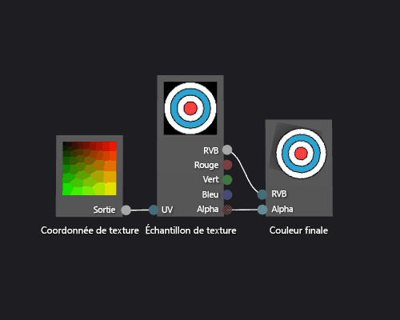

# Proc&#233;dure&#160;: cr&#233;er un nuanceur de texture de base
[!INCLUDE[vs2017banner](../code-quality/includes/vs2017banner.md)]

Ce document montre comment utiliser le concepteur Shader et le langage DGSL \(Directed Graph Shader Language\) pour créer un nuanceur avec une texture simple.  Ce nuanceur définit directement la couleur finale sur RVB et les valeurs alpha qui proviennent de la texture.  
  
 Ce document démontre les activités suivantes :  
  
-   Suppression des nœuds d'un graphique shader  
  
-   Ajout de nœuds dans un graphique  
  
-   Définissez les paramètres de shader  
  
-   Définissez les paramètres de visibilité  
  
-   Connexion de nœuds  
  
## Création d'un nuanceur de texture de base  
 Vous pouvez implémenter un nuanceur de base à une seule texture en écrivant les valeurs alpha et de couleur d'un exemple de texture directement dans la couleur finale de sortie.  
  
 Avant de commencer, assurez\-vous que la fenêtre **Propriétés** et que la **Boîte à outils** sont affichées.  
  
#### Pour créer un nuanceur de texture de base  
  
1.  Créez un shader DGSL à utiliser.  Pour plus d'informations sur l'ajout d'un shader DGSL à votre projet, consultez la section Mise en route dans [Concepteur Shader](../designers/shader-designer.md).  
  
2.  Supprimez le nœud **Couleur du point**.  En mode **Select**, sélectionnez le nœud **Couleur du point**, puis dans la barre de menus, sélectionnez **Modifier**, **Supprimer**.  Le nœud ajouté à l'étape suivante bénéficie ainsi d'un espace supplémentaire.  
  
3.  Ajoutez un nœud **Échantillon de texture** au graphique.  Dans **Boîte à outils**, sous **Texture**, sélectionnez **Échantillon de texture** et faites glisser cette option sur l'aire de conception.  
  
4.  Ajoutez un nœud **Coordonnée de texture** au graphique.  Dans **Boîte à outils**, sous **Texture**, sélectionnez **Coordonnée de texture** et faites glisser cette option sur l'aire de conception.  
  
5.  Choisissez une texture à appliquer.  En mode **Sélectionner**, sélectionnez le nœud **Échantillon de texture**, puis dans la fenêtre **Propriétés**, spécifiez la texture à utiliser en utilisant la propriété **Nom de fichier**.  
  
6.  Rendez la texture accessible publiquement.  Selectionnez le noeud **Echantillon de texture**, puis dans la fenetre **Propriétés**, définissez la propriété **Accès** à **Public**.  Vous pouvez à présent définir la texture à partir d'un autre outil, tel que l'**Éditeur de modèle**.  
  
7.  Connectez les coordonnées de texture à l'exemple de texture.  En mode **Select**, déplacez le terminal **Sortie** du nœud **Coordonnée de texture** vers le terminal **UV** du nœud **Échantillon de texture**.  Cette connexion échantillonne la texture des coordonnées spécifiées.  
  
8.  Connectez l'exemple de texture à la couleur finale.  Déplacez le terminal **RVB** du nœud **Échantillon de texture** vers le terminal **RVB** du nœud **Couleur finale**, puis déplacez le terminal **Alpha** du nœud **Échantillon de texture** vers le terminal **Alpha** du nœud **Couleur finale**.  
  
 L'illustration suivante montre le graphique de nuanceur terminé et un aperçu du nuanceur appliqué à un cube.  
  
> [!NOTE]
>  Dans cette illustration, un plan est utilisé comme forme d'aperçu du shader, et une texture a été spécifiée pour mieux illustrer l'effet du shader.  
  
   
  
 Certaines formes peuvent fournir de meilleurs aperçus pour certains nuanceurs.  Pour plus d'informations sur la prévisualisation des nuanceurs dans le concepteur Shader, consultez [Concepteur Shader](../designers/shader-designer.md).  
  
## Voir aussi  
 [Comment : appliquer un nuanceur à un modèle 3D](../designers/how-to-apply-a-shader-to-a-3-d-model.md)   
 [Éditeur d'images](../designers/image-editor.md)   
 [Concepteur Shader](../designers/shader-designer.md)   
 [Nœuds du concepteur Shader](../designers/shader-designer-nodes.md)