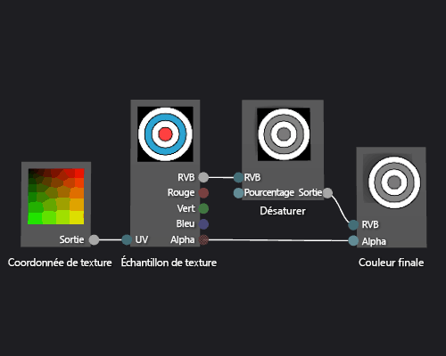

# Comment&#160;: cr&#233;er un nuanceur de texture avec nuances de gris
[!INCLUDE[vs2017banner](../code-quality/includes/vs2017banner.md)]

Ce document montre comment utiliser le concepteur Shader et le langage DGSL \(Directed Graph Shader Language\) pour créer un nuanceur avec une texture avec nuances de gris.  Ce nuanceur modifie la valeur de couleur RVB de l'exemple de texture, puis l'utilise avec la valeur alpha non modifiée pour définir la couleur finale.  
  
## Création d'un shader de texture de niveaux de gris  
 Vous pouvez implémenter un nuanceur de texture en nuances de gris en modifiant la valeur de couleur d'un exemple de texture avant de l'écrire dans la couleur finale de sortie.  
  
 Avant de commencer, assurez\-vous que la fenêtre **Propriétés** et que la **Boîte à outils** sont affichées.  
  
#### Pour créer un shader de texture de niveaux de gris  
  
1.  Créez un shader de texture de base, comme décrit dans [Procédure : créer un nuanceur de texture de base](../designers/how-to-create-a-basic-texture-shader.md).  
  
2.  Déconnectez le terminal **RVB** du nœud **Échantillon de texture** du terminal **RVB** du nœud **Couleur finale**.  En mode **Sélectionner**, choisissez le terminal **RVB** du nœud **Échantillon de texture**, puis choisissez **Rompre les liaisons**.  Le nœud ajouté à l'étape suivante bénéficie ainsi d'un espace supplémentaire.  
  
3.  Ajoutez un nœud **Désaturer** au graphique.  Dans **Boîte à outils**, sous **Filtres**, sélectionnez **Desaturer** et faites glisser cette option sur l'aire de conception.  
  
4.  Calculer la valeur de nuances de gris en utilisant le nœud **Désaturer**.  En mode **Selectionner**, déplacez le terminal **RVB** du nœud **Echantillon de texture** vers le terminal **RVB** du nœud **Desaturer**.  
  
    > [!NOTE]
    >  Par défaut, le noeud**Désaturer** desaturate entièrement la couleur d'entrée, et applique les niveaux de luminance standard pour la conversion en nuances de gris.  Vous pouvez modifier la façon dont le nœud **Désaturer** fonctionne en modifiant la valeur de la propriété **Luminance**, ou en ne désaturant que partiellement la couleur d'entrée.  Pour désaturer partiellement la couleur d'entrée, fournissez une valeur scalaire dans la plage de \[0,1\) au terminal **Pourcentage** du nœud **Désaturer**.  
  
5.  Connectez la valeur de l'échelle de nuances de gris à la couleur finale.  Déplacez le terminal **Sortie** du nœud **Désaturer** vers le terminal **RVB** du nœud **Couleur finale**.  
  
 L'illustration suivante montre le graphique de nuanceur terminé et un aperçu du nuanceur appliqué à un cube.  
  
> [!NOTE]
>  Dans cette illustration, un plan est utilisé comme forme d'aperçu du shader, et une texture a été spécifiée pour mieux illustrer l'effet du shader.  
  
   
  
 Certaines formes peuvent fournir de meilleurs aperçus pour certains nuanceurs.  Pour plus d'informations sur la prévisualisation des nuanceurs dans le concepteur de nuanceurs, consultez [Concepteur Shader](../designers/shader-designer.md).  
  
## Voir aussi  
 [Comment : appliquer un nuanceur à un modèle 3D](../designers/how-to-apply-a-shader-to-a-3-d-model.md)   
 [Procédure : exporter un nuanceur](../designers/how-to-export-a-shader.md)   
 [Éditeur d'images](../designers/image-editor.md)   
 [Concepteur Shader](../designers/shader-designer.md)   
 [Nœuds du concepteur Shader](../designers/shader-designer-nodes.md)