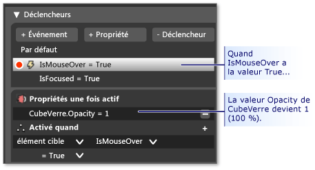

# Insérer des contrôles et modifier leur comportement dans le concepteur XAML

Les contrôles permettent aux utilisateurs d'interagir avec votre application. Elles peuvent s'avérer utiles pour collecter des informations et effectuer des actions, comme animer un objet ou interroger une source de données.

## Ajouter des contrôles à la planche graphique

Vous pouvez faire glisser des contrôles du panneau **Composants** vers la **planche graphique**, puis les modifier dans la fenêtre **Propriétés** .

Ces vidéos vous montrent comment utiliser quelques-uns des contrôles les plus courants.

|Contrôle|Regardez une courte vidéo :|
|-------------|-------------------------|
|`Menu` | [Ajouter les contrôles](https://www.youtube.com/watch?v=ra4AHfgD4Ys&list=PLBDF977B2F1DAB358&index=45)|
|`Button` | [Concevoir un bouton](http://www.popscreen.com/v/6A4gb/Microsoft-Expression-Blend-Designing-a-Button)|
|`Textblock` | [Ajouter des images à un bloc de texte](http://www.popscreen.com/v/6A4du/Microsoft-Expression-Blend-Adding-Images-to-a-TextBlock)|
|`Slider` | [Générer un curseur avec une info-bulle](http://www.bing.com/videos/search?q=slider%20expression%20blend&qs=n&form=QBVR&pq=slider%20expression%20blend&sc=1-23&sp=-1&sk=#view=detail&mid=F1BB7DB91B2772A8CA2AF1BB7DB91B2772A8CA2A)|

### Créer un contrôle à partir d’une image, d’une forme ou d’un tracé

 Vous pouvez transformer n'importe quel objet en contrôle.

 

 Par exemple, imaginez une image de téléviseur au milieu d'une page. Vous pourriez créer des contrôles à partir de petites images représentant des boutons de téléviseur. Les utilisateurs pourraient ensuite cliquer sur ces boutons pour changer de chaîne.

 Cela serait possible, car les boutons seraient dès lors des contrôles. Les contrôles permettent de répondre aux interactions de l'utilisateur (dans ce cas, le clic de l'utilisateur sur un bouton).

 Pour créer un contrôle, sélectionnez un objet. Ensuite, dans le menu **Outils** , cliquez sur **Créer un contrôle**.

## Rendre les contrôles actifs

 Les contrôles peuvent effectuer des actions quand les utilisateurs interagissent avec eux. Par exemple, ils peuvent démarrer une animation, mettre à jour une source de données ou lire une vidéo.

 Pour rendre des contrôles actifs, vous devez utiliser des *déclencheurs*, des *comportements*et des *événements* .

### déclencheurs

 Un *déclencheur* modifie une propriété ou effectue une tâche en réponse à un événement ou à une modification apporté à une autre propriété. Par exemple, vous pouvez faire en sorte qu'un bouton change de couleur quand les utilisateurs le pointent avec la souris.

 

 **Regardez une courte vidéo :**  [Ajouter un déclencheur de propriété](http://www.popscreen.com/v/6A4gO/Microsoft-Expression-Blend-Adding-a-Property-Trigger).

### comportements

 Un *comportement* est un ensemble de code réutilisable. Il permet de faire un peu plus que modifier les propriétés. Il permet d'effectuer certaines actions, comme interroger un service de données. Blend en propose une petite collection, mais vous pouvez en ajouter d'autres. Faites glisser un comportement sur un objet dans la planche graphique, puis personnalisez-le en définissant des propriétés.

 

 **Regardez une courte vidéo :**  [Conseils sur Blend : introduction à l’utilisation des comportements - Partie 1](http://www.bing.com/videos/search?q=Expression%20blend%20behaviors&qs=n&form=QBVR&pq=expression%20blend%20behavior&sc=4-25&sp=-1&sk=#view=detail&mid=CF0DD797ED84DE740904CF0DD797ED84DE740904).

### Événements

 Pour un maximum de souplesse, traitez un *événement*. Vous devrez écrire un peu de code.

 **Regardez une courte vidéo :**  [Ajouter un événement de souris](https://www.youtube.com/watch?v=2PMxAlb-x_E).