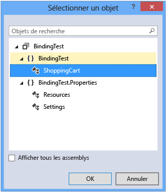
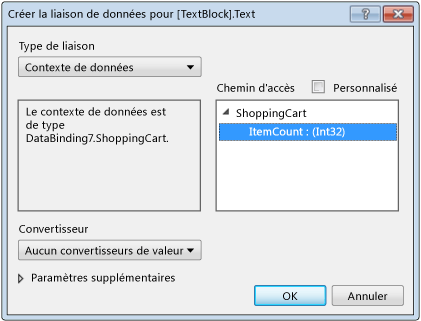

# <a name="walkthrough-bind-to-data-in-xaml-designer"></a>Procédure pas à pas : effectuer une liaison de données dans le concepteur XAML

Dans le concepteur XAML, vous pouvez définir des propriétés de liaison de données à l’aide de la planche graphique et de la fenêtre Propriétés. L'exemple dans cette procédure pas à pas montre comment lier des données à un contrôle. Plus précisément, la procédure pas à pas montre comment créer une classe de panier d’achat simple dotée d’une propriété [DependencyProperty](/uwp/api/Windows.UI.Xaml.DependencyProperty) nommée `ItemCount`, puis lier la propriété `ItemCount` à la propriété **Text** d’un contrôle [TextBlock](/uwp/api/Windows.UI.Xaml.Controls.TextBlock).

## <a name="to-create-a-class-to-use-as-a-data-source"></a>Pour créer une classe à utiliser comme source de données

1. Dans le menu **Fichier**, choisissez **Nouveau**> **Projet**.

1. Dans la boîte de dialogue **Nouveau projet**, choisissez le nœud **Visual C#** ou **Visual Basic**, développez le nœud **Bureau Windows**, puis choisissez le modèle **Application WPF**.

1. Nommez le projet **BindingTest**, puis choisissez le bouton **OK**.

1. Ouvrez le fichier MainWindow.xaml.cs (ou MainWindow.xaml.vb) et ajoutez le code suivant. En C#, ajoutez le code dans l'espace de noms `BindingTest` (avant la dernière parenthèse fermante dans le fichier). En Visual Basic, ajoutez simplement la nouvelle classe.

   ```csharp
   public class ShoppingCart : DependencyObject
   {
       public int ItemCount
       {
           get { return (int)GetValue(ItemCountProperty); }
           set { SetValue(ItemCountProperty, value); }
       }

       public static readonly DependencyProperty ItemCountProperty =
            DependencyProperty.Register("ItemCount", typeof(int),
            typeof(ShoppingCart), new PropertyMetadata(0));
   }
   ```

   ```vb
   Public Class ShoppingCart
       Inherits DependencyObject

       Public Shared ReadOnly ItemCountProperty As DependencyProperty = DependencyProperty.Register(
            "ItemCount", GetType(Integer), GetType(ShoppingCart), New PropertyMetadata(0))
       Public Property ItemCount As Integer
           Get
               ItemCount = CType(GetValue(ItemCountProperty), Integer)
           End Get
           Set(value As Integer)
               SetValue(ItemCountProperty, value)
           End Set
       End Property
   End Class
   ```

   Ce code définit la valeur 0 comme nombre d’éléments par défaut à l’aide de l’objet [PropertyMetadata](/uwp/api/Windows.UI.Xaml.PropertyMetadata).

1. Dans le menu **Fichier**, choisissez **Générer** > **Générer la solution**.

## <a name="to-bind-the-itemcount-property-to-a-textblock-control"></a>Pour lier la propriété ItemCount à un contrôle TextBlock

1. Dans l’Explorateur de solutions, ouvrez le menu contextuel pour MainWindow.xaml, puis choisissez **Concepteur de vues**.

1. Dans la boîte à outils, choisissez un contrôle [Grid](/uwp/api/Windows.UI.Xaml.Controls.Grid) et ajoutez-le au formulaire.

1. Une fois l’élément `Grid` sélectionné, dans la fenêtre Propriétés, choisissez le bouton **Nouveau** situé à côté de la propriété **DataContext**.

1. Dans la boîte de dialogue **Sélectionner un objet**, vérifiez que la case **Afficher tous les assemblys** est décochée, choisissez **ShoppingCart** sous l’espace de noms **BindingTest**, puis le bouton **OK**.

     L’illustration suivante montre la boîte de dialogue **Sélectionner un objet** avec **ShoppingCart** sélectionné.

     

1. Dans la **boîte à outils**, choisissez un contrôle `TextBlock` pour l’ajouter au formulaire.

1. Une fois le contrôle `TextBlock` sélectionné, dans la fenêtre Propriétés, choisissez le marqueur de propriété à droite de la propriété **Text**, puis **Créer une liaison de données**. (Le marqueur de propriété ressemble à une petite zone.)

1. Dans la boîte de dialogue Créer une liaison de données, dans la zone **Chemin d’accès**, choisissez la propriété **ItemCount : (int32)**, puis le bouton **OK**.

     L’illustration suivante montre la boîte de dialogue **Créer une liaison de données** avec la propriété **ItemCount** sélectionnée.

     

1. Appuyez sur **F5** pour exécuter l'application.

     Le contrôle `TextBlock` doit présenter la valeur par défaut 0 sous forme de texte.

## <a name="see-also"></a>Voir aussi

- [Créer une IU à l’aide du concepteur XAML](../designers/creating-a-ui-by-using-xaml-designer-in-visual-studio.md)
- [Boîte de dialogue Ajouter un convertisseur de valeurs](https://msdn.microsoft.com/c5f3d110-a541-4b55-8bca-928f77778af8)