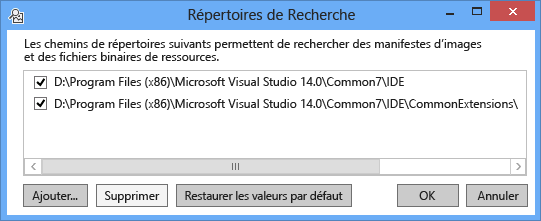
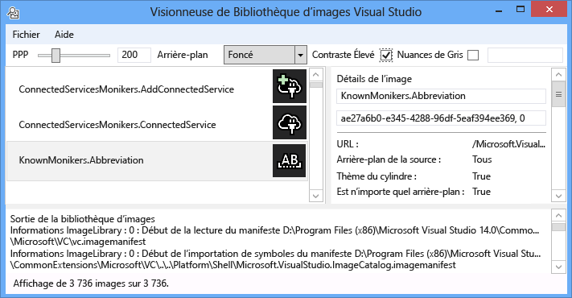
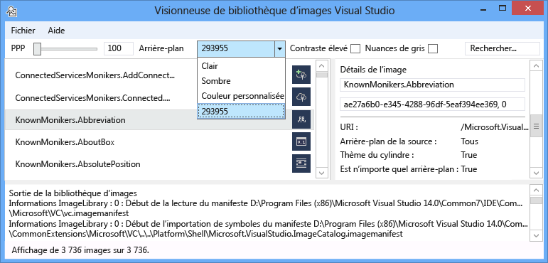
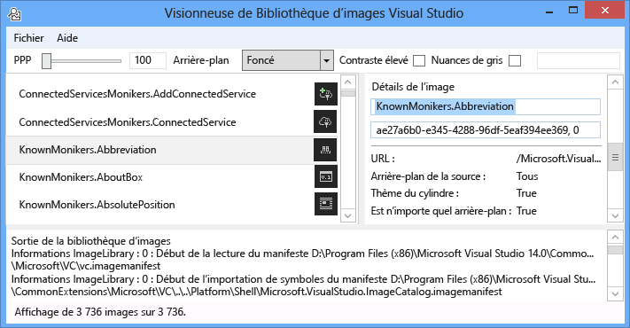
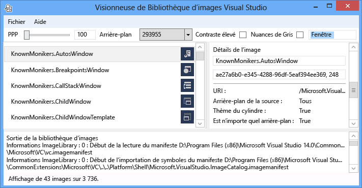
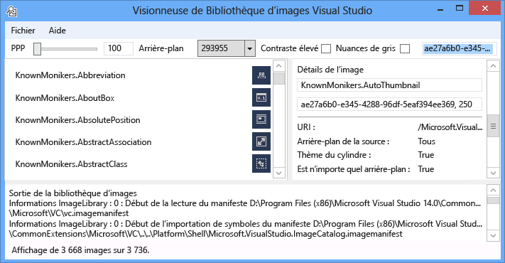
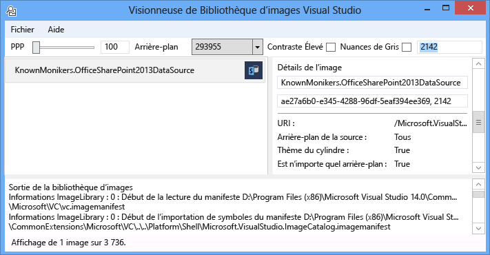

# Visionneuse d’images
[!INCLUDE[vs2017banner](../../code-quality/includes/vs2017banner.md)]

L’outil Visionneuse bibliothèque d’images Visual Studio peut charger et rechercher des manifestes d’image, permettant à l’utilisateur pour les manipuler de la même manière Visual Studio. L’utilisateur peut modifier en arrière-plan, tailles, PPP, contraste élevé et autres paramètres. Également, l’outil affiche des informations de chargement pour chaque manifeste de l’image et affiche les informations de source de chaque image dans le manifeste de l’image. Cet outil est utile pour :  
  
1.  Diagnostic d’erreurs  
  
2.  S’assurer que les attributs sont correctement définies dans les manifestes d’image personnalisée  
  
3.  Recherchez des images dans le catalogue d’images Visual Studio, afin qu’une extension Visual Studio peut utiliser des images qui tiennent le style de Visual Studio  
  
   
  
 **Moniker de l’image**  
  
 Un moniker image (ou le nom abrégé) est une paire de GUID:ID qui identifie de façon unique une ressource ou un composant de liste image dans la bibliothèque d’images.  
  
 **Fichiers manifestes d’image**  
  
 Image manifeste (.imagemanifest) sont des fichiers XML qui définissent un ensemble de composants de l’image, les monikers qui représentent ces actifs et l’image réelle ou des images qui représentent chaque élément multimédia. Manifestes d’image peuvent définir les images autonome ou de listes d’images pour la prise en charge héritée de l’interface utilisateur. En outre, il existe des attributs qui peuvent être définies sur l’élément multimédia ou les images individuelles derrière chaque élément multimédia pour modifier quand et comment ces actifs sont affichés.  
  
 **Schéma du manifeste d’image**  
  
 Un manifeste de l’image complète ressemble à ceci :  
  
```xml  
<ImageManifest>  
      <!-- zero or one Symbols elements -->  
      <Symbols>  
        <!-- zero or more Guid, ID, or String elements -->  
      </Symbols>  
      <!-- zero or one Images elements -->  
      <Images>  
        <!-- zero or more Image elements -->  
      </Images>  
      <!-- zero or one ImageLists elements -->  
      <ImageLists>  
        <!-- zero or more ImageList elements -->  
      </ImageLists>  
</ImageManifest>  
```  
  
 **Symboles**  
  
 Une meilleure lisibilité et la maintenance aider, le manifeste de l’image pouvez utiliser les symboles pour les valeurs d’attribut. Symboles qui sont définis comme suit :  
  
```xml  
<Symbols>  
      <Import Manifest="manifest" />  
      <Guid Name="ShellCommandGuid" Value="8ee4f65d-bab4-4cde-b8e7-ac412abbda8a" />  
      <ID Name="cmdidSaveAll" Value="1000" />  
      <String Name="AssemblyName" Value="Microsoft.VisualStudio.Shell.UI.Internal" />  
</Symbols>  
```  
  
|||  
|-|-|  
|**Sous-élément**|**Définition**|  
|Import|Importe les symboles du fichier manifeste donné pour une utilisation dans le manifeste en cours.|  
|Guid|Le symbole représente un GUID et doit correspondre à la mise en forme de GUID.|  
|ID|Le symbole représente un ID et doit être un entier non négatif.|  
|Chaîne|Le symbole représente une valeur de chaîne arbitraire.|  
  
 Les symboles sont sensibles à la casse et référencé à l’aide de la syntaxe de $(symbol-name) :  
  
```xml  
<Image Guid="$(ShellCommandGuid)" ID="$(cmdidSaveAll)" >  
      <Source Uri="/$(AssemblyName);Component/Resources/image.xaml" />  
</Image>  
```  
  
 Certains symboles sont prédéfinis pour tous les manifestes. Ils peuvent être utilisés dans l’attribut Uri de la \< Source> ou \< Import> élément aux chemins d’accès de référence sur l’ordinateur local.  
  
|||  
|-|-|  
|**Symbole**|**Description**|  
|CommonProgramFiles|La valeur de la variable d’environnement % %CommonProgramFiles|  
|LocalAppData|La valeur de la variable d’environnement % LocalAppData|  
|ManifestFolder|Le dossier contenant le fichier manifeste|  
|Mes documents|Le chemin d’accès complet du dossier Mes Documents de l’utilisateur actuel|  
|ProgramFiles|La valeur de la variable d’environnement % ProgramFiles %|  
|System|Le dossier Windows\System32|  
|WinDir|La valeur de la variable d’environnement % windir%|  
  
 **Image**  
  
 Le \< Image> élément définit une image qui peut être référencée par un moniker. Le GUID et l’ID d’ensemble forment le moniker de l’image. Le moniker de l’image doit être unique dans la bibliothèque de l’intégralité de l’image. Si plus d’une image a un nom donné, le premier lors de la génération de la bibliothèque est celui qui est conservé.  
  
 Il doit contenir au moins une source. Bien que les sources de taille indépendant donnera de meilleurs résultats sur un large éventail de tailles, ils ne sont pas requis. Si le service est demandé pour une image de taille non définie dans le \< Image> élément et il n’existe aucune source indépendante de la taille, le service choisir la meilleure source spécifique à la taille et l’échelle à la taille demandée.  
  
```xml  
<Image Guid="guid" ID="int" AllowColorInversion="true/false">  
      <Source ... />  
      <!-- optional additional Source elements -->  
</Image>  
```  
  
|||  
|-|-|  
|**Attribut**|**Définition**|  
|Guid|[Obligatoire] Le GUID du moniker d’image|  
|ID|[Obligatoire] La partie de l’ID du moniker d’image|  
|AllowColorInversion|[Facultatif, true par défaut] Indique si l’image peut avoir ses couleurs inversées par programme lorsqu’il est utilisé sur un arrière-plan sombre.|  
  
 **Source**  
  
 Le \< Source> élément définit une seule source ressource (XAML et PNG).  
  
```xml  
<Source Uri="uri" Background="background">  
      <!-- optional NativeResource element -->  
 </Source>  
```  
  
|||  
|-|-|  
|**Attribut**|**Définition**|  
|URI|[Obligatoire] URI qui définit où l’image peut être chargée à partir de. Il peut avoir l'une des valeurs suivantes :<br /><br /> -A [URI à EN-TÊTE Pack](http://msdn.microsoft.com/en-US/library/aa970069\(v=vs.100\).aspx) à l’aide de l’application : / / / autorité<br /><br /> -Une référence à une ressource composant absolu<br /><br /> -Un chemin d’accès d’un fichier contenant une ressource native|  
|Présentation|[Facultatif] Indique quel type d’arrière-plan de que la source est destinée à être utilisée.<br /><br /> Il peut avoir l'une des valeurs suivantes :<br /><br /> - *Lumière*: la source peut être utilisée sur un arrière-plan clair.<br /><br /> - *Sombre*: la source peut être utilisée sur un arrière-plan sombre.<br /><br /> - *Contraste élevé*: la source peut être utilisée sur n’importe quel arrière-plan en mode de contraste élevé.<br /><br /> - *HighContrastLight*: la source peut être utilisée sur un arrière-plan clair en mode de contraste élevé.<br /><br /> -*HighContrastDark*: la source peut être utilisée sur un arrière-plan sombre en mode de contraste élevé.<br /><br /> Si le **arrière-plan** attribut est omis, la source peut être utilisée sur n’importe quel arrière-plan.<br /><br /> Si **arrière-plan** est *Light*, *foncé*, *HighContrastLight*, ou *HighContrastDark*, les couleurs de la source ne sont jamais inversés. Si **arrière-plan** est omis ou défini comme *contraste élevé*, l’inversion des couleurs de la source est contrôlée par l’image **AllowColorInversion** attribut.|  
  
 Un \< Source> élément peut avoir un seul des sous-éléments facultatives suivantes :  
  
||||  
|-|-|-|  
|**Élément**|**Attributs (toutes sont requises)**|**Définition**|  
|\< taille>|Valeur|La source est utilisée pour les images de la taille donnée (en unités de périphérique). L’image sera carré.|  
|\< SizeRange>|MinSize, MaxSize|La source servira pour les images à partir de MinSize à MaxSize (en unités de périphérique) (inclus). L’image sera carré.|  
|\< dimensions>|Largeur, hauteur|La source est utilisée pour les images de la largeur donnée et la hauteur (en unités de périphérique).|  
|\< DimensionRange>|MinWidth, MinHeight,<br /><br /> MaxWidth, MaxHeight|La source servira pour les images à partir de la largeur/hauteur minimale de la largeur/hauteur maximale (en unités de périphérique) (inclus).|  
  
 Un \< Source> élément peut également avoir facultatif \< NativeResource> sous-élément qui définit un \< Source> qui est chargé à partir d’un assembly natif plutôt qu’un assembly managé.  
  
```xml  
<NativeResource Type="type" ID="int" />  
```  
  
|||  
|-|-|  
|**Attribut**|**Définition**|  
|Type|[Obligatoire] Le type de la ressource native, XAML ou PNG|  
|ID|[Obligatoire] La partie ID d’entier de la ressource native|  
  
 **ImageList**  
  
 Le \< ImageList> élément définit une collection d’images qui peuvent être retournées dans une seule bande. La bande est basée sur la demande, en fonction des besoins.  
  
```xml  
<ImageList>  
      <ContainedImage Guid="guid" ID="int" External="true/false" />  
      <!-- optional additional ContainedImage elements -->  
 </ImageList>  
```  
  
|||  
|-|-|  
|**Attribut**|**Définition**|  
|Guid|[Obligatoire] Le GUID du moniker d’image|  
|ID|[Obligatoire] La partie de l’ID du moniker d’image|  
|Externe|[Facultatif, false de valeur par défaut] Indique si le moniker image fait référence à une image dans le manifeste en cours.|  
  
 Le moniker de l’image de relation contenant-contenu ne devra pas faire référence à une image définie dans le manifeste en cours. Si l’image de relation contenant-contenu est introuvable dans la bibliothèque d’images, une image d’espace réservé vide sera utilisée à la place.  
  
## <a name="how-to-use-the-tool"></a>L’utilisation de l’outil  
 **Validation d’un manifeste de l’image personnalisée**  
  
 Pour créer un manifeste personnalisé, nous vous recommandons d’utiliser l’outil ManifestFromResources pour générer automatiquement le manifeste. Pour valider le manifeste personnalisé, lancer la visionneuse d’images et sélectionnez Fichier > définir les chemins... Pour ouvrir la boîte de dialogue répertoires de recherche. L’outil utilise les répertoires de recherche pour charger des manifestes de l’image, mais il l’utilisez également les trouver les fichiers .dll qui contiennent les images dans un manifeste, veillez à inclure le manifeste et les répertoires de la DLL dans cette boîte de dialogue.  
  
   
  
 Cliquez sur **Ajouter...** Pour sélectionner les nouveaux répertoires de recherche pour rechercher des manifestes et leurs DLL correspondant. L’outil enregistre ces répertoires de recherche, et il peuvent être activés ou désactivé en activant ou désactivant un répertoire.  
  
 Par défaut, l’outil tente de trouver le répertoire d’installation de Visual Studio et ajoutez ces répertoires à la liste des répertoires. Vous pouvez ajouter manuellement l’outil ne trouve pas de répertoires.  
  
 Une fois que tous les manifestes sont chargés, l’outil peut être utilisé pour basculer vers **en arrière-plan** couleurs, **PPP**, **contraste élevé**, ou **grayscaling** pour les images afin qu’un utilisateur peut inspecter visuellement les composants de l’image pour vérifier qu’ils sont restituées correctement pour les différents paramètres.  
  
   
  
 La couleur d’arrière-plan peut être définie à la lumière, sombre ou une valeur personnalisée. En sélectionnant « Personnalisée » ouvre une boîte de dialogue de sélection de couleur et ajouter une couleur personnalisée au bas de la zone de liste déroulante en arrière-plan pour réutiliser facilement ultérieurement.  
  
   
  
 Moniker d’image affiche les informations pour chaque image derrière ce moniker réel dans le volet de détails de l’Image sur la droite. Le volet permet également aux utilisateurs de copier un moniker par nom ou par valeur de GUID:ID brut.  
  
   
  
 Les informations affichées pour chaque source d’image inclut le type d’arrière-plan pour l’afficher, si elle peut être à thème ou prend en charge le contraste élevé, les tailles est valide pour ou s’il est indépendant de la taille et si l’image provient d’un assembly natif.  
  
   
  
 Lorsque vous validez un manifeste de l’image, nous vous recommandons de déployer le manifeste et l’image de DLL dans leurs emplacements réels. Cette commande vérifie que les chemins d’accès relatifs sont fonctionne correctement et que la bibliothèque d’images peut rechercher et charger le manifeste et l’image de DLL.  
  
 **Recherche de catalogue des images KnownMonikers**  
  
 Pour mieux faire correspondre le style de Visual Studio, une extension Visual Studio peut utiliser des images dans le catalogue des images de Visual Studio, plutôt que la création et l’utilisation de son propre. Cela présente l’avantage de ne pas avoir à gérer ces images et garantit que l’image possède une image haute résolution sauvegarde afin qu’il doit être correct dans tous les paramètres PPP prenant en charge Visual Studio.  
  
 La visionneuse d’images permet un manifeste à rechercher afin qu’un utilisateur peut rechercher le moniker qui représente une ressource d’image et utiliser ce nom dans le code. Pour rechercher des images, entrez le terme de recherche dans la zone de recherche et appuyez sur ENTRÉE. La barre d’état en bas affiche le nombre de correspondances trouvé hors les images totales dans tous les manifestes.  
  
   
  
 Lorsque vous recherchez des monikers d’image dans les manifestes existants, nous recommandons que vous recherchez et utilisez uniquement des monikers le Visual Studio Image du catalogue, autres monikers intentionnellement publiquement accessibles ou votre propre monikers personnalisés. Si vous utilisez des monikers non publics, l’interface Utilisateur personnalisée est peut-être rompu ou ont ses images modifiées de façon inattendue si ou lorsque ces monikers non publics et les images sont modifiés ou mis à jour.  
  
 En outre, il est possible de faire des recherches par GUID. Ce type de recherche est utile pour filtrer la liste à un seul manifeste ou sous-section unique d’un manifeste si ce manifeste contient plusieurs GUID.  
  
   
  
 Enfin, la recherche par ID est possible ainsi.  
  
   
  
## <a name="notes"></a>Notes  
  
-   Par défaut, l’outil va récupérer plusieurs manifestes image présents dans le répertoire d’installation de Visual Studio. Est le seul qui a des monikers utilisable publiquement les **Microsoft.VisualStudio.ImageCatalog** manifeste. GUID : ae27a6b0-e345-4288-96df-5eaf394ee369 (faire **pas** remplacer ce GUID dans un manifeste personnalisé) Type : KnownMonikers  
  
-   L’outil tente de démarrage pour charger tous les manifestes d’image qu’il trouve, il peut prendre quelques secondes pour que l’application s’affiche réellement. Il peut également être lente ou ne répondent pas pendant le chargement des manifestes.  
  
## <a name="sample-output"></a>Résultat de l'exemple  
 Cet outil ne génère pas de sortie.