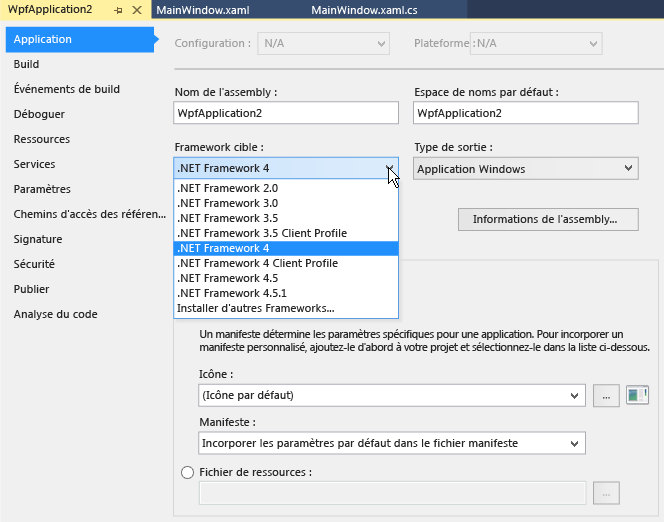

# Comment : cibler une version du .NET Framework

Ce document explique comment cibler une version du .NET Framework quand vous créez un projet, puis comment changer la version ciblée dans un projet Visual Basic, C# ou Visual F# existant.

> [!IMPORTANT]
> Pour plus d’informations sur la façon de modifier la version cible des projets C++, consultez [Guide pratique pour modifier le framework cible et l’ensemble d’outils de la plateforme](/cpp/build/how-to-modify-the-target-framework-and-platform-toolset).

## Ciblage d'une version lorsque vous créez un projet

Lorsque vous créez un projet, la version du .NET Framework que vous ciblez détermine les modèles que vous pouvez utiliser.

### Pour cibler une version lorsque vous créez un projet

1.  Dans la barre de menus, sélectionnez **Fichier**, **Nouveau**, **Projet**.

2.  Dans la liste située en haut de la boîte de dialogue **Nouveau projet**, choisissez la version de .NET Framework que votre projet doit cibler.

3.  Dans la liste des modèles installés, choisissez le type de projet à créer, puis nommez-le et choisissez le bouton **OK**.

    La liste de modèles affiche uniquement les projets qui sont pris en charge par la version du .NET Framework que vous avez choisie.

## Modification de la version cible

Vous pouvez modifier la version ciblée de .NET Framework dans un projet Visual Basic, C# ou Visual F# en suivant cette procédure.

Pour plus d’informations sur la façon de modifier la version cible des projets C++, consultez [Guide pratique pour modifier le framework cible et l’ensemble d’outils de la plateforme](/cpp/build/how-to-modify-the-target-framework-and-platform-toolset).

### Pour modifier la version ciblée

1.  Dans l’**Explorateur de solutions**, ouvrez le menu contextuel du projet que vous souhaitez modifier, puis choisissez **Propriétés**.

    

2. Dans la colonne de gauche de la fenêtre Propriétés, choisissez l’onglet **Application**.

    

    > [!NOTE]
    > Après avoir créé une application UWP, vous ne pouvez pas modifier la version ciblée de Windows ou du .NET Framework.

3.  Dans la liste **Framework cible**, choisissez la version que vous souhaitez.

4.  Dans la boîte de dialogue de vérification qui apparaît, choisissez le bouton **Oui**.

    Le projet est alors déchargé. Lorsqu'il se recharge, il cible la version du . NET Framework que vous venez de choisir.

    > [!NOTE]
    > Si votre code contient des références à une autre version du .NET Framework que celui que vous avez ciblé, des messages d'erreur peuvent s'afficher lorsque vous compilez et exécutez le code. Pour résoudre ces erreurs, vous devez modifier les références. Consultez [Dépannage des erreurs de ciblage du .NET Framework](../msbuild/troubleshooting-dotnet-framework-targeting-errors.md).

## Voir aussi

[Vue d’ensemble du multiciblage Visual Studio](../ide/visual-studio-multi-targeting-overview.md)  
[Dépannage des erreurs de ciblage du .NET Framework](../msbuild/troubleshooting-dotnet-framework-targeting-errors.md)  
[Page Application, Concepteur de projets (C#)](../ide/reference/application-page-project-designer-csharp.md)  
[Page Application, Concepteur de projets (Visual Basic)](../ide/reference/application-page-project-designer-visual-basic.md)  
[Guide pratique pour modifier le framework cible et l’ensemble d’outils de plateforme (C++)](/cpp/build/how-to-modify-the-target-framework-and-platform-toolset)