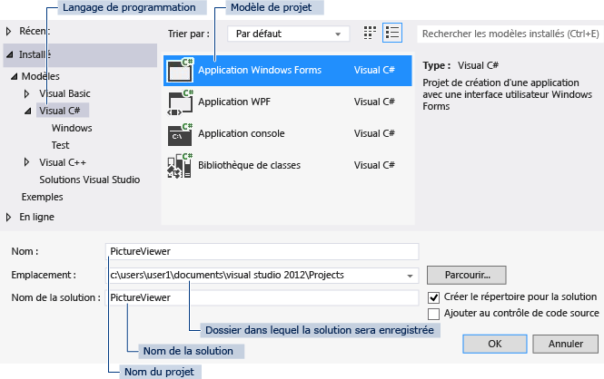
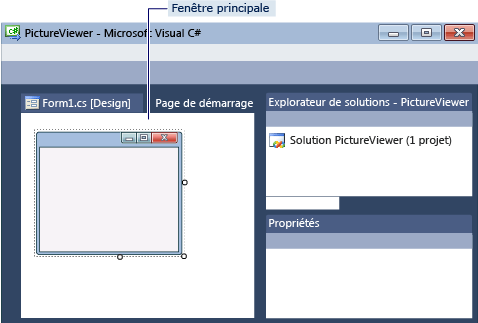

# Étape 1 : créer un projet d'application Windows Forms
Lorsque vous créez une visionneuse d’images, la première étape consiste à créer un projet d’application Windows Forms.

 Pour obtenir une version vidéo de cette rubrique, consultez [Didacticiel 1 : Créer une visionneuse d’images en Visual Basic - Vidéo 1](http://go.microsoft.com/fwlink/?LinkId=205209) ou [Tutoriel 1 : Créer une visionneuse d’images en C# - Vidéo 1](http://go.microsoft.com/fwlink/?LinkId=205199). Ces vidéos utilisent une version antérieure de Visual Studio et présentent donc de légères différences quant à certaines commandes de menu et autres éléments d’interface utilisateur. Toutefois, les concepts et les procédures fonctionnent de façon similaire dans la version actuelle de Visual Studio.

## Pour créer un projet Application Windows Forms

1.  Dans la barre de menus, choisissez **Fichier** > **Nouveau** > **Projet**. La boîte de dialogue doit se présenter comme suit.

     
Boîte de dialogue **Nouveau projet**

2.  Dans la liste **Modèles installés**, choisissez **Visual C#** ou **Visual Basic**.

3.  Dans la liste des modèles, choisissez l’icône **Application Windows Forms**. Nommez le nouveau formulaire **PictureViewer**, puis sélectionnez le bouton **OK**.

     Visual Studio crée une solution pour votre programme. Une solution joue le rôle de conteneur pour tous les projets et fichiers requis par votre programme. Ces termes seront expliqués plus en détail dans les prochaines étapes de ce didacticiel.

4.  L'illustration suivante montre ce que vous devez maintenant voir dans l'interface de Visual Studio.

    > [!NOTE]
    >  Votre disposition de fenêtre peut ne pas se présenter exactement comme dans cette illustration. La disposition exacte de la fenêtre dépend de la version de Visual Studio, du langage de programmation que vous utilisez et d'autres facteurs. Toutefois, vous devez vérifier que les trois fenêtres apparaissent.

     
Fenêtre **IDE**

     L’interface contient trois fenêtres : une fenêtre principale, l’**Explorateur de solutions** et la fenêtre **Propriétés**.

     Si l’une de ces fenêtres est manquante, restaurez la disposition de fenêtre par défaut en sélectionnant dans la barre de menus **Fenêtre** > **Rétablir la disposition de fenêtre**. Vous pouvez également afficher les fenêtres à l'aide des commandes de menu. Dans la barre de menus, choisissez **Affichage** > **Fenêtre Propriétés** ou **Explorateur de solutions**. Si d’autres fenêtres sont ouvertes, fermez-les en choisissant le bouton **Fermer** (x) dans l’angle supérieur droit.

5.  L'illustration montre les fenêtres suivantes (dans le sens des aiguilles d'une montre, à partir de l'angle supérieur gauche) :

    -   **Fenêtre principale** Dans cette fenêtre, vous effectuez la majeure partie de votre travail, notamment l’utilisation des formulaires et la modification du code. Dans l'illustration, la fenêtre affiche un formulaire dans l'**éditeur de formulaires**. En haut de la fenêtre, les onglets **Page de démarrage** et **Form1.cs [Design]** s’affichent. (En Visual Basic, le nom d'un onglet se termine par *.vb* au lieu de *.cs*.)

    -   **Fenêtre Explorateur de solutions** Dans cette fenêtre, vous pouvez afficher tous les éléments de votre solution et y accéder. Si vous sélectionnez un fichier, le contenu de la fenêtre **Propriétés** est modifié. Si vous ouvrez un fichier de code (qui se termine par *.cs* en Visual C# et par *.vb* en Visual Basic), le fichier de code ou un concepteur pour le fichier de code s'affiche. Un concepteur est une surface visuelle à laquelle vous pouvez ajouter des contrôles tels que des boutons et des listes. Pour les formulaires Visual Studio, le concepteur est appelé **Concepteur Windows Forms**.

    -   **Fenêtre Propriétés** Elle vous permet de modifier les propriétés des éléments que vous choisissez dans les autres fenêtres. Par exemple, si vous sélectionnez Form1, vous pouvez modifier son titre en définissant la propriété **Text**, et vous pouvez modifier la couleur d’arrière-plan en définissant la propriété **Backcolor**.

    > [!NOTE]
    >  La première ligne de l’**Explorateur de solutions** affiche **Solution « PictureViewer » (1 projet)**, ce qui signifie que Visual Studio a créé une solution pour vous. Une solution peut contenir plusieurs projets, mais, pour le moment, vous utiliserez des solutions contenant un seul projet.

6.  Dans la barre de menus, sélectionnez **Fichier** > **Enregistrer tout**.

     Vous pouvez aussi sélectionner le bouton **Enregistrer tout**, présenté dans l’illustration suivante, dans la barre d’outils.

     
Bouton de barre d’outils **Enregistrer tout**

     Visual Studio renseigne automatiquement le nom du dossier et le nom du projet, puis crée le projet dans votre dossier de projets.

## Pour continuer ou examiner

-   Pour passer à l’étape suivante du tutoriel, consultez [Étape 2 : exécuter votre programme](../ide/step-2-run-your-program.md).

-   Pour revenir à la rubrique de présentation, consultez [Tutoriel 1 : créer une visionneuse d’images](../ide/tutorial-1-create-a-picture-viewer.md).
