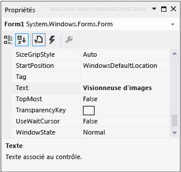

# &#201;tape&#160;3&#160;: d&#233;finir les propri&#233;t&#233;s de votre formulaire
[!INCLUDE[vs2017banner](../code-quality/includes/vs2017banner.md)]

Ensuite, vous utilisez la fenêtre **Propriétés** pour modifier l'apparence de votre formulaire.  
  
  Pour obtenir une version vidéo de cette rubrique, consultez [Didacticiel 1 : Créer une visionneuse d'images en Visual Basic – Vidéo 1](http://go.microsoft.com/fwlink/?LinkId=205209) ou [Didacticiel 1 : Créer une visionneuse d'images en C\# – Vidéo 1](http://go.microsoft.com/fwlink/?LinkId=205199).  Ces vidéos utilisent une version antérieure de Visual Studio et présentent donc de légères différences quant à certaines commandes de menu et autres éléments d'interface utilisateur.  Toutefois, les concepts et les procédures fonctionnent de façon similaire dans la version actuelle de Visual Studio.  
  
### Pour définir les propriétés de votre formulaire  
  
1.  Vérifiez que vous êtes dans le Concepteur Windows Forms.  Dans l'environnement de développement intégré \(IDE\) de Visual Studio, choisissez l'onglet **Form1.cs \[Design\]** \(ou l'onglet **Form1.vb \[Design\]** en Visual Basic\).  
  
2.  Sélectionnez un endroit quelconque du formulaire **Form1** pour le sélectionner.  La fenêtre **Propriétés** doit maintenant afficher les propriétés du formulaire.  Les formulaires ont plusieurs propriétés.  Par exemple, vous pouvez définir la couleur du premier plan et de l'arrière\-plan, le texte du titre qui est affiché en haut du formulaire, les dimensions du formulaire, ainsi que d'autres propriétés.  
  
    > [!NOTE]
    >  Si la fenêtre **Propriétés** ne s'affiche pas, arrêtez votre programme en choisissant le bouton carré **Arrêter le débogage** dans la barre d'outils, ou fermez simplement la fenêtre.  Si le programme est arrêté et si la fenêtre **Propriétés** n'apparaît toujours pas, dans la barre de menus, sélectionnez **Affichage**, **Fenêtre Propriétés**.  
  
3.  Après avoir sélectionné le formulaire, recherchez la propriété **Text** dans la fenêtre **Propriétés**.  Suivant la façon dont la liste est triée, vous devrez peut\-être la faire défiler.  Choisissez **Text**, tapez Visionneuse d'images, puis appuyez sur Entrée.  Le texte **Visionneuse d'images** doit maintenant s'afficher dans la barre de titre de votre formulaire, et la fenêtre **Propriétés** doit ressembler à l'image suivante.  
  
       
Fenêtre Propriétés  
  
    > [!NOTE]
    >  Les propriétés peuvent être classées selon une vue Par catégorie ou Alphabétique.  Vous pouvez passer d'une vue à l'autre à l'aide des boutons de la fenêtre **Propriétés**.  Dans ce didacticiel, il est plus facile de rechercher des propriétés via la vue Alphabétique.  
  
4.  Revenez au Concepteur Windows Forms.  Sélectionnez la poignée de déplacement située dans l'angle inférieur droit du formulaire, c'est\-à\-dire le petit carré blanc présenté ci\-dessous.  
  
       
Poignée de déplacement  
  
     Faites glisser la poignée pour redimensionner le formulaire et le rendre plus large et un peu plus grand.  
  
5.  Examinez la fenêtre **Propriétés**, et notez que la propriété **Size** a été modifiée.  La propriété **Size** change chaque fois que vous redimensionnez le formulaire.  Essayez de faire glisser la poignée du formulaire pour lui donner une taille adaptée à ce projet, soit environ 550, 350 \(l'exactitude n'est pas nécessaire\).  Vous pouvez également entrer les valeurs directement dans la propriété **Size**, puis appuyer sur la touche Entrée.  
  
6.  Exécutez à nouveau votre programme.  Gardez à l'esprit que vous pouvez utiliser n'importe laquelle des méthodes suivantes pour exécuter votre programme.  
  
    -   Appuyez sur la touche **F5**.  
  
    -   Dans la barre de menus, sélectionnez **Débogage**, puis **Démarrer le débogage**.  
  
    -   Dans la barre d'outils, choisissez le bouton **Démarrer le débogage**, qui se présente comme suit.  
  
           
Bouton de barre d'outils Démarrer le débogage  
  
     Comme auparavant, l'IDE génère et exécute votre programme, et une fenêtre s'affiche.  
  
7.  Avant de passer à l'étape suivante, arrêtez votre programme, car l'IDE ne vous autorisera pas à le modifier tant qu'il est en cours d'exécution.  Gardez à l'esprit que vous pouvez utiliser n'importe laquelle des méthodes suivantes pour arrêter votre programme.  
  
    -   Dans la barre d'outils, choisissez le bouton **Arrêter le débogage**.  
  
    -   Dans la barre de menus, choisissez **Débogage**, **Arrêter le débogage**.  
  
    -   Dans l'angle supérieur de la fenêtre **Form1**, choisissez le bouton X.  
  
### Pour continuer ou examiner  
  
-   Pour passer à l'étape suivante du didacticiel, consultez [Étape 4 : composer votre formulaire avec un contrôle TableLayoutPanel](../ide/step-4-lay-out-your-form-with-a-tablelayoutpanel-control.md).  
  
-   Pour revenir à l'étape précédente du didacticiel, consultez [Étape 2 : exécuter votre programme](../ide/step-2-run-your-program.md).