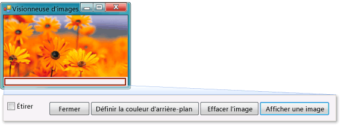

# Didacticiel&#160;1&#160;: cr&#233;er une visionneuse d&#39;images
[!INCLUDE[vs2017banner](../code-quality/includes/vs2017banner.md)]

Dans ce didacticiel, vous générez un programme qui charge une image à partir d'un fichier et l'affiche dans une fenêtre.  Vous apprenez à faire glisser des contrôles \(par exemple, des boutons et des zones d'image\) sur votre formulaire, définir leurs propriétés et utiliser des conteneurs pour redimensionner facilement le formulaire.  Vous commencez également à écrire du code.  Vous apprenez à :  
  
-   Créer un nouveau projet.  
  
-   Tester \(déboguer\) une application.  
  
-   Ajouter des contrôles de base, comme des cases à cocher et des boutons, à un formulaire.  
  
-   Positionner des contrôles sur un formulaire à l'aide de dispositions.  
  
-   Ajouter des boîtes de dialogue **Ouvrir un fichier** et **Couleur** à un formulaire.  
  
-   Écrire du code à l'aide d'IntelliSense et d'extraits de code.  
  
-   Écrire des méthodes de gestionnaire d'événements.  
  
 Lorsque vous aurez terminé, votre programme ressemblera à l'image suivante.  
  
   
Image créée dans ce didacticiel  
  
 Pour télécharger une version complète de l'exemple, consultez [Exemple complet de la visionneuse d'images du didacticiel](http://code.msdn.microsoft.com/Complete-Picture-Viewer-7d91d3a8).  
  
  Pour obtenir une version vidéo de cette rubrique, consultez [Comment créer une visionneuse d'images en Visual Basic](http://go.microsoft.com/fwlink/?LinkId=205207) ou [Comment : créer une visionneuse d'images en C\#](http://go.microsoft.com/fwlink/?LinkId=205198).  
  
> [!NOTE]
>  Ces vidéos utilisent une version antérieure de Visual Studio et présentent donc de légères différences quant à certaines commandes de menu et autres éléments d'interface utilisateur.  Toutefois, les concepts et les procédures fonctionnent de façon similaire dans la version actuelle de Visual Studio.  Visual C\# et Visual Basic sont tous deux traités dans ce didacticiel. Ne tenez compte que des informations spécifiques au langage de programmation que vous utilisez.  
>   
>  Pour consulter le code pour Visual Basic, choisissez l'onglet **VB** en haut des blocs de code. Pour visualiser le code pour Visual C\#, choisissez l'onglet **C\#**.  Si vous voulez en savoir plus sur Visual C\+\+, consultez [Prise en main](../misc/getting-started-with-visual-cpp-in-visual-studio-2015.md) et [Didacticiel du langage C\+\+](http://www.cplusplus.com/doc/tutorial/).  
>   
>  Si vous voulez savoir comment écrire des applications Visual C\# ou Visual Basic pour le Windows Store, consultez [Créer votre première application pour le Windows Store en utilisant C\# ou Visual Basic](http://msdn.microsoft.com/library/windows/apps/hh974581.aspx).  Pour plus d'informations sur la création d'applications JavaScript pour le Windows Store, consultez [Créer votre première application pour le Windows Store en JavaScript](http://msdn.microsoft.com/library/windows/apps/br211385.aspx).  
  
## Rubriques connexes  
  
|Titre|Description|  
|-----------|-----------------|  
|[Étape 1 : créer un projet d'application Windows Forms](../ide/step-1-create-a-windows-forms-application-project.md)|Commencez par créer un projet d'application Windows Forms.|  
|[Étape 2 : exécuter votre programme](../ide/step-2-run-your-program.md)|Exécutez le programme d'application Windows Forms que vous avez créé dans l'étape précédente.|  
|[Étape 3 : définir les propriétés de votre formulaire](../ide/step-3-set-your-form-properties.md)|Modifiez l'apparence de votre formulaire à l'aide de la fenêtre **Propriétés**.|  
|[Étape 4 : composer votre formulaire avec un contrôle TableLayoutPanel](../ide/step-4-lay-out-your-form-with-a-tablelayoutpanel-control.md)|Ajoutez un contrôle `TableLayoutPanel` à votre formulaire.|  
|[Étape 5 : ajouter des contrôles à votre formulaire](../Topic/Step%205:%20Add%20Controls%20to%20Your%20Form.md)|Ajoutez des contrôles \(par exemple, `PictureBox` et `CheckBox`\) à votre formulaire.  Ajoutez des boutons à votre formulaire.|  
|[Étape 6 : affecter un nom à vos contrôles bouton](../ide/step-6-name-your-button-controls.md)|Renommez vos boutons en leur donnant des noms plus explicites.|  
|[Étape 7 : ajouter des composants Dialog à votre formulaire](../ide/step-7-add-dialog-components-to-your-form.md)|Ajoutez un composant **OpenFileDialog** et un composant **ColorDialog** à votre formulaire.|  
|[Étape 8 : écrire du code pour le gestionnaire d'événements du bouton Afficher une image](../ide/step-8-write-code-for-the-show-a-picture-button-event-handler.md)|Écrivez du code à l'aide de l'outil IntelliSense.|  
|[Étape 9 : examiner, commenter et tester votre code](../ide/step-9-review-comment-and-test-your-code.md)|Vérifiez et testez votre code.  Ajoutez autant de commentaires que nécessaire.|  
|[Étape 10 : écrire du code pour les boutons supplémentaires et une case à cocher](../Topic/Step%2010:%20Write%20Code%20for%20Additional%20Buttons%20and%20a%20Check%20Box.md)|Écrivez du code à l'aide d'IntelliSense pour faire fonctionner d'autres boutons et une case à cocher.|  
|[Étape 11 : exécuter votre programme et tester d'autres fonctionnalités](../Topic/Step%2011:%20Run%20Your%20Program%20and%20Try%20Other%20Features.md)|Exécutez votre programme et définissez la couleur d'arrière\-plan.  Essayez d'autres fonctionnalités, telles que la modification des couleurs, des polices et des bordures.|