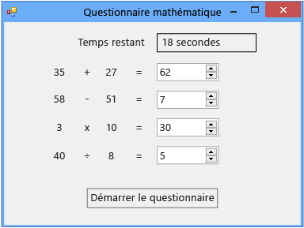

# Didacticiel&#160;2&#160;: cr&#233;er un questionnaire math&#233;matique chronom&#233;tr&#233;
[!INCLUDE[vs2017banner](../code-quality/includes/vs2017banner.md)]

Dans ce didacticiel, vous générez un questionnaire dans lequel la personne interrogée doit résoudre quatre problèmes arithmétiques aléatoires dans un délai imparti.  Vous apprenez à :  
  
-   Générer des nombres aléatoires à l'aide de la classe `Random`.  
  
-   Déclencher des événements à une heure spécifique à l'aide d'un contrôle **Timer**.  
  
-   Contrôler le flux d'un programme à l'aide d'instructions `if else`.  
  
-   Effectuer des opérations arithmétiques de base dans le code.  
  
 Lorsque vous aurez terminé, votre questionnaire ressemblera à celui illustré ci\-dessous, avec des valeurs différentes.  
  
   
Questionnaire créé dans ce didacticiel  
  
 Pour télécharger la version finale du questionnaire, consultez [Exemple complet de questionnaire de mathématiques du didacticiel](http://code.msdn.microsoft.com/Complete-Math-Quiz-8581813c).  
  
> [!NOTE]
>  Ce didacticiel couvre à la fois Visual C\# et Visual Basic : ne tenez compte que des informations spécifiques au langage de programmation que vous utilisez.  
  
## Rubriques connexes  
  
|Titre|Description|  
|-----------|-----------------|  
|[Étape 1 : créer un projet et ajouter des étiquettes à votre formulaire](../ide/step-1-create-a-project-and-add-labels-to-your-form.md)|Commencez par créer le projet, modifier ses propriétés et ajouter des contrôles `Label`.|  
|[Étape 2 : créer un problème d'addition aléatoire](../ide/step-2-create-a-random-addition-problem.md)|Créez un problème d'addition et utilisez la classe `Random` pour générer des nombres aléatoires.|  
|[Étape 3 : ajouter un temporisateur](../Topic/Step%203:%20Add%20a%20Countdown%20Timer.md)|Ajoutez un temporisateur pour que le questionnaire soit chronométré.|  
|[Étape 4 : ajouter la méthode CheckTheAnswer\(\)](../Topic/Step%204:%20Add%20the%20CheckTheAnswer\(\)%20Method.md)|Ajoutez une méthode pour vérifier si la personne interrogée a fourni une réponse correcte au problème.|  
|[Étape 5 : ajouter des gestionnaires d'événements Enter pour les contrôles NumericUpDown](../Topic/Step%205:%20Add%20Enter%20Event%20Handlers%20for%20the%20NumericUpDown%20Controls.md)|Ajoutez des gestionnaires d'événements pour faciliter le déroulement du questionnaire.|  
|[Étape 6 : ajouter un problème de soustraction](../ide/step-6-add-a-subtraction-problem.md)|Ajoutez un problème de soustraction qui génère des nombres aléatoires, utilise le minuteur et recherche les réponses correctes.|  
|[Étape 7 : ajouter des problèmes de multiplication et de division](../Topic/Step%207:%20Add%20Multiplication%20and%20Division%20Problems.md)|Ajoutez des problèmes de multiplication et de division qui génèrent des nombres aléatoires, utilisent le minuteur et recherchent les réponses correctes.|  
|[Étape 8 : Personnaliser le questionnaire](../ide/step-8-customize-the-quiz.md)|Essayez d'autres fonctionnalités, telles que la modification des couleurs et l'ajout d'une aide.|