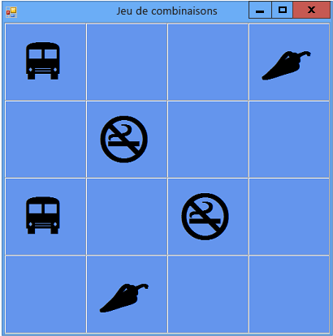

# Didacticiel&#160;3&#160;: cr&#233;er un jeu de combinaisons
[!INCLUDE[vs2017banner](../code-quality/includes/vs2017banner.md)]

Dans ce didacticiel, vous générez un jeu de combinaisons dans lequel le joueur doit associer des paires d'icônes masquées.  Vous apprenez à :  
  
-   stocker des objets, tels que des icônes, dans un objet `List` ;  
  
-   utiliser une boucle `foreach` en Visual C\# ou une boucle `For Each` en Visual Basic pour effectuer des itérations sur les éléments d'une liste ;  
  
-   effectuer le suivi de l'état d'un formulaire à l'aide de variables de référence ;  
  
-   générer un gestionnaire d'événements pour réagir aux événements, que vous pouvez utiliser avec plusieurs objets ;  
  
-   créer un minuteur qui effectue un calcul à rebours, puis déclenche un événement une seule fois après avoir été démarré..  
  
 Lorsque vous aurez terminé ce didacticiel, votre programme aura l'aspect illustré ci\-dessous.  
  
   
Jeu créé dans ce didacticiel  
  
 Pour télécharger une version complète de l'exemple, consultez [Exemple complet du jeu de combinaisons du didacticiel](http://code.msdn.microsoft.com/Complete-Matching-Game-4cffddba).  
  
> [!NOTE]
>  Ce didacticiel aborde Visual C\# et Visual Basic : ne tenez compte que des informations spécifiques au langage de programmation que vous utilisez.  
  
 Si vous êtes bloqué ou avez des questions liées à la programmation, essayez de publier votre question sur l'un des forums MSDN.  Consultez [Forum Visual Basic](http://social.msdn.microsoft.com/Forums/home?forum=vbgeneral) et [Forum Visual C\#](http://social.msdn.microsoft.com/Forums/home?forum=csharpgeneral).  Des ressources vidéo d'apprentissage efficaces et gratuites sont également à votre disposition.  Pour en savoir plus sur la programmation en Visual Basic, consultez [Notions de base de Visual Basic : développement pour les débutants](http://channel9.msdn.com/Series/Visual-Basic-Development-for-Absolute-Beginners).  Pour en savoir plus sur la programmation en C\#, consultez [Notions de base de C\# : développement pour les débutants](http://channel9.msdn.com/Series/C-Sharp-Fundamentals-Development-for-Absolute-Beginners).  
  
## Rubriques connexes  
  
|Titre|Description|  
|-----------|-----------------|  
|[Étape 1 : créer un projet et ajouter une table au formulaire](../ide/step-1-create-a-project-and-add-a-table-to-your-form.md)|Commencez par créer le projet et ajouter un contrôle `TableLayoutPanel` pour maintenir un bon alignement des contrôles.|  
|[Étape 2 : ajouter un objet aléatoire et une liste d'icônes](../ide/step-2-add-a-random-object-and-a-list-of-icons.md)|Ajoutez un objet `Random` et un objet `List` pour créer une liste d'icônes.|  
|[Étape 3 : assigner une icône aléatoire à chaque contrôle Label](../Topic/Step%203:%20Assign%20a%20Random%20Icon%20to%20Each%20Label.md)|Affectez de façon aléatoire les icônes aux contrôles `Label` afin que chaque jeu soit différent.|  
|[Étape 4 : ajouter un gestionnaire d'événements Click à chaque contrôle Label](../Topic/Step%204:%20Add%20a%20Click%20Event%20Handler%20to%20Each%20Label.md)|Ajoutez un gestionnaire d'événements Click pour modifier la couleur du contrôle Label sur lequel clique le joueur.|  
|[Étape 5 : ajouter des références de contrôles Label](../ide/step-5-add-label-references.md)|Ajoutez des variables de référence pour suivre les contrôles Label sur lesquels clique le joueur.|  
|[Étape 6 : ajouter une minuterie](../Topic/Step%206:%20Add%20a%20Timer.md)|Ajoutez une horloge au formulaire pour assurer le suivi du temps écoulé dans le jeu.|  
|[Étape 7 : garder les paires visibles](../Topic/Step%207:%20Keep%20Pairs%20Visible.md)|Laissez des paires d'icônes visibles, si une paire identique est sélectionnée.|  
|[Étape 8 : ajouter une méthode pour vérifier si le joueur a gagné](../ide/step-8-add-a-method-to-verify-whether-the-player-won.md)|Ajoutez une méthode `CheckForWinner()` pour vérifier si le joueur a gagné.|  
|[Étape 9 : tester d'autres fonctionnalités](../ide/step-9-try-other-features.md)|Essayez d'autres fonctionnalités \(par exemple, la modification des icônes et des couleurs, l'ajout d'une grille et l'ajout de sons\).  Essayez d'agrandir le plateau et d'ajuster la minuterie.|