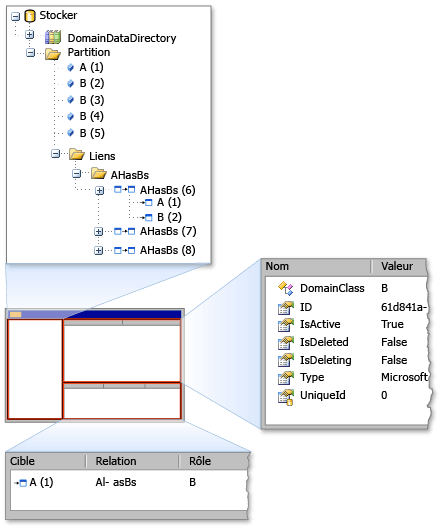

# D&#233;bogage &#224; l&#39;aide de la visionneuse de banque d&#39;information
[!INCLUDE[vs2017banner](../code-quality/includes/vs2017banner.md)]

Avec la visionneuse de le magasin, vous pouvez examiner l'état *d'un magasin* utilisée par [!INCLUDE[dsl](../modeling/includes/dsl_md.md)].  La visionneuse du magasin affiche tous les éléments du modèle de domaine qui sont dans un magasin spécifique, avec des propriétés d'éléments et des liens entre des éléments.  
  
## Ouvrir la visionneuse du magasin  
 Lorsque vous êtes dans la génération expérimentale de [!INCLUDE[vsprvs](../code-quality/includes/vsprvs_md.md)], arrêtez votre code à un point d'arrêt dans laquelle une instance du magasin contient les informations de modèle. Ensuite, ouvrez la visionneuse du magasin en tapant la commande suivante dans la fenêtre d' **Exécution**:  
  
```  
Microsoft.VisualStudio.Modeling.Diagnostics.StoreViewer.Show(mystore);  
```  
  
> [!NOTE]
>  Vous devez remplacer `mystore` par le nom de votre instance de le magasin.  En outre, si vous ajoutez l'espace de noms de votre code, vous pouvez taper la commande pour afficher la visionneuse de le magasin sans espace de noms qualifié complet :  
>   
>  `using Microsoft.VisualStudio.Modeling.Diagnostics;`  
>   
>  `…`  
>   
>  `StoreViewer.Show(mystore);`  
  
 La méthode `Show` a plusieurs surcharges.  Vous pouvez spécifier une instance d'un magasin ou d'une partition comme paramètre.  
  
 Sinon, vous pouvez mettre la ligne de code qui affiche la visionneuse du magasin n'importe où dans votre code où le paramètre que vous passez à la méthode d' `Show` est dans la portée.  Cette action affiche la visionneuse du magasin lorsque la ligne de code s'exécute comme un instantané du contenu du magasin.  
  
### À l'aide de la visionneuse du magasin  
 Lorsque la visionneuse du magasin s'ouvre, une fenêtre non modale Windows Forms s'affiche, comme le montre l'illustration suivante.  
  
   
Visionneuse du magasin  
  
 La visionneuse du magasin a trois volets : le volet gauche, le volet en haut à droite, et en bas à droite le volet.  Le volet gauche est une arborescence des types dans le membre d' `DomainDataDirectory` d'un magasin.  Si vous développez le nœud de partition et cliquez sur un élément, les propriétés de l'élément s'affichent dans le volet supérieure droite.  Si l'élément est lié à d'autres éléments, les éléments supplémentaires s'affichent dans la partie inférieure droite le volet.  Si vous double\-cliquez sur un élément dans la partie inférieure droite le volet, l'élément est mis en surbrillance dans le volet gauche.  
  
## Voir aussi  
 [Navigation et mise à jour d'un modèle dans le code de programme](../modeling/navigating-and-updating-a-model-in-program-code.md)