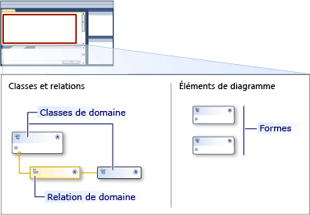

# Vue d'ensemble de l'interface utilisateur des outils de langage spécifique à un domaine
Lorsque vous ouvrez pour la première fois une solution d’outils de langage spécifique à un domaine (outils DSL) dans [!INCLUDE[vsprvs](../code-quality/includes/vsprvs_md.md)], l’interface utilisateur ressemble à l’image suivante.

 

 Le tableau suivant explique comment les parties de l’interface utilisateur sont utilisées.

|**Élément**|**Définition**|
|-----------------|--------------------|
|Diagramme|Le diagramme affiche le modèle de domaine.   Le diagramme comporte deux parties. Côté « un » définit les types d’éléments dans les modèles. L’autre côté définit l’apparaissent de vos modèles à l’écran.|
|Boîte à outils|Faites glisser des outils à partir de la boîte à outils pour ajouter des classes de domaine et la forme de types au diagramme. Pour ajouter des cartes de formes, les connecteurs et les relations, cliquez sur l’outil, puis cliquez sur le nœud source sur le diagramme, puis le nœud cible.|
|explorateur DSL|**Explorateur DSL** s’affiche lorsqu’une définition DSL est la fenêtre active. Il montre la DSL sous forme d’arborescence. Explorateur DSL vous permet de modifier les fonctionnalités du modèle qui ne sont pas affichées sur le diagramme. Par exemple, vous pouvez ajouter des éléments de boîte à outils et basculer sur le processus de validation à l’aide de la **Explorateur DSL**.|
|Fenêtre des détails DSL|Le **détails DSL** fenêtre affiche les propriétés du domaine des éléments du modèle qui vous permettent de contrôler la façon dont les éléments sont affichés, et comment les éléments sont copiés et supprimés.   -Par défaut, le **détails DSL** fenêtre s’affiche en regard du **liste d’erreurs** et **sortie** windows.|

## Le diagramme de modèle de domaine
 Le diagramme de modèle de domaine est divisé en deux parties. Une partie du diagramme indique les éléments et les relations dans le modèle. L’autre côté montre comment le modèle à afficher, ainsi que les formes qui sont utilisées pour afficher les éléments et les propriétés du diagramme de modèle. L’illustration suivante montre les éléments du diagramme.

 

 Le tableau suivant décrit certains des éléments du diagramme de modèle de domaine.

|**Terme**|**Définition**|
|--------------|--------------------|
|Classe de domaine|Classes de domaine sont les types d’éléments dans les modèles.   Une classe de domaine peut apparaître plusieurs fois dans un diagramme, s’il s’agit de la cible de plusieurs relations.   Pour ajouter une classe de domaine, faites glisser l’outil de classe de domaine à partir de la **boîte à outils** à la **Classes et relations** côté du diagramme.|
|Relation de domaine|Relations de domaine sont les types de liens entre des éléments dans les modèles.   Un *imbrication de la relation* indique que l’élément cible est détenu ou figurant dans l’élément source et apparaît sous la forme d’un trait plein. Chaque élément dans un modèle doit être la cible d’une relation d’incorporation, afin que le modèle de forme d’une arborescence. A *relation de référence* indique un lien général entre les éléments de modèle et apparaît sous la forme d’une ligne en pointillé. N’importe quel élément peut avoir n’importe quel nombre de liens de référence.   Créer une relation en cliquant sur l’outil sur le **boîte à outils**, en cliquant sur la classe de domaine source, puis en cliquant sur la classe cible.|
|Formes et connecteurs|Formes spécifient comment les éléments de modèle doivent être affichées sur un diagramme DSL., les connecteurs de spécifient des lignes dans un diagramme DSL qui peut être utilisé pour afficher les relations.   Pour créer une forme ou un connecteur, faites glisser l’outil pour la **des éléments de diagramme** côté du diagramme.|
|Mappages de formes|Une carte de forme apparaît comme une ligne sur le diagramme de modèle de domaine, liaison d’une forme à la classe de domaine qu’il affiche, ou d’un connecteur à la relation de domaine qui s’affiche.|

## Voir aussi

- [Vue d’ensemble des outils de langage spécifique à un domaine](../modeling/overview-of-domain-specific-language-tools.md)
- [Glossaire des outils de langage spécifique à un domaine](http://msdn.microsoft.com/ca5e84cb-a315-465c-be24-76aa3df276aa)
- [Personnalisation et extension d’un langage spécifique à un domaine](../modeling/customizing-and-extending-a-domain-specific-language.md)