# Utiliser des cartes du code pour déboguer vos applications
Les cartes de code peuvent vous éviter de vous perdre dans les bases de code volumineuses, dans du code inconnu ou dans du code hérité. Par exemple, lorsque vous effectuez un débogage, vous devez examiner du code sur de nombreux fichiers et projets. Utilisez des cartes de code pour naviguer parmi les éléments de code et comprendre les relations entre eux. Ainsi, vous n'avez pas à effectuer le suivi de ce code dans votre tête, ni à dessiner un diagramme distinct. Si vous devez interrompre votre travail de codage, les cartes de code vous aident à vous rafraîchir la mémoire concernant le code sur lequel vous travaillez.  
  
   
  
 **Une affiche une flèche verte où votre curseur s’affiche dans l’éditeur**  
  
 Pour plus d’informations des commandes et des actions que vous pouvez utiliser lorsque vous travaillez avec des cartes de code, consultez [Parcourir et réorganiser des cartes de code](../modeling/browse-and-rearrange-code-maps.md).  
  
## Comprendre le problème  
 Supposons qu'il existe un bogue dans un programme de dessin sur lequel vous travaillez. Pour reproduire le bogue, vous ouvrez la solution dans Visual Studio, puis appuyez sur **F5** pour démarrer le débogage.  
  
 Lorsque vous dessinez une ligne et choisissez **annuler mon dernier trait**, rien ne se produit jusqu'à ce que vous dessinez la ligne suivante.  
  
 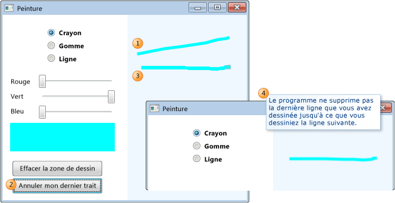  
  
 Vous commencez donc par rechercher la méthode `Undo`. Elle se trouve dans la classe `PaintCanvas`.  
  
 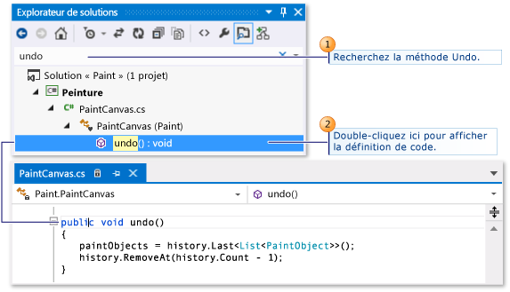  
  
## Commencer à mapper le code  
 Commencez maintenant à mapper la méthode `undo` et ses relations. Dans l'éditeur de code, ajoutez la méthode `undo` et les champs référencés à une nouvelle carte de code. Lorsque vous créez une carte, l'indexation du code peut prendre un certain temps. Cela permet aux opérations ultérieures de s'exécuter plus rapidement.  
  
 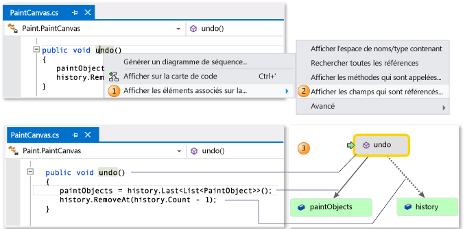  
  
> [!TIP]
>  Le surlignage vert indique les derniers éléments ajoutés à la carte. La flèche verte indique la position de votre curseur dans le code. Les flèches situées entre les éléments représentent différentes relations. Vous pouvez obtenir plus d'informations sur les éléments qui figurent sur la carte en déplaçant la souris dessus et en examinant leurs info-bulles.  
  
 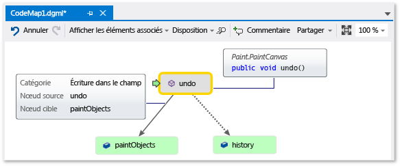  
  
## Naviguer et examiner le code à partir de la carte  
 Pour afficher la définition de code pour chaque champ, double-cliquez sur le champ sur la carte, ou sélectionnez le champ et appuyez sur **F12**. La flèche verte se déplace entre les éléments de la carte. Votre curseur dans l'éditeur de code se déplace également automatiquement.  
  
 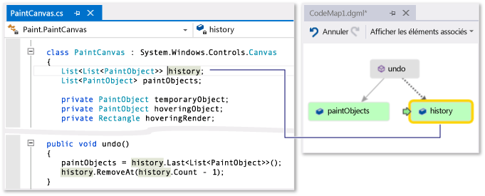  
  
 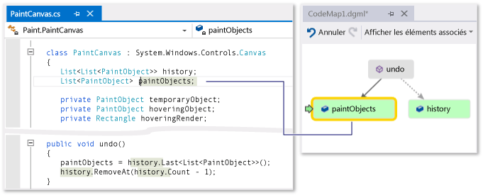  
  
> [!TIP]
>  Vous pouvez également déplacer la flèche verte sur la table en déplaçant le curseur dans l'éditeur de code.  
  
## Comprendre les relations entre les éléments de code  
 Vous souhaitez maintenant déterminer quel autre code interagit avec les champs `history` et `paintObjects`. Vous pouvez ajouter toutes les méthodes qui référencent ces champs à la carte. Vous pouvez le faire à partir de la carte ou à partir de l'éditeur de code.  
  
 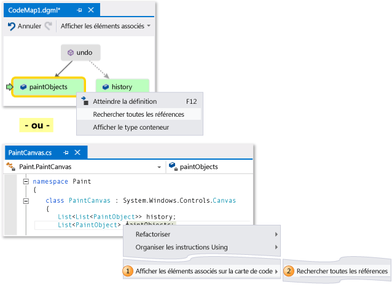  
  
   
  
> [!NOTE]
>  Si vous ajoutez des éléments à partir d'un projet partagé par plusieurs applications, comme Windows Phone ou Windows Store, ces éléments apparaissent toujours avec le projet d'application actif sur la carte. Ainsi, si vous changez de contexte vers un autre projet d'application, le contexte sur la carte change également pour tout élément récemment ajouté à partir du projet partagé. Les opérations que vous effectuez avec un élément de la carte s'appliquent uniquement aux éléments qui partagent le même contexte.  
  
 Modifiez la disposition pour réorganiser le flux des relations et simplifier la lecture de la carte. Vous pouvez également déplacer des éléments sur la carte en les faisant glisser.  
  
 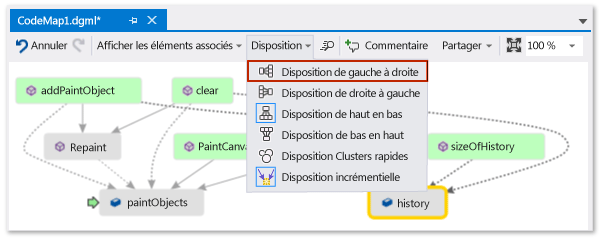  
  
> [!TIP]
>  Par défaut, **disposition incrémentielle** est activée. Ainsi, lorsque vous ajoutez de nouveaux éléments, la carte est réorganisée au minimum. Pour réorganiser l’ensemble de la carte chaque fois que vous ajoutez de nouveaux éléments, désactivez **disposition incrémentielle**.  
  
 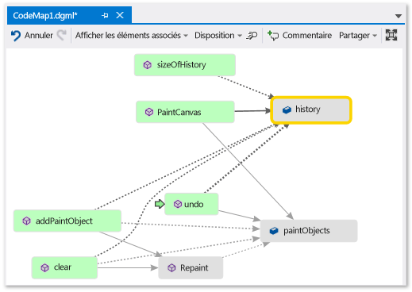  
  
 Examinons ces méthodes. Sur la carte, double-cliquez sur le **PaintCanvas** (méthode), ou sélectionnez cette méthode et la presse **F12**. Vous apprenez que cette méthode crée `history` et `paintObjects` sous forme de listes vides.  
  
   
  
 Répétez maintenant les mêmes étapes pour examiner la définition de la méthode `clear`. Vous apprenez que `clear` effectue des tâches avec `paintObjects` et `history`. Elle appelle ensuite la méthode `Repaint`.  
  
 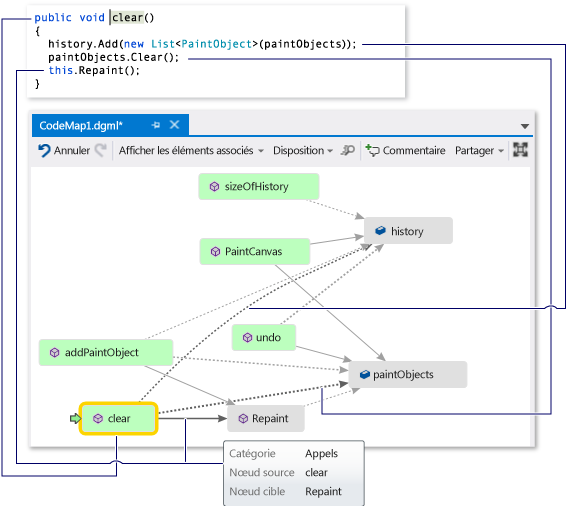  
  
 Examinez maintenant la définition de méthode `addPaintObject`. Elle effectue également quelques tâches avec `history` et `paintObjects`. Elle appelle également `Repaint`.  
  
 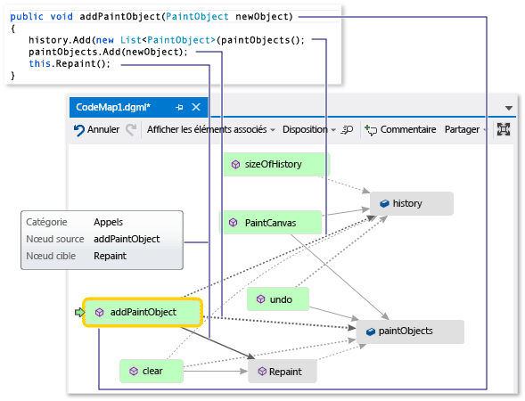  
  
## Rechercher le problème en examinant la carte  
 Il apparaît que toutes les méthodes qui modifient `history` et `paintObjects` appellent `Repaint`. Néanmoins la méthode `undo` n'appelle pas `Repaint`, même si `undo` modifie les mêmes champs. Vous pensez ainsi pouvoir résoudre ce problème en appelant `Repaint` depuis `undo`.  
  
 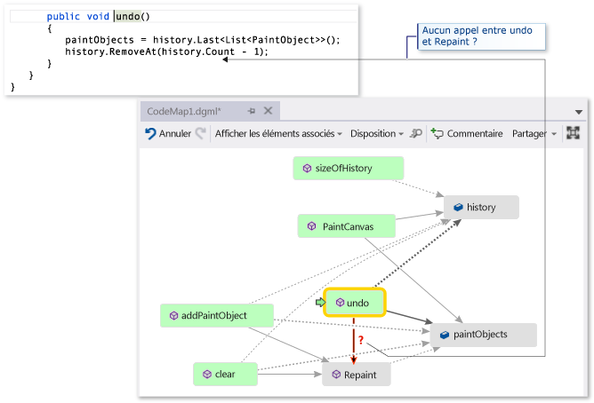  
  
 Si vous n'aviez pas de carte pour indiquer cet appel manquant, il aurait pu être plus difficile de rechercher ce problème, surtout avec un code plus complexe.  
  
## Partager votre découverte et étapes suivantes  
 Avant de corriger ce problème, vous pouvez rédiger des notes sur la carte à propos du problème et de la façon de le résoudre.  
  
 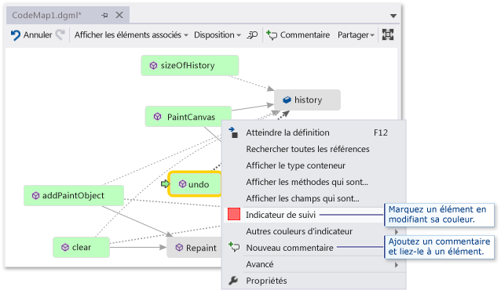  
  
 Par exemple, vous pouvez ajouter des commentaires à la carte et signaler des éléments à l'aide de couleurs.  
  
 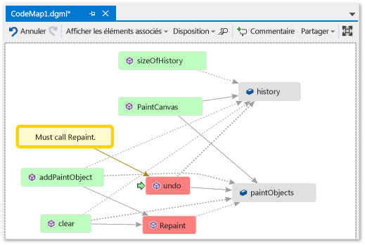  
  
 Si vous avez installé Microsoft Outlook, vous pouvez envoyer la carte à d'autres personnes par courrier électronique. Vous pouvez également exporter la carte en tant qu'image ou dans un autre format.  
  
 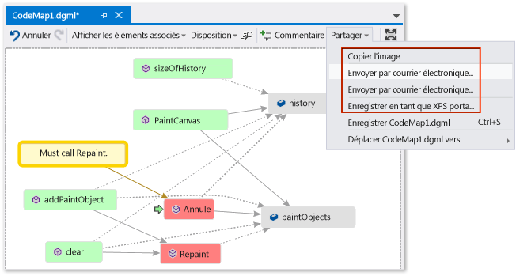  
  
## Corriger le problème et afficher ce que vous avez fait  
 Pour corriger ce bogue, ajoutez l'appel de `Repaint` à `undo`.  
  
 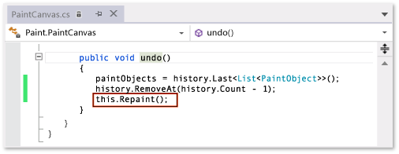  
  
 Pour confirmer votre correction, redémarrez la session de débogage et essayez de reproduire le bogue. Maintenant en choisissant **annuler mon dernier trait** fonctionne comme prévu et confirme que vous avez apportées à la correction appropriée.  
  
 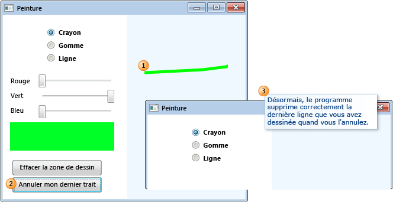  
  
 Vous pouvez mettre à jour la carte pour afficher la correction effectuée.  
  
 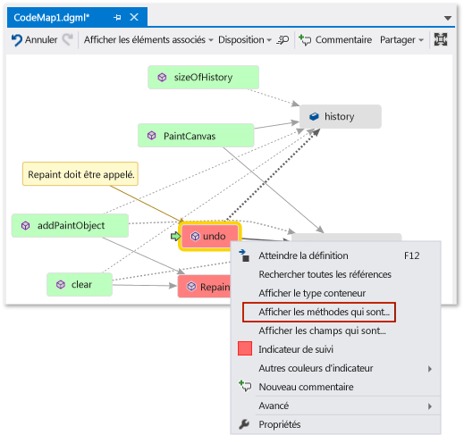  
  
 Votre carte affiche maintenant un lien entre **Annuler** et **repeindre**.  
  
 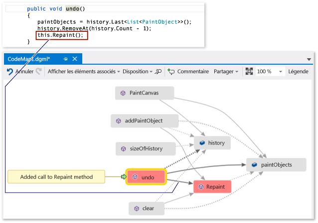  
  
> [!NOTE]
>  Lorsque vous mettez à jour la carte, un message peut s'afficher pour indiquer que l'index de code utilisé pour créer votre carte a été mis à jour. Cela signifie que quelqu'un a modifié le code, ce qui provoque une incompatibilité de votre carte avec le code actuel. Cela ne vous empêche pas de mettre à jour la carte, mais vous devrez peut-être la recréer pour confirmer qu'elle correspond au code.  
  
 Vous avez maintenant terminé votre examen. Vous avez trouvé et résolu avec succès le problème en mappant le code. Vous disposez également d'une carte qui vous permet de naviguer dans le code, de vous souvenir de ce que vous avez appris et d'indiquer les mesures prises pour résoudre le problème.  
  
## Voir aussi  
 [Mapper les méthodes sur la pile des appels pendant le débogage](../debugger/map-methods-on-the-call-stack-while-debugging-in-visual-studio.md)   
 [Visualiser du code](../modeling/visualize-code.md)