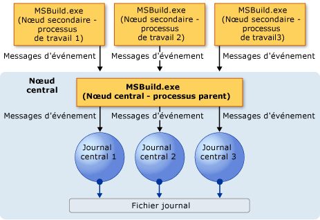
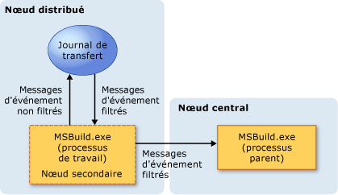

# Writing Multi-Processor-Aware Loggers
[!INCLUDE[vs2017banner](../code-quality/includes/vs2017banner.md)]

La capacité de [!INCLUDE[vstecmsbuild](../extensibility/internals/includes/vstecmsbuild_md.md)] de tirer parti de plusieurs processeurs peut décroître le temps de génération d'un projet, mais il ajoute également de la complexité aux journaux d'événements de build.  Dans un environnement à processeur unique, les événements, messages, avertissements et erreurs arrivent aux journaux de façon prévisible et séquentielle.  Toutefois, dans un environnement  multi\-processeur, les événements de sources différentes peuvent arriver au même instant ou hors séquence.  Pour résoudre ce problème, [!INCLUDE[vstecmsbuild](../extensibility/internals/includes/vstecmsbuild_md.md)] fournit un enregistreur d'événements multiprocesseur et un nouveau modèle de journalisation ; il vous permet par ailleurs de créer des « journaux de transfert » personnalisés.  
  
## Défis de journalisation avec plusieurs processeurs  
 Lors de la génération d'un ou de plusieurs projets sur un système multiprocesseur ou multicœur, les événements de build [!INCLUDE[vstecmsbuild](../extensibility/internals/includes/vstecmsbuild_md.md)] de tous les projets sont générés en même temps.  Une avalanche de messages d'événement peut arriver au journal en même temps ou hors séquence.  Étant donné que l'enregistreur d'événements [!INCLUDE[vstecmsbuild](../extensibility/internals/includes/vstecmsbuild_md.md)] 2.0 n'est pas conçu pour gérer cette situation, il risque d'être surchargé ; par ailleurs, cette situation peut augmenter la durée de la génération, produire des sorties d'enregistreur incorrectes, voire même arrêter la génération.  Pour résoudre ces problèmes, l'enregistreur d'évènements \(qui commence par [!INCLUDE[vstecmsbuild](../extensibility/internals/includes/vstecmsbuild_md.md)] 3.5\) peut traiter des événements hors séquence ou les mettre en corrélation avec leurs sources.  
  
 Vous pouvez améliorer l'efficacité de journalisation en créant un journal de transfert personnalisé.  Un journal de transfert personnalisé agit comme un filtre en vous permettant de choisir, avant de générer, les événements que vous souhaitez surveiller.  Lorsque vous utilisez un journal de transfert personnalisé, les événements non désirés ne peuvent pas saturer vos journaux ou ralentir la génération.  
  
## Modèles de journalisation multi\-processeur  
 Pour résoudre les problèmes liés à la génération dans les environnements multiprocesseurs, [!INCLUDE[vstecmsbuild](../extensibility/internals/includes/vstecmsbuild_md.md)] prend en charge deux modèles de journalisation : le modèle central et le modèle distribué.  
  
### Modèle de journalisation central  
 Dans le modèle de journalisation central, une instance unique MSBuild.exe agit comme « nœud central » et les instances enfants du nœud central \(« nœuds secondaires »\) se joignent au nœud central pour l'aider à effectuer les tâches de génération.  
  
   
  
 Les journaux de divers types qui s'attachent au nœud central sont connus sous le nom de « journaux centraux ». Seule une instance de chaque type de journal peut être attachée au nœud central à un même instant.  
  
 Lorsqu'une génération se produit, les nœuds secondaires routent leurs événements de build au nœud central.  Le nœud central route tous ses événements, et également ceux des nœuds secondaires, à un ou plusieurs des journaux centraux joints.  Les journaux créent ensuite des fichiers journaux basés sur les données entrantes.  
  
 Bien qu'uniquement, <xref:Microsoft.Build.Framework.ILogger> soit requis pour être implémenté par le journal central, nous vous recommandons d'implémenter également <xref:Microsoft.Build.Framework.INodeLogger> afin que le journal central s'initialise avec le nombre des nœuds qui participent à la génération.  La surcharge suivante de la méthode <xref:Microsoft.Build.Framework.ILogger.Initialize%2A> est appelée lorsque le moteur initialise le journal.  
  
```  
public interface INodeLogger: ILogger  
{  
    public void Initialize(IEventSource eventSource, int nodeCount);  
}  
```  
  
 Tout <xref:Microsoft.Build.Framework.ILogger>préexistant \- les journaux basés peuvent agir comme journaux centraux et peuvent se joindre à la génération.  Toutefois, les journaux centraux écrits sans prise en charge explicite des scénarios de journalisation multi\-processeur et des événements désordonnés peuvent arrêter une génération ou produire une sortie sans signification.  
  
### Modèle de journalisation distribué  
 Dans le modèle de journalisation central, un trafic de messages entrants trop important peut accabler le nœud central, par exemple, lorsque de nombreux projets génèrent en même temps.  Cela peut consommer beaucoup de ressources système et diminuer les performance de génération.  Pour limiter ce problème, [!INCLUDE[vstecmsbuild](../extensibility/internals/includes/vstecmsbuild_md.md)] prend en charge un modèle de journalisation distribué.  
  
   
  
 Le modèle de journalisation distribué étend le modèle de journalisation central en vous permettant de créer un journal de transfert.  
  
#### Journaux de transfert  
 Un journal de transfert est un journal secondaire, léger, doté d'un filtre d'événement, attaché à un nœud secondaire. Il reçoit des événements de build entrants de ce nœud.  Il filtre les événements entrants et transfère uniquement ceux que vous destinez au nœud central.  Cela réduit le trafic de messages envoyé au nœud central et améliore la performance de génération.  
  
 Il y a deux façons d'utiliser la journalisation distribuée :  
  
-   Personnalisez le journal de transfert prédéfini nommé <xref:Microsoft.Build.BuildEngine.ConfigurableForwardingLogger>.  
  
-   Écrivez votre propre journal de transfert personnalisé.  
  
 Vous pouvez modifier ConfigurableForwardingLogger pour l'adapter à vos spécifications.  Pour cela, appelez le journal avec la ligne de commande en utilisant MSBuild.exe, et répertoriez les événements de build que vous souhaitez faire envoyer par le journal au nœud central.  
  
 Vous pouvez également créer un journal de transfert personnalisé.  En créant un journal de transfert personnalisé, vous pouvez régler avec précision le comportement du journal.  Toutefois, la création d'un journal de transfert personnalisé est plus complexe que la personnalisation de ConfigurableForwardingLogger.  Pour plus d'informations, consultez [Creating Forwarding Loggers](../msbuild/creating-forwarding-loggers.md).  
  
## Utilisation du ConfigurableForwardingLogger pour la journalisation distribuée simple  
 Pour joindre un ConfigurableForwardingLogger ou un journal de transfert personnalisé, utilisez le commutateur `/distributedlogger` \(`/dl` raccourcis\) dans une génération par ligne de commande MSBuild.exe.  Le format pour spécifier les noms des types de journaux et classes est le même que celui pour le commutateur `/logger`, mais un journal distribué a toujours deux classes d'enregistrement au lieu d'une, le journal de transfert et le journal central.  Les éléments suivants sont un exemple de rattachement de transfert personnalisé nommé XMLForwardingLogger.  
  
```  
msbuild.exe myproj.proj/distributedlogger:XMLCentralLogger,MyLogger,Version=1.0.2,Culture=neutral*XMLForwardingLogger,MyLogger,Version=1.0.2,Culture=neutral  
```  
  
> [!NOTE]
>  Un astérisque \(\*\) doit séparer les deux noms de journaux dans le commutateur `/dl`.  
  
 L'utilisation de ConfigurableForwardingLogger est similaire à celle de tout autre journal \(comme il est esquissé dans [Obtention de journaux de génération](../msbuild/obtaining-build-logs-with-msbuild.md)\), mais vous joignez le journal ConfigurableForwardingLogger au lieu du journal [!INCLUDE[vstecmsbuild](../extensibility/internals/includes/vstecmsbuild_md.md)] typique et vous spécifiez comme paramètre les événements que vous souhaitez que le ConfigurableForwardingLogger passe au nœud central.  
  
 Par exemple, si vous souhaitez être notifié uniquement du démarrage et de la fin de la génération, ainsi que des erreurs éventuelles, vous passeriez `BUILDSTARTEDEVENT`, `BUILDFINISHEDEVENT`et `ERROREVENT` comme paramètres.  Plusieurs paramètres peuvent être passés en les séparant avec les points\-virgules.  Les éléments suivants sont un exemple d'utilisation du ConfigurableForwardingLogger pour transférer uniquement les événements `BUILDSTARTEDEVENT`, `BUILDFINISHEDEVENT`et `ERROREVENT`.  
  
```  
msbuild.exe myproj.proj /distributedlogger:XMLCentralLogger,MyLogger,Version=1.0.2,Culture=neutral*ConfigureableForwardingLogger,C:\My.dll;BUILDSTARTEDEVENT; BUILDFINISHEDEVENT;ERROREVENT  
```  
  
 La liste des paramètres disponibles pour ConfigurableForwardingLogger :  
  
|Paramètres ConfigurableForwardingLogger|  
|---------------------------------------------|  
|BUILDSTARTEDEVENT|  
|BUILDFINISHEDEVENT|  
|PROJECTSTARTEDEVENT|  
|PROJECTFINISHEDEVENT|  
|TARGETSTARTEDEVENT|  
|TARGETFINISHEDEVENT|  
|TASKSTARTEDEVENT|  
|TASKFINISHEDEVENT|  
|ERROREVENT|  
|WARNINGEVENT|  
|HIGHMESSAGEEVENT|  
|NORMALMESSAGEEVENT|  
|LOWMESSAGEEVENT|  
|CUSTOMEVENT|  
|COMMANDLINE|  
|PERFORMANCESUMMARY|  
|NOSUMMARY|  
|SHOWCOMMANDLINE|  
  
## Voir aussi  
 [Creating Forwarding Loggers](../msbuild/creating-forwarding-loggers.md)