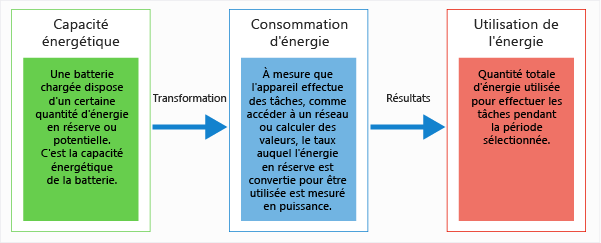
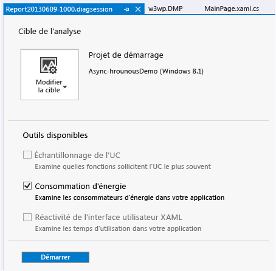
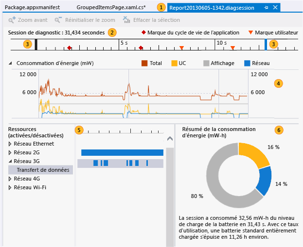
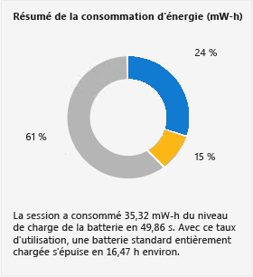

# <a name="analyze-energy-use-in-uwp-apps"></a>Analyser la consommation d’énergie dans les applications UWP
Le profileur **Consommation d’énergie** de Visual Studio vous permet d’analyser la consommation d’électricité et de batterie des applications UWP sur les tablettes de faible puissance qui fonctionnent tout ou partie du temps sur batterie. Sur un périphérique alimenté par batterie, une application trop gourmande en énergie peut entraîner le mécontentement du client, voire, éventuellement, sa désinstallation. L’optimisation de l’utilisation d’énergie peut augmenter la popularité et l’utilisation de votre application par les clients.  
  
##  <a name="BKMK_What_the_Energy_Consumption_tool_is__how_it_works__and_what_it_measures"></a> Présentation du profileur Consommation d'énergie, de son fonctionnement et de ce qu'il mesure  
 Le profileur de consommation d'énergie capture les activités de l'affichage, de l'UC, et des connexions réseau d'un périphérique pendant une session de profilage. Il génère alors des estimations de la puissance utilisée pour ces activités et de l'énergie totale nécessaire à la session de profilage.  
  
> [!NOTE]
>  Le profileur d'énergie estime l'utilisation de puissance et d'énergie à l'aide d'un modèle de logiciel de matériel de périphérique standard de référence, représentatif des tablettes de faible puissance sur lesquelles votre application est susceptible de s'exécuter. Pour obtenir les estimations les plus justes, nous vous recommandons de collecter les données de profil sur une tablette de faible puissance.  
>   
>  Bien que le modèle fournit des estimations correctes pour un grand nombre de périphériques de faible puissance, les valeurs réelles du périphérique profilé seront probablement différentes. Utilisez ces valeurs pour découvrir les activités d'affichage, d'UC et de réseau très coûteuses en énergie par rapport à d'autres utilisations de ressources et que vous pourriez utiliser à des fins d'optimisation.  
  
 Le profileur de consommation d'énergie utilise les définitions de *puissance* et d' *énergie*suivantes :  
  
-   La*puissance* est la mesure de la force utilisée pour effectuer une tâche sur une période donnée. En électricité, l’unité de mesure de la puissance est le *watt*. Un watt correspond à la puissance avec laquelle un ampère de courant parcourt une différence de potentiel électrique d’un volt. Dans le graphique **Consommation d’énergie** , les unités sont affichées en milliwatts ( **mW** ). Un milliwatt représente un millième de watt.  
  
     La puissance étant un taux, elle a une direction (l’intensité peut augmenter ou baisser dans une période donnée) et une vitesse (le volume d’augmentation ou de baisse d’intensité).  
  
-   L'*énergie* mesure la puissance totale, comme une capacité ou un potentiel, telle la capacité de puissance d'une batterie, ou comme la puissance totale consommée au cours d'une période donnée. L'unité d'énergie est le watt-heure, la quantité de puissance d'un watt constamment appliquée à une heure. Dans le **Résumé d'énergie**, les unités sont affichées sous forme de milliwatts heure **mW-h**.  
  
   
  
 Par exemple, la batterie entièrement chargée d'une tablette stocke une certaine quantité d'énergie. Lorsque l'énergie est utilisée pour effectuer des tâches telles que la communication sur un réseau, le calcul de valeurs, ou l'affichage de graphiques, la puissance de la batterie se dissipe à des taux différents. Pour une période définie, le total de puissance consommé est également mesuré en énergie.  
  
##  <a name="BKMK_Identify_scenarios_with_user_marks"></a> Identifier des scénarios avec des marques utilisateur  
 Vous pouvez ajouter des *marques utilisateur* à vos données de profilage pour vous aider à identifier des zones dans la chronologie.  
  
   
  
 La marque apparaît sous la forme d'un triangle orange dans la chronologie lorsque la méthode est exécutée. Le message et l'heure sont affichés sous la forme d'une info-bulle lorsque vous pointez sur la marque. Si plusieurs marques utilisateur sont proches, les marques sont fusionnées et les données de l'info-bulle sont rassemblées. Vous pouvez effectuer un zoom avant sur la chronologie pour dissocier les marques.  
  
 **Ajouter des marques au code C#, Visual Basic, C++**  
  
 Pour ajouter des marques à du code C#, Visual Basic ou C++, créez tout d’abord un objet [Windows.Foundation.Diagnostics LoggingChannel](http://msdn.microsoft.com/library/windows/apps/windows.foundation.diagnostics.loggingchannel.aspx) . Insérez ensuite un appel aux méthodes [LoggingChannel.LogMessage](http://msdn.microsoft.com/library/windows/apps/dn264210.aspx) aux points de votre code que vous souhaitez marquer. Utilisez [LoggingLevel.Information](http://msdn.microsoft.com/library/windows/apps/windows.foundation.diagnostics.logginglevel.aspx) dans les appels.  
  
 Lors de l'exécution de la méthode, une marque utilisateur est ajoutée aux données de profilage accompagnées d'un message.  
  
> [!NOTE]
>  -   Windows.Foundation.Diagnostics LoggingChannel implémente l’interface [Windows.Foundation.IClosable](/uwp/api/windows.foundation.iclosable) interface (projetée comme [System.IDisposable](/dotnet/api/system.idisposable) en C# et Visual Basic). Pour éviter la fuite de ressources du système d’exploitation, appelez [LoggingChannel.Close](/uwp/api/Windows.Foundation.Diagnostics.LoggingChannel) ([Windows.Foundation.Diagnostics.LoggingChannel.Dispose](/uwp/api/Windows.Foundation.Diagnostics.LoggingChannel) en C# et Visual Basic) quand vous avez terminé d’utiliser un canal d’enregistrement.  
> -   Chaque canal d'enregistrement ouvert doit avoir un nom unique. La tentative de création d'un canal d'enregistrement avec un nom identique comme un canal non supprimé entraîne une exception.  
  
 Consultez la page [LoggingSession Sample](http://code.msdn.microsoft.com/windowsapps/LoggingSession-Sample-ccd52336) concernant un exemple du Kit de développement logiciel (SDK) Windows.  
  
 **Ajouter des marques au code JavaScript**  
  
 Pour ajouter des marques utilisateur, ajoutez le code suivant aux points de votre code que vous souhaitez marquer :  
  
```JavaScript  
if (performance && performance.mark) {  
    performance.mark(markDescription);  
}  
```  
  
 *markDescription* est une chaîne contenant le message à afficher dans l'info-bulle de l'utilisateur.  
  
##  <a name="BKMK_Configure_your_environment_for_profiling"></a> Configurer votre environnement pour le profilage  
 Pour obtenir des estimations correctes, effectuez le profilage de l’utilisation d’énergie de l’application sur un appareil de faible puissance alimenté par batterie. Comme Visual Studio ne s’exécute pas sur la plupart de ces appareils, vous devez connecter votre ordinateur Visual Studio à l’appareil à l’aide des Outils de contrôle à distance Visual Studio. Pour se connecter à un appareil distant, vous devez configurer le projet Visual Studio et l'appareil distant. Pour plus d’informations, consultez [Exécuter des applications UWP sur un ordinateur distant](../debugger/run-windows-store-apps-on-a-remote-machine.md).  
  
> [!TIP]
>  -   Nous ne recommandons pas le profilage de l’énergie sur le simulateur UWP ou sur l’ordinateur Visual Studio. Les données collectées lors d'un profilage sur le périphérique réel sont beaucoup plus réalistes.  
> -   Effectuez le profilage sur le périphérique cible alors qu'il est alimenté par batterie.  
> -   Fermez les applications pouvant utiliser les mêmes ressources (réseau, UC, ou affichage).  
  
##  <a name="BKMK_Collect_energy_profile_data_for_your_app"></a> Collecter les données de profil d'énergie de votre application  
  
1.  Dans le menu **Déboguer** , choisissez **Démarrer les diagnostics sans débogage**.  
  
       
  
2.  Choisissez **Consommation d'énergie** puis **Démarrer**.  
  
    > [!NOTE]
    >  Lorsque vous démarrez le profileur de **consommation d'énergie** , une fenêtre **Contrôle de compte d'utilisateur** apparaît, vous demandant l'autorisation d'exécuter VsEtwCollector.exe. Cliquez sur **Oui**.  
  
3.  Exercez votre application à collecter des données.  
  
4.  Pour arrêter le profilage, rebasculez vers Visual Studio (Alt + Tab) et cliquez sur **Arrêter la collecte** sur la page du hub de diagnostic.  
  
       
  
     Visual Studio analyse les données collectées et affiche les résultats.  
  
##  <a name="BKMK_Collect_energy_profile_data_for_an_installed_app"></a> Collecter les données de profil d'énergie d'une application installée  
 L'outil Consommation d'énergie ne peut être exécuté que sur des applications UWP lancées à partir d'une solution Visual Studio ou installées depuis le Microsoft Store. Lorsqu'une solution est ouverte dans Visual Studio, la cible par défaut est le **Projet de démarrage**. Pour cibler une application installée :  
  
1.  Choisissez **Modifier la cible** puis **Application installée**.  
  
2.  Dans la liste **Sélectionner le package d'application installé** , choisissez la cible.  
  
3.  Choisissez **Consommation d'énergie** dans la page du concentrateur de diagnostic.  
  
4.  Choisissez **Démarrer** pour démarrer le profilage.  
  
 Pour arrêter le profilage, rebasculez vers Visual Studio (Alt + Tab) et cliquez sur **Arrêter la collecte** sur la page du hub de diagnostic.  
  
##  <a name="BKMK_Analyze_energy_profile_data"></a> Analyser des données de profil d'énergie  
 Les données de profil d'énergie s'affichent dans la fenêtre de document de Visual Studio :  
  
   
  
|||  
|-|-|  
||Le fichier de rapport est nommé Report*AAAAMMJJ-HHMM*.diagsession. Vous pouvez modifier le nom du rapport si vous décidez de l'enregistrer.|  
||La chronologie indique la durée de la session de profilage, les événements d'activation du cycle de vie de l'application et les marques utilisateur.|  
||Vous pouvez limiter le rapport à une partie de la chronologie en faisant glisser les barres bleues pour sélectionner une zone de la chronologie.|  
||Le graphique **Consommation d'énergie** est un graphique à courbes qui affiche la modification de la puissance de sortie provoquée par une ressource de l'appareil pendant une session de profilage. Le profileur Consommation d'énergie suit l'énergie utilisée par le processeur, l'activité réseau et l'écran.|  
||Le graphique **Ressources (activées/désactivées)**  fournit des détails sur les coûts d'énergie de réseau. La barre **Réseau** représente la durée d'ouverture de la connexion réseau. La barre enfant **Transfert de données** est la durée pendant laquelle l'application a reçu ou envoyé des données via le réseau.|  
||Le **Résumé de la consommation d'énergie** montre le montant proportionnel de l'énergie totale utilisée dans la chronologie sélectionnée par le processeur, l'activité réseau et l'écran.|  
  
 **Pour analyser les données de profil d'énergie**  
  
 Recherchez une zone dans laquelle l'énergie utilisée par une ressource a atteint un pic. Comparez cette zone à la fonctionnalité de votre application. Puis, utilisez les barres de contrôle de chronologie sur la chronologie pour effectuer un zoom avant sur cette zone. Si vous avez le focus sur l'utilisation du réseau, développez le nœud **Réseau** dans le graphique **Ressources (activées/désactivées)**  pour comparer la durée pendant laquelle la connexion est restée ouverte à la durée pendant laquelle l'application a reçu ou transféré des données via la connexion. Réduire la durée d'ouverture inutile du réseau est une forme d'optimisation très efficace.  
  
##  <a name="BKMK_Optimize_energy_use"></a> Optimiser l'utilisation d'énergie  
 Outre la transmission des données, les connexions réseau entraînent des coûts énergétiques pour initialiser, gérer, et arrêter la connexion. Certains réseaux maintiennent la connexion un certain temps après l'envoi ou la réception des données pour permettre la transmission de données supplémentaires sur une connexion unique. Vous pouvez utiliser le volet **Ressources (activées/désactivées)** pour examiner la façon dont votre application interagit avec la connexion.  
  
   
  
 Si les barres **Réseau** et **Transfert de données** indiquent que la connexion est ouverte pendant de longues périodes pour transmettre par intermittence une série de petits paquets de données, vous pouvez traiter les données par lots pour les envoyer en une seule transmission, réduire la durée d'ouverture du réseau et économiser ainsi un coût énergétique.  
  
   
  
 Vous avez moins de contrôle sur les coûts d'énergie de l'écran. La plupart des écrans requièrent davantage d'énergie pour afficher les couleurs claires que les couleurs sombres, l'utilisation d'un arrière-plan foncé est un moyen de réduire ces coûts.  
  
##  <a name="BKMK_Other_resources"></a> Autres ressources  
  
-   Les sections **Gestion de l’état et des coûts de connexion** pour [C#/VB/C++ et XAML](http://msdn.microsoft.com/en-us/0ee0b706-8432-4d49-9801-306ed90764e1) et [JavaScript et HTML](http://msdn.microsoft.com/en-us/372afa6a-1c7c-4657-967d-03a77cd8e933) dans le Centre de développement Windows décrivent les API Windows qui fournissent les informations de connexion réseau que votre application peut utiliser pour réduire le coût du trafic réseau.  
  
     Le simulateur Visual Studio pour les applications UWP vous permet de simuler les propriétés de connexion aux données des API d’informations réseau. Consultez [Exécuter des applications UWP dans le simulateur](../debugger/run-windows-store-apps-in-the-simulator.md)  
  
-   Les outils **Minutage de fonction JavaScript** et **Utilisation de l'UC** peuvent vous aider à réduire la charge processeur quand elle est due à des fonctions inefficaces. Voir [Analyser l’utilisation de l’UC](../profiling/analyze-cpu-usage-in-a-windows-universal-app.md).

## <a name="see-also"></a>Voir aussi
 [Profilage dans Visual Studio](../profiling/index.md)  
 [Visite guidée des fonctionnalités de profilage](../profiling/profiling-feature-tour.md)