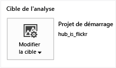
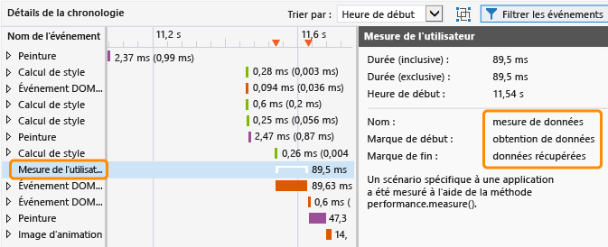
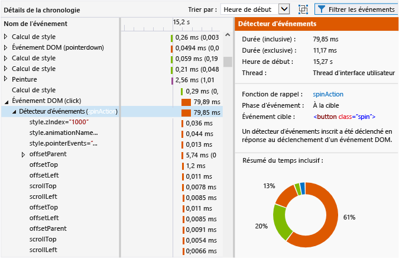
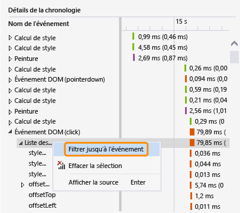
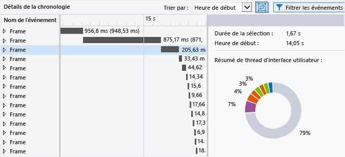

# <a name="analyze-html-ui-responsiveness-in-universal-windows-apps"></a>Analyser la réactivité de l’interface utilisateur HTML dans les applications Windows universelles
Cette rubrique explique comment isoler les problèmes de performances dans vos applications à l’aide du profileur de réactivité de l’interface utilisateur, outil d’analyse des performances disponible pour les applications Windows universelles.  
  
 Le profileur de réactivité de l'interface utilisateur peut aider à isoler certaines problèmes tels que ceux de la réactivité de l'interface utilisateur ou les effets secondaires de plateforme qui se présentent généralement avec les symptômes suivants :  
  
-   L'interface utilisateur manque de réactivité. L'application peut être lente à répondre si le thread d'interface utilisateur se bloque. Les éléments qui peuvent bloquer le thread d'interface utilisateur sont, par exemple, du code JavaScript synchrone excessif, une disposition CSS ou une opération de calcul excessive, des requêtes XHR synchrones, un garbage collection, des durées de peinture excessives ou du code JavaScript sollicitant beaucoup le processeur.  
  
-   Temps de chargement lent pour l'application ou pour une page. Cela est généralement dû à la durée excessive de chargement des ressources.  
  
-   Les mises à jour visuelles qui sont moins fréquentes que prévu. Cela se produit si le thread d'interface utilisateur est trop occupé pour assurer une fréquence d'images lisse. Par exemple, si le thread d'interface utilisateur est occupé, des images peuvent être supprimées. Un travail thread qui n'est pas une interface utilisateur, par exemple les demandes réseau, le décodage d'image et les peintures, peut également limiter la fréquence des mises à jour visuelles. (Les peintures ne sont pas toutes exécutées sur le thread d'interface utilisateur.)  
  
##  <a name="RunningProfiler"></a> Exécuter l’outil de réactivité de l’interface utilisateur HTML  
 Vous pouvez utiliser l’outil Réactivité de l'interface utilisateur HTML lorsque vous avez une application UWP ouverte dans Visual Studio.  
  
1.  Si vous exécutez l’application à partir de Visual Studio, sur la barre d’outils **Standard**, dans la liste **Démarrer le débogage**, choisissez une cible de déploiement, par exemple **Ordinateur local** ou **Appareil**.  
  
2.  Dans le menu **Déboguer** , choisissez **Profileur de performances**.  
  
     Pour modifier la cible d’analyse du profileur, sélectionnez**Modifier la cible**.  
  
       
  
     Les options suivantes sont disponibles pour la cible d'analyse :  
  
    -   **Projet de démarrage**. Sélectionnez cette option pour analyser le projet de démarrage actif. Si vous exécutez l'application sur un ordinateur ou un périphérique distants, vous devez utiliser ce paramètre, qui est la valeur par défaut.  
  
    -   **Application en cours d'exécution**. Choisissez cette option pour sélectionner une application UWP dans la liste des applications en cours d’exécution. Vous ne pouvez pas utiliser cette option lorsque vous exécutez l'application sur un ordinateur ou un périphérique distants.  
  
         Vous pouvez utiliser cette option pour analyser les performances des applications en cours d'exécution sur votre ordinateur lorsque vous n'avez pas accès au code source.  
  
    -   **Application installée**. Sélectionnez cette option pour sélectionner une application installée à analyser. Vous ne pouvez pas utiliser cette option lorsque vous exécutez l'application sur un ordinateur ou un périphérique distants.  
  
         Vous pouvez utiliser cette option pour analyser les performances des applications que vous avez installées sur votre ordinateur lorsque vous n'avez pas accès au code source. Cette option s'avère également utile lorsque vous souhaitez uniquement analyser les performances d'une application, en dehors de votre propre développement d'applications.  
  
3.  Dans **Outils disponibles**, sélectionnez **Réactivité de l'interface utilisateur HTML**, puis sélectionnez **Démarrer**.  
  
4.  Lorsque vous démarrez le profileur de réactivité de l'interface utilisateur, une fenêtre de contrôle de compte d'utilisateur peut vous demander l'autorisation d'exécuter Visual Studio ETW Collector.exe. Cliquez sur **Oui**.  
  
     Interagissez avec l'application pour tester le scénario de performances approprié. Pour obtenir un flux de travail détaillé, voir [Isoler un problème de réactivité de l'interface utilisateur](#Workflow) et [Isolate a visual throughput problem](#IsolateVisualThroughput).  
  
5.  Basculez vers Visual Studio en appuyant sur Alt+Tab.  
  
6.  Pour arrêter le profilage de l'application et afficher les données que le profileur a rassemblées, sélectionnez **Arrêter la collecte**.  
  
##  <a name="IsolateAnIssue"></a> Isoler un problème  
 La section suivante propose des solutions pour vous aider à isoler les problèmes de performances. Pour obtenir une explication pas à pas de l’identification et de la correction des problèmes de performances à l’aide d’un exemple d’application de test de performances, consultez [Procédure pas à pas : amélioration de la réactivité de l’interface utilisateur (HTML)](../profiling/walkthrough-improving-ui-responsiveness-html.md).  
  
###  <a name="Workflow"></a> Isoler un problème de réactivité de l’interface utilisateur  
 La procédure suivante constitue une proposition de flux de travail qui peut vous aider à utiliser le profileur de réactivité de l'interface utilisateur plus efficacement :  
  
1.  Ouvrez votre application dans Visual Studio.  
  
2.  Testez votre application afin d'identifier les problèmes de réactivité de l'interface utilisateur. (Appuyez sur Ctrl+F5 pour démarrer votre application sans débogage.)  
  
     Si vous identifiez un problème, continuez à tester pour essayer de limiter la période pendant laquelle le problème survient ou tenter d'identifier les éléments déclencheurs.  
  
3.  Basculez à nouveau vers Visual Studio (appuyez sur Alt+Tab) et arrêtez votre application (Maj+F5).  
  
4.  Le cas échéant, vous pouvez ajouter des marques utilisateur à votre code à l'aide de [Marquer du code pour l'analyser](#ProfileMark).  
  
    > [!TIP]
    >  Les marques utilisateur peuvent vous aider à identifier le problème de réactivité lorsque vous affichez les données du profileur. Vous pouvez, par exemple, ajouter une marque utilisateur au début et à la fin d'une section de code qui provoque un problème de réactivité.  
  
5.  Exécutez le profileur de réactivité de l'interface utilisateur en suivant les instructions de la section précédente.  
  
6.  Mettez l'application à l'état provoquant un problème de réactivité de l'interface utilisateur.  
  
7.  Basculez vers Visual Studio (appuyez sur Alt+Tab) et sélectionnez **Arrêter la collecte** dans l'onglet Profileur du profileur de réactivité de l'interface utilisateur.  
  
8.  Si vous avez ajouté des marques utilisateur, elles s'afficheront dans la [Visualiser la chronologie de la session de diagnostic](#Ruler) du profileur. L'illustration suivante montre une marque utilisateur unique utilisée pour spécifier une opération spécifique dans votre code.  
  
       
  
9. Identifiez une zone d'intérêt dans la chronologie et dans les graphiques du profileur à l'aide des marques utilisateur, des événements du cycle de vie de l'application ou des données visibles dans les graphiques. Voici quelques indications pour vous aider à analyser et utiliser les données dans les graphiques :  
  
    -   Utilisez la [Visualiser la chronologie de la session de diagnostic](#Ruler) pour afficher les [Marquer du code pour l'analyser](#ProfileMark), les événements du cycle de vie de l'application et la chronologie associée pour ces événements, ainsi que la chronologie des données dans les autres graphiques.  
  
    -   Utilisez le [CPU utilization graph](#CPUutilization) pour afficher les informations générales sur l'activité du processeur et le type de travail géré au cours d'une période spécifique. Les périodes d'activité excessive du processeur sont plus susceptibles d'entraîner des problèmes de réactivité et la suppression d'images.  
  
    -   Si vous développez un jeu ou une application multimédia élaborée, utilisez le [Visualiser le débit visuel (i/s)](#VisualThroughput) pour identifier les périodes durant lesquelles la fréquence d'images a été supprimée.  
  
10. Sélectionnez la zone d'intérêt dans l'un des graphiques en cliquant sur une partie du graphique et en faisant glisser le pointeur pour effectuer une sélection (ou en utilisant la touche Tab ou les flèches). Lorsque vous sélectionnez une période en effectuant une sélection, le graphique des détails de chronologie dans le volet inférieur du profileur change pour n'afficher que la période sélectionnée.  
  
     L'illustration suivante montre le graphique d'utilisation de l'UC. Une zone d'intérêt est mise en surbrillance.  
  
       
  
11. Utilisez la [Visualiser les détails de la chronologie](#TimelineDetails) pour obtenir des informations détaillées sur les événements qui s'exécutent trop souvent ou qui durent trop longtemps. Recherchez par exemple les éléments suivants :  
  
    -   Écouteurs d'événements, minuteries et rappels d'image d'animation. Selon l'événement spécifique, les données fournies peuvent inclure l'ID des éléments DOM modifiés, le nom des propriétés CSS modifiées, un lien vers l'emplacement de la source, et le nom de l'événement associé ou de la fonction de rappel.  
  
    -   Disposition ou événements de script qui ont provoqué des éléments de rendu, tels que des appels à `window.getComputedStyles`. L'élément DOM associé pour l'événement est fourni.  
  
    -   Pages ou ressources URL chargées par l'application, telles que des évaluations de script pour des événements d'analyse de code HTML. Le nom du fichier ou la ressource est fourni.  
  
    -   Autres événements spécifiés dans [Profiler event reference](#ProfilerEvents).  
  
    > [!TIP]
    >  La plupart des informations utiles dans le profileur sont affichées dans le graphique des détails de chronologie.  
  
12. Lorsqu'une zone est sélectionnée dans le graphique d'utilisation de l'UC ou de débit visuel (en i/s), sélectionnez **Zoom avant** (via le bouton ou le menu contextuel) pour plus d'informations. La chronologie correspondant au graphique change et n'affiche que la période sélectionnée.  
  
13. Une fois le zoom avant effectué, sélectionnez une partie du graphique de l'utilisation de l'UC ou du graphique visuel de débit. Lorsque vous effectuez une sélection, le graphique des détails de chronologie dans le volet inférieur du profileur change pour n'afficher que la période sélectionnée.  
  
###  <a name="IsolateVisualThroughput"></a> Isolate a visual throughput problem  
 Les périodes d'utilisation excessive de l'UC peuvent entraîner des fréquences d'images faibles ou incohérentes. Si vous développez des applications multimédias élaborées et des jeux, le graphique visuel de débit peut fournir des données plus importantes que le graphique d'utilisation de l'UC.  
  
 Pour isoler un problème de débit visuel, suivez les étapes décrites dans la section précédente, mais utilisez le graphique visuel de débit comme l'un des points de données clés.  
  
###  <a name="ProfileMark"></a> Marquer du code pour l'analyser  
 Pour aider à isoler une section de code d'application associé à des données affichées dans les graphiques, vous pouvez ajouter un appel de fonction dans votre application. Cet appel de fonction indique au profileur d'insérer une marque de profil (un triangle inversé) dans la chronologie lors de l'exécution de la fonction. Toute marque utilisateur ajoutée s'affiche dans la chronologie du graphique d'utilisation de l'UC, du graphique visuel de débit et dans celui des détails de chronologie.  
  
 Pour ajouter une marque utilisateur, ajoutez le code suivant à votre application. Dans cet exemple, la description de l'événement est « obtention de données ».  
  
```javascript  
if (performance && performance.mark) {  
    performance.mark("getting data");  
}  
  
```  
  
 La description de l'événement s'affiche sous forme d'info-bulle lorsque vous placez le pointeur de la souris sur la marque utilisateur. Vous pouvez ajouter le nombre de marques utilisateur dont vous avez besoin.  
  
> [!NOTE]
>  `console.timeStamp`, une commande Chrome, s'affiche également en tant que marque utilisateur.  
  
 L'illustration suivante montre la règle de diagnostic avec une seule marque utilisateur et son info-bulle.  
  
   
  
 Vous pouvez également créer des événements générés par un outil dans l'affichage des détails de la chronologie pour afficher le temps entre deux marques utilisateur. Le code suivant ajoute une seconde marque utilisateur et une mesure du temps entre l'exécution de deux marques utilisateur (le code précédent montre la première marque utilisateur).  
  
```javascript  
if (performance.mark && performance.measure) {  
    performance.mark("data retrieved");  
    performance.measure("data measure", "getting data", "data retrieved");  
}  
```  
  
 Si la seconde marque utilisateur n'est pas spécifiée, `performance.measure` utilise un horodatage comme seconde marque utilisateur. La première marque utilisateur est requise.  
  
 La mesure du temps s'affiche en tant qu'événement **Mesure de l'utilisateur** dans l'affichage détaillé de la chronologie, et donne des informations détaillées quand elle est sélectionnée.  
  
   
  
##  <a name="AnalyzeData"></a> Analyser des données  
 Les sections suivantes fournissent des informations pour aider à interpréter les données qui s'affichent dans le profileur.  
  
###  <a name="Ruler"></a> Visualiser la chronologie de la session de diagnostic  
 La règle en haut du profileur montre la chronologie correspondant aux informations profilées. Cette chronologie s'applique au graphique d'utilisation de l'UC et au graphique visuel de débit.  
  
 Voici à quoi ressemble la chronologie de la session de diagnostic avec une info-bulle pour plusieurs événements du cycle de vie de l'application :  
  
   
  
 La chronologie indique le moment où se produisent les événements du cycle de vie d'une application, comme l'événement d'activation, et indique les marques utilisateur (les triangles Marque utilisateur) que vous pouvez ajouter à votre code. Vous pouvez sélectionner les événements pour afficher des info-bulles contenant plus d’informations. Pour plus d'informations sur les marques utilisateur, consultez [Marquer du code pour l'analyser](#ProfileMark) dans cette rubrique.  
  
 Les événements du cycle de vie de l'application s'affichent sous forme de losanges. Ce sont des événements DOM et ils comprennent notamment :  
  
-   Les événements`DOMContentLoaded` et `Load` events, which typically occur in the activated event hetler in your code. L'info-bulle de ces événements montre l'événement spécifique et l'URL.  
  
-   Un événement de navigation, qui se produit lorsque vous accédez à une autre page. L'info-bulle de cet événement indique l'URL de la page de destination.  
  
###  <a name="CPUUtilization"></a> Visualiser l'utilisation de l'UC  
 Le graphique d'utilisation de l'UC vous permet d'identifier les périodes pour lesquelles il existe une activité excessive du processeur. Il fournit des informations sur l'utilisation moyenne du processeur par l'application sur une période donnée. Les informations sont colorées pour représenter les catégories spécifiques suivantes : **Chargement en cours**, **Scripts**, garbage collection (**GC**), **Styles**, **Rendu**et **Décodage d'image**. Pour plus d'informations sur ces catégories, consultez [Profiler event reference](#ProfilerEvents) plus loin dans cette rubrique.  
  
 Le graphique d'utilisation de l'UC illustre le temps passé sur tous les threads d'application, en combinant les valeurs d'utilisation de l'UC pour un ou plusieurs processeurs en une seule valeur de pourcentage. La valeur d'utilisation de l'UC peut dépasser 100 % lorsque plusieurs processeurs sont en cours d'utilisation.  
  
> [!NOTE]
>  L'utilisation du GPU n'apparaît pas dans le graphique.  
  
 Cet exemple montre à quoi ressemble le graphique d'utilisation de l'UC :  
  
   
  
 Utilisez ce graphique pour :  
  
-   Identifier les zones générales posant problème.  
  
-   Choisir une période spécifique à afficher dans le graphique des détails de chronologie. Pour choisir une période, sélectionnez une partie du graphique et faites glisser le pointeur pour effectuer une sélection.  
  
-   Obtenez une vue plus détaillée d'une période sélectionnée en sélectionnant le bouton **Zoom avant** .  
  
 Pour plus d'informations sur l'utilisation du graphique, voir [Isolate a UI responsiveness problem](#Workflow) dans cette rubrique.  
  
###  <a name="VisualThroughput"></a> Visualiser le débit visuel (i/s)  
 Le graphique visuel de débit vous permet d'identifier les périodes durant lesquelles la fréquence d'images a été supprimée. Il indique les images par seconde (i/s) pour l'application. Ce graphique est très utile pour le développement de jeux et d'applications multimédias élaborées.  
  
 La fréquence d'images affichée peut différer de la fréquence d'images réelle. Gardez les informations ci-dessous à l'esprit lorsque vous examinez les données de ce graphique.  
  
-   Le graphique affiche la fréquence d'images (en i/s) que l'application peut atteindre à un moment spécifique. Lorsque l'application est inactive, la fréquence d'images est identique à la fréquence de rafraîchissement du moniteur.  
  
-   Le graphique affiche la fréquence d'images réelle si l'application effectue un travail qui requiert des mises à jour visuelles.  
  
-   Le graphique affiche la valeur zéro si les images sont en cours de suppression.  
  
 L'exemple suivant montre à quoi ressemble le graphique visuel de débit :  
  
   
  
 Utilisez le graphique visuel de débit pour :  
  
-   Identifier les zones générales posant problème.  
  
-   Choisir une période spécifique à afficher dans le graphique des détails de chronologie. Pour choisir une période, sélectionnez une partie du graphique et faites glisser le pointeur pour effectuer une sélection.  
  
-   Obtenez une vue plus détaillée d'une période sélectionnée en sélectionnant le bouton **Zoom avant** .  
  
###  <a name="TimelineDetails"></a> Visualiser les détails de la chronologie  
 Le graphique des détails de chronologie s'affiche dans le volet inférieur du profileur de réactivité de l'interface utilisateur. Il fournit des informations séquentielles et hiérarchiques sur les événements qui ont consommé le plus de temps processeur pendant les périodes sélectionnées. Ce graphique peut vous aider à déterminer ce qui a déclenché un événement particulier et, pour certains événements, comment l'événement est mappé en retour au code source. Ce graphique vous aide également à déterminer le temps nécessaire pour peindre des mises à jour visuelles sur l'écran.  
  
 Le graphique montre le travail du thread d'interface utilisateur et le travail sur les threads d'arrière-plan qui peuvent contribuer à ralentir les mises à jour visuelles. Le graphique n'affiche pas le travail JIT JavaScript, le travail GPU asynchrone, le travail effectué en dehors du processus hôte (tel que le travail RuntimeBroker.exe et dwm.exe) ou le travail pour les zones du Windows Runtime qui n'a pas été instrumenté pour le profilage (telles que les E/S de disque).  
  
> [!TIP]
>  Lorsqu'un événement se produit sur un thread d'arrière-plan, l'ID de thread apparaît entre parenthèses à côté du nom de l'événement.  
  
 Cet exemple montre à quoi ressemble le graphique des détails de chronologie lorsque l'écouteur d'événements est sélectionné pour un événement de clic DOM :  
  
   
  
 Dans cette illustration, le gestionnaire d'événements **spinAction** dans la colonne **Nom de l'événement** est un lien qui, lorsqu'il est sélectionné, vous amène au gestionnaire d'événements dans le code source. Dans le volet de droite, la propriété **Fonction de rappel** fournit le même lien vers le code source. D'autres propriétés fournissent également des informations sur l'événement, par exemple l'élément DOM associé.  
  
 Si vous sélectionnez une partie de la chronologie correspondant à l'utilisation de l'UC et au graphique visuel de débit (i/s), le graphique des détails de chronologie présente des informations détaillées pour la période sélectionnée.  
  
 Les événements présents dans le graphique des détails de chronologie sont colorés pour représenter les mêmes catégories de travail que celles affichées dans le graphique d'utilisation de l'UC. Pour plus d'informations sur les catégories d'événements et les événements spécifiques, voir [Profiler event reference](#ProfilerEvents) dans cette rubrique.  
  
 Utilisez le graphique des détails de chronologie pour :  
  
-   Afficher les heures de début, la durée et les heures de fin approximatives d'un événement dans une vue Chronologie et un affichage de grille. Le graphique des détails de chronologie peut afficher des périodes allant de 30 millisecondes à 30 secondes dans l'affichage de grille, selon l'état du zoom. Pour les valeurs de durée :  
  
    -   Les temps inclusifs représentent la durée de l'événement, les enfants de l'événement étant inclus. Cette valeur est affichée en premier dans l'affichage de grille.  
  
    -   Les temps exclusifs représentent la durée de l'événement, les enfants de l'événement étant exclus. Cette valeur apparaît entre parenthèses dans l'affichage de grille.  
  
-   Développez un événement dans la hiérarchie pour afficher ses enfants. Les enfants d'un événement sont d'autres événements déclenchés par l'événement parent. Par exemple, un événement DOM peut avoir des écouteurs d'événements qui s'affichent comme étant des enfants. Un écouteur d'événements peut avoir d'autres événements qui en découlent, par exemple un événement de disposition.  
  
-   Triez les événements par heure de début (par défaut) ou par durée. Utilisez la liste **Trier par** pour sélectionner une méthode de tri.  
  
-   Consultez les détails de chaque événement dans le volet d'informations (à droite). Les propriétés varient selon l'événement spécifique, comme le montrent les exemples suivants :  
  
    -   Pour les minuteries, les écouteurs d'événements (événements DOM) et les rappels d'images d'animation, la propriété **Fonction de rappel** fournit un lien vers l'emplacement du code source, avec le nom du gestionnaire d'événements ou de la fonction de rappel.  
  
    -   Pour les minuteries, les écouteurs d'événements (événements DOM), les événements de disposition et les rappels d'images d'animation, un résumé coloré de l'événement sélectionné et de tous ses enfants s'affiche dans la section **Résumé du temps inclusif** (anneau coloré). Chaque tranche colorée de l'image représente un type d'événement. Les info-bulles fournissent le nom du type d'événement.  
  
    > [!TIP]
    >  Le graphique des détails de la chronologie et **Résumé du temps inclusif** peuvent vous aider à identifier des zones pour l'optimisation. Si l'une de ces vues affiche un grand nombre de petites tâches, l'événement peut être un candidat à l'optimisation. Par exemple, une application peut actualiser souvent les éléments DOM, ce qui provoque de grandes quantités d'événements de disposition et d'analyse HTML. Vous pouvez optimiser les performances lors du traitement par lots de ce travail.  
  
###  <a name="FilterTimelineDetails"></a> Filtrer les détails de la chronologie  
 Vous pouvez filtrer l'affichage des détails de la chronologie pour un événement particulier en sélectionnant **Filtrer jusqu'à l'événement** à partir du menu contextuel d'un événement spécifique. Lorsque vous choisissez cette option, la chronologie et l'affichage de la grille s'étendent sur l'événement sélectionné. La sélection dans le graphique d'utilisation de l'UC s'étend également sur l'événement spécifique.  
  
   
  
###  <a name="FilterEvents"></a> Filtrer des événements  
 Vous pouvez exclure des événements du graphique des détails de chronologie pour éliminer le bruit dans les données, ou pour éliminer des données sans intérêt pour votre scénario d'analyse de performances. Vous pouvez filtrer par nom d'événement ou durée de l'événement, ou en utilisant des filtres spécifiques décrits ci-après.  
  
 Pour exclure le décodage d'image, le téléchargement spéculatif et les événements de GC, désactivez l'option **Activité en arrière-plan** à partir de l'icône de filtre dans le volet inférieur. Comme ces événements ne font l'objet que de peu d'actions, ils sont masqués par défaut.  
  
   
  
 Pour exclure les événements de requête HTTP, désactivez l'option **Trafic réseau** à partir de l'icône de filtre dans le volet inférieur. Par défaut, ces événements sont affichés dans le graphique des détails de chronologie.  
  
 Pour exclure l'activité de thread d'interface utilisateur, désactivez l'option **Activité d'interface utilisateur** .  
  
> [!TIP]
>  Désactivez cette option et sélectionnez l'option Trafic réseau pour résoudre les problèmes de latence réseau.  
  
 Pour exclure des mesures de l'utilisateur, désactivez l'option **Mesures de l'utilisateur** . Les mesures de l'utilisateur sont des événements de niveau supérieur sans enfant.  
  
###  <a name="GroupFrames"></a> Regrouper les événements par frame  
 Vous pouvez regrouper les événements qui s'affichent dans l'affichage des détails de la chronologie afin d'afficher des frames individuels. Ces événements de frame sont des événements générés par des outils qui représentent les conteneurs d'événements pour tout le travail de thread d'interface utilisateur qui se produit entre les événements de dessin. Pour activer cet affichage, sélectionnez **Regrouper les événements de niveau supérieur par frames**.  
  
   
  
 Quand vous regroupez les événements par frame, les événements de niveau supérieur dans l'affichage des détails de la chronologie représentent chacun un frame.  
  
   
  
##  <a name="SaveSession"></a> Enregistrer une session de diagnostic  
 Dans Visual Studio, vous pouvez enregistrer une session en fermant l'onglet associé à celle-ci. Les sessions enregistrées peuvent être rouvertes ultérieurement.  
  
##  <a name="ProfilerEvents"></a> Profiler event reference  
 Les événements du profileur sont classés et colorés dans le profileur de réactivité de l'interface utilisateur. Voici les catégories d'événements :  
  
-   **Chargement en cours.** Indique le temps passé à la récupération des ressources d'application et à l'analyse du code HTML et CSS lors du premier chargement de l'application. Les demandes réseau peuvent être incluses.  
  
-   **Scripts.** Indique le temps passé à l'analyse et à l'exécution du code JavaScript. Sont inclus les événements DOM, les minuteries, l'évaluation des scripts et le framework d'animation. Sont compris le code utilisateur et le code de bibliothèque.  
  
-   **GC.** Indique le temps passé à effectuer le garbage collection.  
  
-   **Style.** Indique le temps passé à analyser le code CSS et à calculer la présentation et la disposition des éléments.  
  
-   **Rendu.** Indique le temps consacré à la peinture de l'écran.  
  
-   **Décodage d'image.** Indique le temps passé à décompresser er décoder les images.  
  
 Pour le script et les catégories de style, le profileur de réactivité de l'interface utilisateur peut fournir des données sur lesquelles vous pouvez agir dans le graphique des détails de chronologie. Si vous identifiez des problèmes liés aux scripts comme un problème, vous pouvez exécuter le profileur d'échantillonnage de l'UC avec le profileur de réactivité de l'interface utilisateur. Vous pouvez également utiliser le profileur de fonction de Visual Studio pour obtenir un plus grand nombre de données détaillées. Pour plus d'informations, consultez [Mémoire JavaScript](../profiling/javascript-memory.md).  
  
 Pour les autres catégories d'événements, vous pouvez peut-être identifier les effets secondaires de plateforme qui résultent de l'ajout de fonctionnalités à votre application, mais dans ce cas vous ne pouvez peut-être pas résoudre les problèmes de performance particuliers à l'aide du profileur de réactivité de l'interface utilisateur.  
  
 Ce tableau affiche les événements et leurs descriptions :  
  
|événement|Catégorie d'événement|Se produit lorsque|  
|-----------|--------------------|-----------------|  
|Analyse de code CSS|Chargement en cours|Un nouveau contenu CSS a été rencontré et il a été tenté d'analyser le contenu CSS.|  
|Analyse de code HTML|Chargement|Un nouveau contenu HTML a été rencontré et il a été tenté d'analyser le contenu dans des nœuds et d'insérer le contenu dans l'arborescence DOM.|  
|Requête HTTP|Chargement en cours|Une ressource distante a été trouvée dans le DOM ou un XMLHttpRequest a été créé qui a provoqué une requête HTTP.|  
|Téléchargement spéculatif|Chargement en cours|Les ressources requises ont été recherchées dans le contenu HTML de la page de sorte que les requêtes HTTP suivantes concernant les ressources ont pu être planifiées rapidement.|  
|Fonction de rappel d'image d'animation|Scripts|Le navigateur allait afficher une autre image et cela a déclenché une fonction de rappel fournie par l'application.|  
|Événement DOM|Scripts|Un événement DOM s'est produit et a été exécuté.<br /><br /> La propriété `context` de l'événement DOM, par exemple  `DOMContentLoaded` ou `click`, est affichée entre parenthèses.|  
|Écouteur d'événements|Scripts|Un écouteur d'événements a été appelé et exécuté.|  
|Écouteur de requête multimédia|Scripts|Une requête multimédia inscrite a été annulée, ce qui a entraîné l'exécution de ses écouteurs associés.|  
|Observateur de mutations|Scripts|Un ou plusieurs éléments DOM observés ont été modifiés, ce qui a entraîné l’exécution du rappel associé à MutationObserver.|  
|Évaluation des scripts|Scripts|Un nouvel élément SCRIPT a été trouvé dans le DOM et il a été tenté d'analyser et d'exécuter le script.|  
|Minuterie|Scripts|Une minuterie planifiée s'est écoulée et a provoqué l'exécution de sa fonction de rappel associée.|  
|Fonction de rappel asynchrone Windows Runtime|Scripts|Une opération asynchrone qui a déclenché une fonction de rappel `Promise` a été effectuée par un objet Runtime Windows.|  
|Événement Windows Runtime|Scripts|Un événement qui s'est produit sur un objet Windows Runtime a déclenché un écouteur inscrit.|  
|Garbage collection|GC|Du temps a été passé à collecter de la mémoire pour des objets qui n'étaient plus utilisés.|  
|Calcul du code CSS|Styles|Des modifications ont été apportées au DOM qui ont nécessité de recalculer les propriétés de style de tous les éléments affectés.|  
|Mise en page|Styles|Des modifications ont été apportées au DOM qui ont nécessité de recalculer la taille et/ou la position de tous les éléments affectés.|  
|Peinture|Rendu|Des modifications visuelles ont été apportées au DOM et il a été tenté d'effectuer un nouveau rendu de parties de la page.|  
|Couche de rendu|Rendu|Des modifications visuelles ont été apportées à un fragment du DOM (appelé une couche) rendu indépendamment et ces modifications ont nécessité le rendu d'une partie de la page.|  
|Décodage d'image|Décodage d'image|Une image a été incluse dans le DOM et il a été tenté de décompresser et décoder le format initial de l'image en bitmap.|  
|Frame|N/A|Les modifications visuelles ont été apportées au DOM, c'est pourquoi toutes les parties concernées dans la page ont été redessinées. Il s'agit d'un événement généré par un outil qui est utilisé pour le regroupement.|  
|Mesure de l'utilisateur|N/A|Un scénario spécifique à une application a été mesuré à l'aide de la méthode `performance.measure` . Il s'agit d'un événement généré par un outil qui est utilisé pour analyser le code.|  
  
##  <a name="Tips"></a> Informations supplémentaires  
  
-   Visionnez [cette vidéo](http://channel9.msdn.com/Events/Build/2013/3-316) de la conférence Build 2013 sur le profileur de réactivité de l’interface utilisateur.  
  
-   Prenez connaissance des conseils sur les performances pour les applications UWP générées pour Windows en JavaScript. Pour plus d’informations, consultez [Bonnes pratiques en matière de performances pour les applications UWP en JavaScript](http://msdn.microsoft.com/library/windows/apps/hh465194.aspx).  
  
-   Pour plus d’informations sur le modèle et les performances d’exécution de code monothread, consultez [Exécution du code](http://msdn.microsoft.com/library/windows/apps/hh781217.aspx).  
  
## <a name="see-also"></a>Voir aussi  
 [Outils de profilage](../profiling/profiling-tools.md)