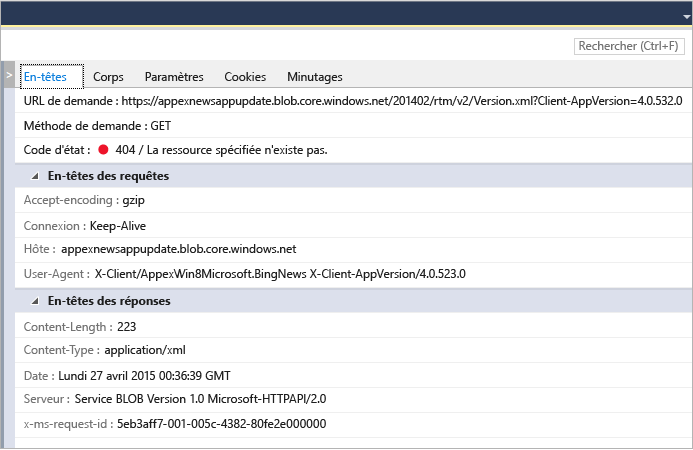

# Analyser l&#39;utilisation du r&#233;seau
[!INCLUDE[vs2017banner](../code-quality/includes/vs2017banner.md)]

L'outil de diagnostic **réseau** de Visual Studio collecte les données sur les opérations réseau effectuées à l'aide de l'API [Windows.Web.Http](https://msdn.microsoft.com/library/windows/apps/windows.web.http.aspx).  L'analyse des données peut vous aider à résoudre les problèmes tels que les problèmes d'accès et d'authentification, l'utilisation incorrecte du cache et les médiocres performances d'affichage et de téléchargement.  
  
 L'outil Réseau prend en charge seulement les applications de la plateforme universelle Windows.  Les autres plateformes ne sont pas prises en charge pour l'instant.  
  
> [!NOTE]
>  Pour obtenir une description plus complète de l'outil Réseau, consultez [Présentation de l'outil Réseau de Visual Studio](http://blogs.msdn.com/b/visualstudio/archive/2015/05/04/introducing-visual-studio-s-network-tool.aspx).  
  
## Collecte des données de l'outil Réseau  
 Vous devez exécuter l'outil **Réseau** avec un projet Visual Studio ouvert sur l'ordinateur Visual Studio.  
  
1.  Ouvrez le projet dans Visual Studio.  
  
2.  Dans le menu, cliquez sur **Déboguer \/ Démarrer les outils de diagnostic sans débogage**.  Sélectionnez **Réseau**, puis **Démarrer**.  
  
3.  L'outil Réseau commence à collecter le trafic HTTP de votre application.  
  
     Quand vous exécutez votre application, la vue récapitulative dans le volet gauche affiche automatiquement une liste des opérations HTTP capturées.  Sélectionnez un élément dans la vue récapitulative pour afficher plus d'informations dans le panneau des détails du volet droit.  
  
4.  Choisissez **Arrêter** pour fermer l'application.  
  
 La fenêtre de rapport doit se présenter comme ceci :  
  
## Analyse des données  
 Vous pouvez analyser le trafic HTTP capturé pendant l'exécution de votre application, ou même après la fermeture de l'application, en sélectionnant l'une des opérations réseau affichées sur la vue récapitulative.  
  
 La vue récapitulative **Réseau** affiche les données de chaque opération réseau de l'exécution de votre application.  Cliquez sur un en\-tête de colonne pour trier la liste ou choisissez les types de contenu à afficher dans la vue de filtre **Type de contenu**.  
  
 Choisissez **Enregistrer en tant que HAR** pour créer un fichier JSON qui peut être consommé par des outils tiers, comme Fiddler.  
  
 Les vues des détails **Réseau** affichent plus d'informations sur une opération réseau dans la vue récapitulative.  
  
   
  
|||  
|-|-|  
|**En\-têtes**|Informations sur les en\-têtes de demande de l'événement.|  
|**Corps**|Données de charge utile de la demande et de la réponse.|  
|**Paramètres**|Noms et valeurs des paramètres de la chaîne de requête.|  
|**Cookies**|Données de cookie de la demande et de la réponse.|  
|**Minutages**|Graphique des étapes lors de l'acquisition des ressources sélectionnées.|  
  
 La barre **résumé** du Réseau montre le nombre d'opérations réseau qui sont affichées à un moment donné, la quantité de données qui a été transférée, le temps nécessaire pour les télécharger et le nombre d'erreurs \(demandes avec des réponses 4xx ou 5xx\).  
  
### Conseils pour l'analyse  
 Cet outil met en évidence certaines parties qui peuvent être utiles quand vous effectuez une analyse liée au réseau :  
  
1.  Les demandes qui sont entièrement traitées à partir du cache sont indiquées par la mention **\(du cache\)** dans la colonne **Reçu**.  Ce marquage peut vous aider à déterminer si vous utilisez le cache efficacement pour économiser la bande passante de l'utilisateur, ou si vous placez par erreur des réponses dans le cache et que vous fournissez donc des données obsolètes à l'utilisateur final de votre application.  
  
2.  Les réponses d'erreur \(4xx ou 5xx\) sont affichées dans la colonne **Résultats** avec un code d'état rouge et sont également mises en surbrillance dans la barre récapitulative.  Le repérage des erreurs parmi les demandes potentiellement nombreuses de votre application est ainsi facilité.  
  
3.  Le bouton d'impression automatique des réponses \(à l'intérieur de l'onglet du corps\) peut vous aider à analyser les charges utiles des réponses JSON, XML, HTML, CSS, JavaScript et TypeScript en améliorant la lisibilité du contenu.  
  
## Voir aussi  
 [Exécuter les outils de diagnostic sans débogage](../Topic/Run%20profiling%20tools%20without%20debugging.md)   
 [Blog Visual Studio : Présentation de l'inspecteur de réseau Visual Studio](http://go.microsoft.com/fwlink/?LinkId=535022)   
 [Vidéo Channel 9 : Outils de diagnostic VS et nouveau profileur réseau](http://channel9.msdn.com/Series/ConnectOn-Demand/206)