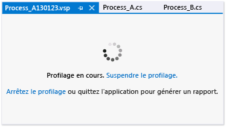

# D&#233;finition des options g&#233;n&#233;rales d&#39;une session de performance
[!INCLUDE[vs2017banner](../code-quality/includes/vs2017banner.md)]

Vous pouvez définir la méthode de collection et les conventions d'affectation de noms des données de profilage pour une session de performance des outils de profilage [!INCLUDE[vsprvs](../code-quality/includes/vsprvs_md.md)] dans la page **Général** de la boîte de dialogue des propriétés de la session de performance.  Pour ouvrir cette boîte de dialogue à partir de l'**Explorateur de performances**, cliquez avec le bouton droit sur la session de performance, puis cliquez sur **Propriétés**.  
  
 **Configuration requise**  
  
-   [!INCLUDE[vsUltLong](../code-quality/includes/vsultlong_md.md)], [!INCLUDE[vsPreLong](../code-quality/includes/vsprelong_md.md)], [!INCLUDE[vsPro](../code-quality/includes/vspro_md.md)]  
  
## Choix de méthodes de collecte de données  
 Vous définissez la méthode de collection de base en sélectionnant l'une des options sous **Collection de profils**.  Les options sont décrites dans le tableau ci\-après :  
  
|||  
|-|-|  
|**Échantillonnage**.  La méthode d'échantillonnage collecte des informations de profilage à intervalles réguliers.  Cette méthode d'échantillonnage est utile pour détecter les problèmes d'utilisation du processeur et est suggérée pour commencer la plupart des examens de performance.|-   [Collecte de statistiques de performance à l’aide de l’échantillonnage](../profiling/collecting-performance-statistics-by-using-sampling.md)|  
|**Instrumentation**.  La méthode d'instrumentation injecte dans une copie d'un module du code de profilage qui enregistre chaque entrée, sortie et appel de fonction des fonctions dans le module pendant une exécution du profilage.  La méthode d'instrumentation est utile pour collecter des informations de minutage détaillées à propos d'une section de votre code et comprendre l'impact des opérations d'entrée et de sortie sur les performances de l'application.|-   [Collecte de données de temporisation détaillées à l’aide de l’instrumentation](../profiling/collecting-detailed-timing-data-by-using-instrumentation.md)|  
|**Concurrence**.  La méthode de concurrence collecte des données pour chaque événement qui bloque l'exécution de votre code, notamment lorsqu'un thread attend que l'accès à une ressource d'application verrouillée soit libéré.  Cette méthode est utile pour l'analyse d'applications multithreads.|-   [Collecte de données de concurrence de threads et de processus](../profiling/collecting-thread-and-process-concurrency-data.md)|  
  
 Vous pouvez collecter les données de mémoire .NET à l'aide des méthodes d'échantillonnage ou d'instrumentation.  Vous sélectionnez le type de données sous **profils de mémoire .NET**.  
  
|||  
|-|-|  
|**Collecter les informations d'allocation d'objets .NET**.  Par défaut, les données incluent le nombre et la taille d'objets alloués.  Sélectionnez ou désactivez cette case à cocher pour activer ou désactiver la collection de données de la mémoire .NET.   **Collecter aussi les informations de durée de vie des objets .NET**.  Activez cette case à cocher pour inclure des données à propos des générations de garbage collection utilisées pour libérer les objets liés à la mémoire.|-   [Collecte de données liées à l’allocation et à la durée de vie de la mémoire .NET](../profiling/collecting-dotnet-memory-allocation-and-lifetime-data.md)|  
  
 Une page de profilage de session apparaît lorsque vous commencez à profiler une application, où vous pouvez suspendre, reprendre, et arrêter le profilage.  
  
   
  
## Définition des options de fichier de données de profilage  
  
|||  
|-|-|  
|**Rapport**.  Par défaut, le fichier de données de profilage \(.vsp\) prend le nom de l'application profilée et est placé dans le dossier de la solution ou du projet.  Une chaîne de date est également ajoutée au nom, et un nombre incrémenté est ajouté aux fichiers de données ; sinon, ils comporteraient des noms en double.  Vous pouvez changer ces options.|-   [Comment : définir les options de nom de fichier de données de profilage](../profiling/how-to-set-performance-data-file-name-options.md)|