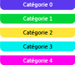

# Marqueurs Span
[!INCLUDE[vs2017banner](../code-quality/includes/vs2017banner.md)]

Un jeton d'étendue représente une phase explicite d'une application.  Par exemple, vous pouvez utiliser une étendue pour représenter un intervalle de temps pendant lequel un élément de travail particulier est traité.  Sa longueur représente la durée de la phase correspondante de l'application.  Cette illustration affiche une étendue dans le visualiseur concurrentiel :  
  
   
Un marqueur d'étendue dans le visualiseur concurrentiel  
  
## Catégorie d'étendue  
 Un jeton d'étendue est affichée de cinq couleurs différentes, selon sa catégorie.  Les couleurs sont répétées s'il y a plus de cinq catégories.  La catégorie peut être n'importe quel entier.  Cette illustration représente les cinq couleurs possibles :  
  
   
Les couleurs des cinq premières catégories d'étendues  
  
## Marques de regroupement d'étendues  
 Parfois des marques d'étendue se produisent si proche les une des autres dans le visualiseur concurrentiel qu'elles ne peuvent pas être dessinées individuellement.  Lorsque cela se produit, un *jeton de regroupement d'étendue* gris qui représente les étendues sous\-jacent est affiché.  Lorsque vous placez le pointeur sur l'une de ces icônes, une info\-bulle affiche le nombre d'étendues sous\-jacentes représentées.  Pour afficher les étendues, zoomez en avant.  Si vous effectuez un zoom avant et que vous obtenez un jeton de regroupement d'étendue, vous pouvez afficher les étendues sous\-jacentes dans [Rapport des marqueurs](../profiling/markers-report.md).  Cette illustration représente un jeton de regroupement d'étendues :  
  
   
Un jeton de regroupement d'étendues  
  
## Voir aussi  
 [Marqueurs du visualiseur concurrentiel](../profiling/concurrency-visualizer-markers.md)   
 [Kit de développement logiciel \(SDK\) du visualiseur concurrentiel](../profiling/concurrency-visualizer-sdk.md)