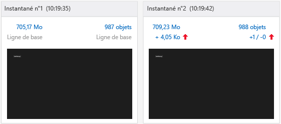
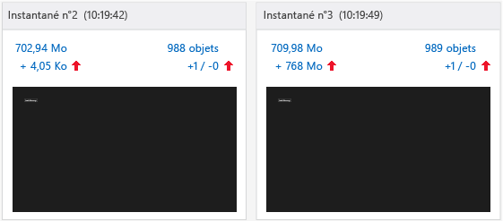
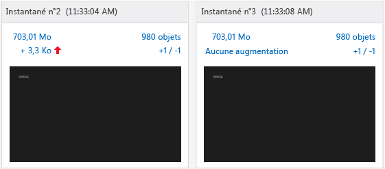

# <a name="walkthrough-find-a-memory-leak-javascript"></a>Procédure pas à pas : rechercher une fuite de mémoire (JavaScript)
  
  
 Cette procédure pas à pas vous guide dans le processus d'identification et de résolution d'un problème de mémoire simple à l'aide de l'analyseur de mémoire JavaScript. L’analyseur de mémoire JavaScript est disponible dans Visual Studio pour les applications UWP générées pour Windows en JavaScript. Dans ce scénario, vous créez une application qui conserve incorrectement les éléments DOM en mémoire au lieu de les éliminer au rythme auquel ils sont créés.  
  
 Bien que la cause de la fuite de mémoire dans cette application soit très spécifique, les étapes indiquées ici décrivent un flux de travail standard permettant d'isoler les objets qui provoquent des fuites de mémoire.  
  
### <a name="running-the-javascript-memory-analyzer-test-app"></a>Exécution de l'application test de l'analyseur de mémoire JavaScript  
  
1.  Dans Visual Studio, sélectionnez **Fichier**, **Nouveau**, **Projet**.  
  
2.  Dans le volet gauche, sélectionnez **JavaScript** , **Windows**, **Windows 8**, puis **Universel** ou **Applications Windows Phone**.  
  
    > [!IMPORTANT]
    >  Les résultats d'utilisation de la mémoire présentés dans cette rubrique sont testés par rapport à une application Windows 8.  
  
3.  Choisissez le modèle de projet **Application vide** dans le volet du milieu.  
  
4.  Dans la zone **Nom** , spécifiez un nom, par exemple `JS_Mem_Tester`, puis choisissez **OK**.  
  
5.  Dans l’**Explorateur de solutions**, ouvrez default.html et collez le code suivant entre les balises \<body> :  
  
    ```html  
    <div class="wrapper">  
        <div id="item"></div>  
        <button class="memleak" style="display: block" >Leak Memory</button>  
    </div>  
    ```  
  
    > [!IMPORTANT]
    >  Si vous utilisez un modèle d'application universelle Windows 8.1, vous devez mettre à jour le code HTML et CSS dans les projets .Windows et .WindowsPhone.  
  
6.  Ouvrez default.css et ajoutez le CSS suivant :  
  
    ```css  
    .memleak {  
        position: absolute; top: 100px; left: 100px;  
    }  
    ```  
  
7.  Ouvrez default.js et remplacez l'ensemble du code par le code suivant :  
  
    ```javascript  
    (function () {  
        "use strict";  
  
        var app = WinJS.Application;  
        var activation = Windows.ApplicationModel.Activation;  
  
        var wrapper;  
        var elem;  
  
        app.onactivated = function (args) {  
            if (args.detail.kind === activation.ActivationKind.launch) {  
                if (args.detail.previousExecutionState !== activation.ApplicationExecutionState.terminated) {  
                } else {  
                }  
                args.setPromise(WinJS.UI.processAll());  
  
                elem = document.getElementById("item");  
                wrapper = document.querySelector(".wrapper");  
                var btn = document.querySelector(".memleak");  
                btn.addEventListener("click", btnHandler);  
                run();  
            }  
        };  
  
        app.oncheckpoint = function (args) {  
        };  
  
        app.start();  
  
        function run() {  
            initialize();  
            load();  
        }  
  
        function initialize() {  
  
            if (wrapper != null) {  
                elem.removeNode(true);  
            }  
        }  
  
        function load() {  
  
            var newDiv = document.createElement("div");  
  
            newDiv.style.zIndex = "-1";  
            newDiv.id = "item";  
  
            wrapper.appendChild(newDiv);  
        }  
  
        function btnHandler(args) {  
            run();  
        }  
  
    })();  
    ```  
  
8.  Appuyez sur la touche F5 pour démarrer le débogage. Vérifiez que le bouton **Fuite de mémoire** apparaît sur la page.  
  
9. Basculez à nouveau vers Visual Studio (Alt+Tab) et appuyez sur Maj + F5 pour arrêter le débogage.  
  
     Maintenant que vous avez vérifié que l'application fonctionne, vous pouvez examiner l'utilisation de la mémoire.  
  
### <a name="analyzing-the-memory-usage"></a>Analyse de l'utilisation de la mémoire  
  
1.  Dans la barre d'outils **Déboguer** , dans la liste **Démarrer le débogage** , choisissez la cible de débogage pour le projet mis à jour : l'un des émulateurs Windows Phone ou **Simulateur**.  
  
    > [!TIP]
    >  Pour une application UWP, vous pouvez également sélectionner **Ordinateur local** ou **Ordinateur distant** dans cette liste. 
  
2.  Dans le menu **Déboguer** , choisissez **Profileur de performances**.  
  
3.  Dans **Outils disponibles**, choisissez **Mémoire JavaScript**, puis **Démarrer**.  
  
     Dans ce didacticiel, vous allez attacher l'analyseur de mémoire au projet de démarrage. Pour plus d'informations sur les autres options, par exemple celle qui permet d'attacher l'analyseur de mémoire à une application installée, consultez [Mémoire JavaScript](../profiling/javascript-memory.md).  
  
     Lorsque vous démarrez l'analyseur de mémoire, un message de contrôle de compte d'utilisateur peut demander votre autorisation pour exécuter VsEtwCollector.exe. Cliquez sur **Oui**.  
  
4.  Sélectionnez successivement le bouton **Fuite de mémoire** à quatre reprises.  
  
     Lorsque vous sélectionnez le bouton, le code de gestion des événements dans default.js fonctionne, une fuite de mémoire se produit. Vous utiliserez cela à des fins de diagnostic.  
  
    > [!TIP]
    >  Renouveler le scénario à tester pour une fuite de mémoire facilite l'exclusion d'informations sans intérêt, comme les objets ajoutés au tas au cours de l'initialisation de l'application ou lors du chargement d'une page.  
  
5.  À partir de l'application en cours d'exécution, basculez vers Visual Studio (Alt+Tab).  
  
     L'analyseur de mémoire JavaScript affiche des informations dans un nouvel onglet de Visual Studio.  
  
     Le graphique de mémoire dans ce mode Résumé illustre l'utilisation de la mémoire de processus au fil du temps. La vue fournit également des commandes telles que **Prendre un instantané du tas**. Un instantané fournit des informations détaillées sur l'utilisation de la mémoire à un moment donné. Pour plus d'informations, consultez [Mémoire JavaScript](../profiling/javascript-memory.md).  
  
6.  Sélectionnez **Prendre un instantané du tas**.  
  
7.  Basculez vers l'application et choisissez **Fuite de mémoire**.  
  
8.  Basculez vers Visual Studio et sélectionnez à nouveau **Prendre un instantané du tas** .  
  
     Cette illustration montre l'instantané de référence (n°1) et l'instantané n°2.  
  
       
  
    > [!NOTE]
    >  Le Windows Phone Emulator n'affiche pas de capture d'écran de l'application au moment de la prise de l'instantané.  
  
9. Basculez vers l'application et choisissez à nouveau le bouton **Fuite de mémoire** .  
  
10. Basculez vers Visual Studio et choisissez **Prendre un instantané du tas** pour la troisième fois.  
  
    > [!TIP]
    >  En prenant un troisième instantané dans ce flux de travail, vous pouvez filtrer les modifications entre l'instantané de base et le deuxième instantané qui ne sont pas associées à des fuites de mémoire. Par exemple, certaines modifications peuvent être prévues, par exemple la mise à jour des en-têtes et des pieds de page sur une page, qui génère des modifications de l'utilisation de la mémoire, mais qui n'est peut-être pas liée à des fuites de mémoire.  
  
     Cette illustration montre l'instantané n°2 et l'instantané n°3.  
  
       
  
11. Dans Visual Studio, choisissez **Arrêter** pour arrêter le profilage.  
  
12. Dans Visual Studio, comparez les instantanés. L'instantané n° 2 affiche les informations suivantes :  
  
    -   La taille du tas (indiqué par la flèche Haut rouge à gauche) a augmenté de plusieurs Ko par rapport à l'instantané n°1.  
  
        > [!IMPORTANT]
        >  Les valeurs exactes d'utilisation de la mémoire pour la taille du tas dépendent de la cible de débogage.  
  
    -   Le nombre d'objets sur le tas (indiqué par la flèche Haut rouge à droite) a augmenté par rapport à l'instantané n°1. Un objet a été ajouté (+1) et aucun objet n'a été supprimé (-0).  
  
     L'instantané n° 3 affiche les informations suivantes :  
  
    -   La taille du tas a augmenté de nouveau de plusieurs centaines d'octets par rapport à l'instantané n°2.  
  
    -   Le nombre d'objets sur le tas a augmenté à nouveau par rapport à l'instantané n°2. Un objet a été ajouté (+1) et aucun objet n'a été supprimé (-0).  
  
13. Dans l'instantané n°3, choisissez le texte du lien à droite, qui montre une valeur de +1/-0 en regard de la flèche Haut rouge.  
  
       
  
     Une vue différentielle des objets sur le tas s'ouvre alors, appelée **Instantané n°3 - Instantané n°2**, avec la vue Types affichée par défaut. Par défaut, une liste répertoriant les objets ajoutés au tas entre les instantanés n°2 et n°3 s'affiche.  
  
14. Dans le filtre **Portée** , sélectionnez **Objets créés à partir de l'instantané n°2**.  
  
15. Ouvrez l'objet HTMLDivElement en haut de l'arborescence d'objets comme indiqué ici.  
  
       
  
     Cette vue affiche des informations utiles sur la fuite de mémoire, par exemple la suivante :  
  
    -   Cet affichage montre un élément DIV avec un ID de `item`et la taille de retenue pour l'objet est de plusieurs centaines d'octets (la valeur exacte peut varier).  
  
    -   Cet objet est l'objet créé à partir de l'instantané n°2 et représente une fuite de mémoire potentielle.  
  
     La connaissance de l'application est une aide à ce stade. Sélectionner le bouton **Fuite de mémoire** doit supprimer un élément DIV et ajouter un élément, si le code ne semble pas fonctionner correctement (dans ce cas, une fuite de mémoire se produit). La section suivante explique comment résoudre cela.  
  
    > [!TIP]
    >  Parfois, la recherche d'un objet par rapport à l'objet `Global` peut aider à identifier cet objet. Pour cela, ouvrez le menu contextuel de l'identificateur et choisissez **Afficher en vue racine**.  
  
##  <a name="FixingMemory"></a> Résolution du problème de mémoire  
  
1.  Les données révélées par le profileur vous permettent d'examiner le code responsable de la suppression d'éléments DOM avec un ID d'« élément ». Cela se produit dans la fonction `initialize()` .  
  
    ```javascript  
    function initialize() {  
  
        if (wrapper != null) {  
            elem.removeNode(true);  
        }  
    }  
    ```  
  
     '`elem.removeNode(true)` ne fonctionne peut-être pas correctement. En examinant la façon dont le code met en cache l'élément DOM, vous trouvez le problème : la référence à l'élément mis en cache n'a pas été mise à jour.  
  
2.  Dans default.js, ajoutez la ligne de code suivante à la fonction de chargement, juste avant l'appel à `appendChild`:  
  
    ```javascript  
    elem = newDiv;  
    ```  
  
     Ce code met à jour la référence à l'élément mis en cache afin que l'élément soit correctement supprimé lorsque vous sélectionnez le bouton **Fuite de mémoire** . Le code complet pour la fonction de chargement ressemble à ceci :  
  
    ```javascript  
    function load() {  
  
        wrapper = document.querySelector(".wrapper");  
  
        var newDiv = document.createElement("div");  
  
        newDiv.style.zIndex = "-1";  
        newDiv.id = "item";  
        elem = newDiv;  
  
        wrapper.appendChild(newDiv);  
    }  
    ```  
  
3.  Dans le menu **Déboguer** , choisissez **Performances et diagnostics**.  
  
4.  Dans **Outils disponibles**, choisissez **Mémoire JavaScript**, puis **Démarrer**.  
  
5.  Suivez la même procédure qu'avant pour prendre trois instantanés. Les étapes sont les suivantes :  
  
    1.  Dans l'application, sélectionnez successivement le bouton **Fuite de mémoire** à quatre reprises.  
  
    2.  Basculez vers Visual Studio et choisissez **Prendre un instantané du tas** pour l'instantané de ligne de base.  
  
    3.  Dans l'application, choisissez le bouton **Fuite de mémoire** .  
  
    4.  Basculez vers Visual Studio et choisissez **Prendre un instantané du tas** pour le deuxième instantané.  
  
    5.  Dans l'application, choisissez le bouton **Fuite de mémoire** .  
  
    6.  Basculez vers Visual Studio et choisissez **Prendre un instantané du tas** pour le troisième instantané.  
  
     L'instantané n°3 affiche maintenant la taille du tas comme étant **Aucune augmentation** à partir de l'instantané n°2, et le nombre d'objets comme étant +1/-1, ce qui indique qu'un objet a été ajouté et un objet a été supprimé. Il s'agit du comportement voulu.  
  
     L'illustration suivante montre l'instantané n°2 et l'instantané n°3.  
  
       
  
## <a name="see-also"></a>Voir aussi  
 [Mémoire JavaScript](../profiling/javascript-memory.md)