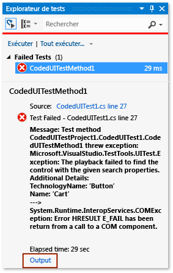
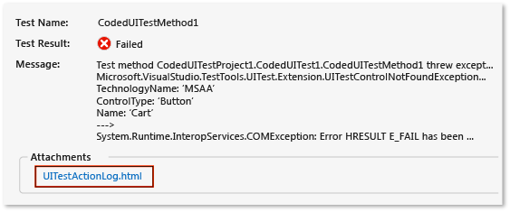

# Analyse des tests cod&#233;s de l&#39;interface utilisateur &#224; l&#39;aide des journaux de test cod&#233; de l&#39;interface utilisateur
[!INCLUDE[vs2017banner](../code-quality/includes/vs2017banner.md)]

Les journaux de tests codés de l'interface utilisateur filtrent et enregistrent des informations importantes sur l'exécution de vos tests codés de l'interface utilisateur.  
  
 **Requirements**  
  
-   Visual Studio Enterprise  
  
## <a name="why-should-i-do-this"></a>Pourquoi est-ce nécessaire ?  
 Les journaux sont présentés dans un format qui permet de déboguer les problèmes rapidement.  
  
## <a name="how-do-i-do-this"></a>Comment faire ?  
  
### <a name="step-1-enable-logging"></a>Étape 1 : Activer la journalisation  
 Selon votre scénario, appliquez l'une des méthodes suivantes pour activer le journal.  
  
-   Cibler .NET Framework version 4 sans fichier App.config présent dans le projet de test  
  
    -   Ouvrez la **QTAgent32_40.exe.config** fichier.  
  
         Par défaut, ce fichier se trouve dans **\< drvie>: \Program Files (x86) \Microsoft Visual Studio 12.0\Common7\IDE**.  
  
         Réglez la valeur de EqtTraceLevel au niveau de journalisation souhaité.  
  
         Enregistrez le fichier.  
  
-   Cibler .NET Framework version 4.5 sans fichier App.config présent dans le projet de test  
  
    -   Ouvrez la **QTAgent32.exe.config** fichier.  
  
         Par défaut, ce fichier se trouve dans **\< drvie>: \Program Files (x86) \Microsoft Visual Studio 12.0\Common7\IDE**.  
  
         Réglez la valeur de EqtTraceLevel au niveau de journalisation souhaité.  
  
         Enregistrez le fichier.  
  
-   Fichier App.config présent dans le projet de test  
  
    -   Ouvrez le fichier App.config dans le projet.  
  
         Ajoutez le code suivant sous le nœud de configuration :  
  
         `<system.diagnostics>     <switches>       <add name="EqtTraceLevel" value="4" />     </switches>  </system.diagnostics>`  
  
-   Activer la journalisation à partir du code de test proprement dit  
  
    -   <xref:Microsoft.VisualStudio.TestTools.UITesting.PlaybackSettings.LoggerOverrideState%2A> = HtmlLoggerState.AllActionSnapshot ;  
  
### <a name="step-2-run-your-coded-ui-test-and-view-the-log"></a>Étape 2 : Exécuter votre test codé de l'interface utilisateur et afficher le journal  
 Lorsque vous exécutez un test codé de l’interface Utilisateur avec les modifications apportées à la **QTAgent32.exe.config** fichier en place, vous pouvez constater qu’un lien de sortie dans les résultats de l’Explorateur de tests. Des fichiers journaux sont générés non seulement quand votre test échoue, mais aussi quand les tests réussissent si le niveau de trace a la valeur « Commentaires ».  
  
1.  Sur le **TEST** menu, choisissez **Windows** puis sélectionnez **Explorateur de tests**.  
  
2.  Sur le **CRÉER** menu, choisissez **Générer la Solution**.  
  
3.  Dans l’Explorateur de tests, sélectionnez le test codé de l’interface Utilisateur, vous souhaitez exécuter, ouvrez le menu contextuel, puis choisissez **exécuter les Tests sélectionnés**.  
  
     Les tests automatisés s'exécuteront et un message indiquera s'ils ont réussi ou échoué.  
  
    > [!TIP]
    >  Pour afficher l’Explorateur de tests à partir de la **menu Test**, pointez sur **Windows** puis **Explorateur de tests**.  
  
4.  Choisissez le **sortie** lien dans les résultats de l’Explorateur de tests.  
  
       
  
     Cela permet d'afficher la sortie du test qui inclut un lien vers le journal des actions.  
  
       
  
5.  Choisissez le lien UITestActionLog.html.  
  
     Le journal s'affiche dans votre navigateur web.  
  
       
  
## <a name="q-a"></a>Q et R  
  
### <a name="q-what-happened-to-the-enablehtmllogger-key"></a>Q : Qu'en est-il de la clé EnableHtmlLogger ?  
 Dans les versions précédentes de Visual Studio, il existait deux autres paramètres de configuration pour activer l'enregistreur d'événements HTML dans un test codé de l'interface utilisateur :  
  
```  
  
<add key="EnableHtmlLogger" value="true"/>  
  
<add key="EnableSnapshotInfo" value="true"/>  
  
```  
  
 Ces deux paramètres sont déconseillés depuis Visual Studio 2012. EqtTraceLevel est le seul paramètre qui doit être modifié pour activer HtmlLogger.  
  
## <a name="see-also"></a>Voir aussi  
 [Utilisation d’UI Automation pour tester votre Code](../test/use-ui-automation-to-test-your-code.md)   
 [Comment : exécuter des Tests à partir de Microsoft Visual Studio](../Topic/How%20to:%20Run%20Tests%20from%20Microsoft%20Visual%20Studio.md)