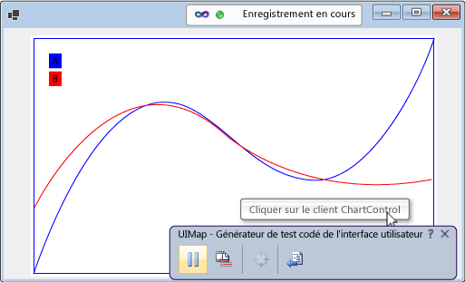
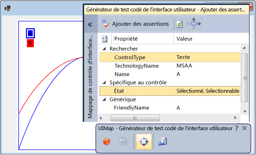

# Activer le test cod&#233; de l&#39;interface utilisateur de vos contr&#244;les
[!INCLUDE[vs2017banner](../code-quality/includes/vs2017banner.md)]

Votre contrôle peut être testé plus facilement si vous implémentez le support pour le framework pour tests codés de l'interface utilisateurs.  Vous pouvez ajouter des niveaux croissant de support en incrémentant.  Vous pouvez commencer par prendre en charge la validation d'enregistrement, de lecture, et de propriété.  Utilisez cela pour permettre au générateur de test codé de l'interface utilisateur de reconnaître les propriétés personnalisées de votre contrôle, et fournissez des classes personnalisées pour accéder à ces propriétés à partir du code généré.  Vous pouvez aussi aider les actions de capture du constructeur de test codé de l'interface d'une manière qui est proche du but de l'action entrain d'être enregistré.  
  
 **Dans cette rubrique :**  
  
1.  [Prise en charge de l'enregistrement et de la lecture, et validation de propriétés en implémentant l'Accessibilité.](../test/enable-coded-ui-testing-of-your-controls.md#recordandplayback)  
  
2.  [Le support de validation de propriétés personnalisées en implémentant un Fournisseur de propriété.](../test/enable-coded-ui-testing-of-your-controls.md#customproprties)  
  
3.  [Prendre en charge la génération de code en implémentant une classe pour accéder aux propriétés personnalisées](../test/enable-coded-ui-testing-of-your-controls.md#codegeneration)  
  
4.  [Le support des actions d'Intent-Aware avec l'implémentation d'un filtre d'action.](../test/enable-coded-ui-testing-of-your-controls.md#intentawareactions)  
  
   
  
##  <a name="recordandplayback"></a> Prise en charge de l'enregistrement et de la lecture, et validation de propriétés en implémentant l'Accessibilité.  
 Le constructeur de test codé de l'interface utilisateur capture des informations à propos des contrôles qu'il rencontre pendant un enregistrement puis génère le code pour rejouer cette session.  Si votre contrôle ne prend pas en charge l'accessibilité, alors le générateur de test codé de l'interface utilisateur capturera des actions \(comme des clics de souris\) à l'aide des coordonnées de l'écran.  Lorsque le test est relancé, le code généré utilisera ces clics de souris dans les mêmes coordonnées de l'écran.  Si votre contrôle s'affiche dans un endroit différent de l'écran quand le test est réexécuté, le code généré échouera dans l'exécution de l'action sur le contrôle.  Ceci peux résulter dans les échecs si le test est reproduit sur des configurations d'écran différentes, dans des environnements différents, ou après des changements dans la disposition de votre interface utilisateur.  
  
   
  
 Toutefois, si vous implémentez l'accessibilité, le générateur de test codé de l'interface utilisateur l'utilisera pour capturer des informations sur votre contrôle lorsqu'il enregistre un test et génère le code.  Dès alors, lorsque vous exécutez le test, le code généré rejouera ces événements sur votre contrôle, même s'il est quelque part d'autre dans l'interface utilisateur.  Les auteurs des tests pourront également créer des affirmations en utilisant les propriétés basics de votre contrôle.  
  
   
  
### Pour supporter l'enregistrement et la lecture, la validation de propriétés et la navigation pour un contrôle Windows Forms.  
 L'implémentation de l'accessibilité pour votre contrôle est présentée dans la procédure suivante, et détaillée dans <xref:System.Windows.Forms.AccessibleObject>.  
  
   
  
1.  L'implémentation d'une classe qui dérive de <xref:System.Windows.Forms.Control.ControlAccessibleObject> et surcharge la propriété <xref:System.Windows.Forms.Control.AccessibilityObject%2A> pour retourner un objet de votre classe.  
  
    ```c#  
    public partial class ChartControl : UserControl  
    {  
        // Overridden to return the custom AccessibleObject for the control.  
        protected override AccessibleObject CreateAccessibilityInstance()  
        {  
            return new ChartControlAccessibleObject(this);  
        }  
  
        // Inner class ChartControlAccessibleObject represents accessible information  
        // associated with the ChartControl and is used when recording tests.  
        public class ChartControlAccessibleObject : ControlAccessibleObject  
        {  
            ChartControl myControl;  
            public ChartControlAccessibleObject(ChartControl ctrl)  
                : base(ctrl)  
            {  
                myControl = ctrl;  
            }  
        }  
    }  
    ```  
  
2.  Remplacez les propriétés et les méthodes <xref:System.Windows.Forms.AccessibleObject.Role%2A>, <xref:System.Windows.Forms.AccessibleObject.State%2A>, <xref:System.Windows.Forms.AccessibleObject.GetChild%2A> et <xref:System.Windows.Forms.AccessibleObject.GetChildCount%2A> de l'objet accessible.  
  
3.  Implémentez un autre objet d'accessibilité pour le contrôle enfant et remplacez la propriété <xref:System.Windows.Forms.Control.AccessibilityObject%2A> du contrôle enfant pour retourner cet objet d'accessibilité.  
  
4.  Remplacez les propriétés et les méthodes <xref:System.Windows.Forms.AccessibleObject.Bounds%2A>, <xref:System.Windows.Forms.AccessibleObject.Name%2A>, <xref:System.Windows.Forms.AccessibleObject.Parent%2A>, <xref:System.Windows.Forms.AccessibleObject.Role%2A>, <xref:System.Windows.Forms.AccessibleObject.State%2A>, <xref:System.Windows.Forms.AccessibleObject.Navigate%2A> et <xref:System.Windows.Forms.AccessibleObject.Select%2A> pour l'objet d'accessibilité du contrôle enfant.  
  
> [!NOTE]
>  Cette rubrique commence par l'exemple d'accessibilité de <xref:System.Windows.Forms.AccessibleObject> dans cette procédure, et utilise le même exemple dans les procédures restantes.  Si vous souhaitez créer une version fonctionnelle de l'exemple d'accessibilité, créez une application console et remplacez ensuite le code dans Program.cs par l'exemple de code.  Vous devez ajouter des références à Accessibility, System.Drawing et System.Windows.Forms.  Vous devriez changer **Incorporer les types d'interopérabilité** pour l'Accessibilité sur False pour éliminer un avertissement sur la génération.  Vous pouvez changer le type de sortie du projet depuis l'Application console vers l'Application Windows de sorte à ne pas afficher une fenêtre lors de l'exécution de l'application.  
  
##  <a name="customproprties"></a> Le support de validation de propriétés personnalisées en implémentant un Fournisseur de propriété.  
 Une fois que vous avez implémenté le support basic pour un enregistrement et lecture et la validation de propriété, vous pouvez rendre vos propriétés de contrôles personnalisées disponible au tests codés de l'interface utilisateur en implémentant le plug\-in suivant <xref:Microsoft.VisualStudio.TestTools.UITesting.UITestPropertyProvider>.  Par exemple, la procédure suivante créer un fournisseur de propriété qui permet aux tests codées de l'interface utilisateur d'accéder à la propriété des contrôles enfant d'état du contrôle de chart CurveLegend.  
  
   
  
### Pour supporter une propriété de validation personnalisée  
   
  
1.  Remplacez la propriété <xref:System.Windows.Forms.AccessibleObject.Description%2A> de l'objet accessible de légende courbe pour passer des valeurs de propriété riches dans la chaîne de description, séparément de la description principale \(et chaque propriété si vous implémentez plusieurs propriétés\) par des points\-virgules \(;\).  
  
    ```c#  
    public class CurveLegendAccessibleObject : AccessibleObject  
    {  
        // add the state property value to the description  
        public override string Description  
        {  
            get  
            {  
                // Add “;” and the state value to the end  
                // of the curve legend’s description  
                return "CurveLegend; " + State.ToString();  
            }  
        }  
    }  
    ```  
  
2.  Créez un package d'extension de test interface utilisateur pour votre contrôle en créant un projet de bibliothèque de classe et ajouter des references à Accessibilité, Microsoft.VisualStudio.TestTools.UITesting, Microsoft.VisualStudio.TestTools.UITest.Common, et Microsoft.VisualStudio.TestTools.Extension.  Modifiez **Incorporer les types d'interopérabilité** pour l'Accessibilité sur False.  
  
3.  Ajoutez une classe de fournisseur de propriétés qui dérive de <xref:Microsoft.VisualStudio.TestTools.UITesting.UITestPropertyProvider>.  
  
    ```c#  
    using System;  
    using System.Collections.Generic;  
    using Accessibility;  
    using Microsoft.VisualStudio.TestTools.UITesting;  
    using Microsoft.VisualStudio.TestTools.UITest.Extension;  
    using Microsoft.VisualStudio.TestTools.UITesting.WinControls;  
    using Microsoft.VisualStudio.TestTools.UITest.Common;  
  
    namespace ChartControlExtensionPackage  
    {  
        public class ChartControlPropertyProvider : UITestPropertyProvider  
        {  
        }  
    }  
    ```  
  
4.  Implémentez le fournisseur de propriété en plaçant les noms des propriétés et leurs descripteurs dans une <xref:System.Collections.Generic.Dictionary%602>.  
  
<CodeContentPlaceHolder>3</CodeContentPlaceHolder>  
5.  Surchargez <xref:Microsoft.VisualStudio.TestTools.UITesting.UITestPropertyProvider.GetControlSupportLevel%2A?displayProperty=fullName> pour indiquer que votre assembly fournit un support spécifique pour contrôle pour votre contrôle et ses enfants.  
  
<CodeContentPlaceHolder>4</CodeContentPlaceHolder>  
6.  Substituez les méthodes abstraites restantes de <xref:Microsoft.VisualStudio.TestTools.UITesting.UITestPropertyProvider?displayProperty=fullName>.  
  
<CodeContentPlaceHolder>5</CodeContentPlaceHolder>  
7.  Ajoutez un package d'extension qui dérive de <xref:Microsoft.VisualStudio.TestTools.UITest.Extension.UITestExtensionPackage>.  
  
<CodeContentPlaceHolder>6</CodeContentPlaceHolder>  
8.  Définissez l'attribut `UITestExtensionPackage` pour l'assembly.  
  
<CodeContentPlaceHolder>7</CodeContentPlaceHolder>  
9. Dans la classe des packages d'extension, substituez <xref:Microsoft.VisualStudio.TestTools.UITest.Extension.UITestExtensionPackage.GetService%2A?displayProperty=fullName> pour retourner la classe du fournisseur de propriétés quand un fournisseur de propriétés est demandé.  
  
<CodeContentPlaceHolder>8</CodeContentPlaceHolder>  
10. Substituez les méthodes abstraites restantes et propriétés de <xref:Microsoft.VisualStudio.TestTools.UITest.Extension.UITestExtensionPackage>.  
  
<CodeContentPlaceHolder>9</CodeContentPlaceHolder>  
11. Compilez vos binaires et copiez les dans **%ProgramFiles%\\Common\\Microsoft Shared\\VSTT\\10.0\\UITestExtensionPackages**.  
  
> [!NOTE]
>  Ce package d'extension sera appliqué pour n'importe quel contrôle qui est de type « Text ».  Si vous testez plusieurs contrôles du même type, vous aurez besoin de les tester séparément et gérer quels packages d'extension sont déployé lorsque vous enregistrez vos tests.  
  
##  <a name="codegeneration"></a> Prendre en charge la génération de code en implémentant une classe pour accéder aux propriétés personnalisées  
 Lorsque le constructeur de tests codés d'interface utilisateur génère du code depuis un enregistrement de session, il utilise la classe <xref:Microsoft.VisualStudio.TestTools.UITesting.UITestControl> pour accéder à vos contrôles.  
  
<CodeContentPlaceHolder>10</CodeContentPlaceHolder>  
 Si vous avez implémenté un fournisseur de propriétés pour fournir l'accès aux propriétés personnalisées de votre contrôle, vous devez ajouter une classe spécialisée qui est utilisée pour accéder à ces propriétés pour que la génération de code soit simplifiée.  
  
<CodeContentPlaceHolder>11</CodeContentPlaceHolder>  
### Pour ajouter une classe spécialisé pour accéder à vos contrôles.  
   
  
1.  Implémentez une classe qui dérive de <xref:Microsoft.VisualStudio.TestTools.UITesting.WinControls.WinControl> et ajoutez le type de contrôle à la collection de propriétés de recherche dans le constructeur.  
  
<CodeContentPlaceHolder>12</CodeContentPlaceHolder>  
2.  Implémentez vos propriétés personnalisées de contrôle comme propriétés de la classe.  
  
<CodeContentPlaceHolder>13</CodeContentPlaceHolder>  
3.  Surchargez la méthode <xref:Microsoft.VisualStudio.TestTools.UITesting.UITestPropertyProvider.GetSpecializedClass%2A?displayProperty=fullName> de votre fournisseur de propriété pour retourner le type de la nouvelle classe pour la courbe légendaire de vos contrôles enfants.  
  
<CodeContentPlaceHolder>14</CodeContentPlaceHolder>  
4.  Surchargez la méthode <xref:Microsoft.VisualStudio.TestTools.UITesting.UITestPropertyProvider.GetPropertyNamesClassType%2A> de votre fournisseur de propriété pour retourner le type de la méthode nouvelle classe PropertyNames.  
  
<CodeContentPlaceHolder>15</CodeContentPlaceHolder>  
##  <a name="intentawareactions"></a> Le support des actions d'Intent\-Aware avec l'implémentation d'un filtre d'action.  
 Quand Visual Studio enregistrant un test, il capture chaque événement de souris et clavier.  Néanmoins, dans certains cas, l'intention de l'action peut être perdu dans la série d'événements clavier et souris.  Par exemple, si votre contrôle prend en charge le remplissage automatique le même ensemble d'événements de clavier et souris peut résulter dans une valeur différente quand le test est réexécuté dans un environnement différent.  Vous pouvez ajouter un plugin de filtre d'action qui remplace la série d'événements clavier et souris avec une seule et unique action.  De cette manière vous pouvez remplacer la série d'événements de clavier et souris, résultant dans la sélection d'une valeur avec une seule action qui règle la valeur.  Cela protège les tests codés de l'interface utilisateur des differences dans le remplissage automatique d'un environnement à un autre.  
  
### Pour supporter des actions intent\-aware  
   
  
1.  Implémentez une classe de filtre d'action qui dérive de <xref:Microsoft.VisualStudio.TestTools.UITest.Common.UITestActionFilter>, surchargeant les propriétés <xref:Microsoft.VisualStudio.TestTools.UITest.Common.UITestActionFilter.ApplyTimeout%2A>, <xref:Microsoft.VisualStudio.TestTools.UITest.Common.UITestActionFilter.Category%2A>, <xref:Microsoft.VisualStudio.TestTools.UITest.Common.UITestActionFilter.Enabled%2A>, <xref:Microsoft.VisualStudio.TestTools.UITest.Common.UITestActionFilter.FilterType%2A>, <xref:Microsoft.VisualStudio.TestTools.UITest.Common.UITestActionFilter.Group%2A> et <xref:Microsoft.VisualStudio.TestTools.UITest.Common.UITestActionFilter.Name%2A>.  
  
<CodeContentPlaceHolder>16</CodeContentPlaceHolder>  
2.  Override <xref:Microsoft.VisualStudio.TestTools.UITest.Common.UITestActionFilter.ProcessRule%2A>.  L'exemple ici remplace une action de double\-clic avec une action de simple clic.  
  
<CodeContentPlaceHolder>17</CodeContentPlaceHolder>  
3.  Ajoutez le filtre d'action dans la méthode <xref:Microsoft.VisualStudio.TestTools.UITest.Extension.UITestExtensionPackage.GetService%2A> de votre package d'extension.  
  
<CodeContentPlaceHolder>18</CodeContentPlaceHolder>  
4.  Compilez vos binaires et copiez les dans %ProgramFiles%\\Common Files\\Microsoft Shared\\VSTT\\10.0\\UITestExtensionPackages.  
  
> [!NOTE]
>  Le filtre de l'action ne dépends pas de l'implémentation d'accessibilité ou du fournisseur de propriétés.  
  
## Déboguez votre fournisseur de propriétés ou du filtre d'action.  
 Votre fournisseur de propriété et filtre d'action son implémentés dans un package d'extension qui est chargé et exécuté par le constructeur de tests codés de l'interface utilisateur dans un processus séparé de votre application.  
  
#### Déboguez votre fournisseur de propriétés ou du filtre d'action.  
  
1.  Compilez la version de débogage de votre package d'extension copiez les fichiers .dll et .pdb vers %ProgramFiles%\\Common Files\\Microsoft Shared\\VSTT\\10.0\\UITestExtensionPackages.  
  
2.  Exécutez votre application \(pas dans le débogueur\).  
  
3.  Exécutez le constructeur de tests codés de l'interface utilisateur.  
  
     `codedUITestBuilder.exe  /standalone`  
  
4.  Attachez le débogueur au processus codedUITestBuild.  
  
5.  Mettez des points d'arrêt dans votre code.  
  
6.  Dans le constructeur de tests codés de l'interface utilisateur, créez des assertions pour exercer votre fournisseur de propriétés, et enregistrez vos actions pour exercer vos filtres d'actions.  
  
## Ressources externes  
  
### Aide  
 [Test de la livraison continue avec Visual Studio 2012 \- Chapitre 2 : Tests unitaires : tests](http://go.microsoft.com/fwlink/?LinkID=255188)  
  
## Voir aussi  
 <xref:System.Windows.Forms.AccessibleObject>   
 [Utiliser l'automatisation de l'interface utilisateur pour tester votre code](../test/use-ui-automation-to-test-your-code.md)