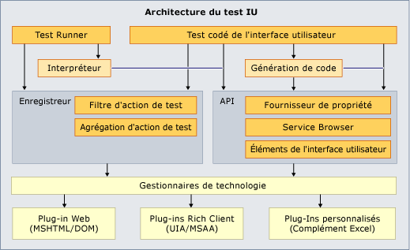

# Extension des tests cod&#233;s de l&#39;interface utilisateur t enregistrements des actions pour prendre charge Microsoft Excel
[!INCLUDE[vs2017banner](../code-quality/includes/vs2017banner.md)]

L'infrastructure de test pour les tests codés de l'interface utilisateur et les enregistrements des actions ne prend pas en charge toutes les interfaces utilisateur possibles.  Elle risque de ne pas prendre en charge l'interface utilisateur spécifique que vous souhaitez tester.  Par exemple, vous ne pouvez pas créer immédiatement un test codé de l'interface utilisateur ou un enregistrement des actions pour une feuille de calcul [!INCLUDE[ofprexcel](../test/includes/ofprexcel_md.md)].  Toutefois, vous pouvez créer votre propre extension de l'infrastructure de test codé de l'interface utilisateur, qui prend en charge votre interface utilisateur spécifique en tirant parti de l'extensibilité de l'infrastructure de test codé de l'interface utilisateur.  La rubrique suivante fournit un exemple montrant comment étendre l'infrastructure pour prendre en charge la création de tests codés de l'interface utilisateur et les enregistrements des actions pour [!INCLUDE[ofprexcel](../test/includes/ofprexcel_md.md)].  Pour plus d'informations sur les plateformes prises en charge, voir [Plateformes et configurations prises en charge pour les tests codés de l'interface utilisateur et les enregistrements des actions](../test/supported-configurations-and-platforms-for-coded-ui-tests-and-action-recordings.md).  
  
 **Spécifications**  
  
-   Visual Studio Enterprise  
  
 Cette section présente une extension de test codé de l'interface utilisateur capable d'enregistrer et de lire les tests de feuilles de calcul Excel.  Chaque partie de l'extension est expliquée dans cette section et dans les commentaires de code pour les développeurs qui souhaitent simplement créer cette extension.  
  
   
Vue d'ensemble de l'architecture  
  
## Télécharger l'exemple  
 L'exemple se compose de quatre projets dans la solution `CodedUIExtensibilitySample.sln` :  
  
-   CodedUIextensibilitySample  
  
-   ExcelCodedUIAddInHelper  
  
-   ExcelUICommunicationHelper  
  
-   SampleTestProject  
  
 Récupérez l'exemple à partir de ce [billet de blog](http://go.microsoft.com/fwlink/?LinkID=185592).  
  
> [!NOTE]
>  L'exemple est conçu pour être utilisé avec Microsoft Excel 2010.  L'exemple peut fonctionner avec d'autres versions de Microsoft Excel, mais il n'est pas pris en charge actuellement.  
  
## Détails de l'exemple  
 Les sections suivantes fournissent des informations sur l'exemple et sa structure.  
  
### Complément Microsoft Excel : ExcelCodedUIAddinHelper  
 Ce projet comprend un complément qui s'exécute dans le processus Excel.  Voir [Exemple de complément Excel pour le test codé de l'interface utilisateur](../test/sample-excel-add-in-for-coded-ui-testing.md) pour une vue d'ensemble du projet de complément.  
  
 Pour plus d'informations, voir [Procédure pas à pas : création de votre premier complément VSTO pour Excel](../Topic/Walkthrough:%20Creating%20Your%20First%20VSTO%20Add-in%20for%20Excel.md).  
  
### Communication de l'interface utilisateur Excel : ExcelUIcommunicationHelper  
 Ce projet comprend l'interface `IExcelUICommunication` et les classes d'information utilisées pour passer des données entre l'infrastructure de test codé de l'interface utilisateur et Excel.  Pour plus d'informations, voir [Exemple d'interface Communicator Excel](../test/sample-excel-communicator-interface.md)  
  
### Extension de test codé de l'interface utilisateur : CodedUIExentsibilitySample  
 Ce projet comprend les classes personnalisées utilisées dans les tests d'une feuille de calcul Excel.  Le code de chacune de ces classes est relativement explicite.  Toutefois, nous fournissons une brève description de chaque classe personnalisée.  Pour plus d'informations, voir [Exemple d’extension du test codé de l’interface utilisateur pour Excel](../test/sample-coded-ui-test-extension-for-excel.md).  
  
### Déploiement de votre complément et de votre extension  
 Après avoir créé tous les projets et objets, exécutez en tant qu'administrateur le fichier `CopyDrop.bat` fourni.  Ce fichier copie la DLL `ExcelCodedUIAddinHelper` et les fichiers PDB vers :  
  
 "`%CommonProgramFiles(x86)%\Microsoft Shared\VSTT\<version number>\UITestExtensionPackages\*.*`", où le numéro de version peut être 11.0, 12.0, etc. selon votre version de Visual Studio.  
  
 La DLL `ExcelUICommunicationHelper` et les fichiers PDB sont copiés vers `"%ProgramFiles(x86)%\Microsoft Visual Studio <version number>\Common7\IDE\PrivateAssemblies”`.  
  
 Vous devrez peut\-être changer les chemins d'accès de copie, mais aucune installation supplémentaire n'est nécessaire.  Sur un ordinateur 64 bits, utilisez l'invite de commandes de Visual Studio Enterprise 32 bits pour exécuter le fichier `CopyDrop.bat`.  
  
### Test d'Excel avec SampleTestProject  
 Vous pouvez exécuter le test dans le projet de test fourni, lequel utilise une version spécifique d'Excel que vous n'avez peut\-être pas. Toutefois, vous pouvez également créer votre propre projet de test, et enregistrer un test de votre choix.  Pour plus d'informations, voir [Création de tests codés de l'interface utilisateur](../test/use-ui-automation-to-test-your-code.md#VerifyingCodeUsingCUITCreate).  
  
## Voir aussi  
 <xref:Microsoft.VisualStudio.TestTools.UITesting.UITestPropertyProvider>   
 <xref:Microsoft.VisualStudio.TestTools.UITest.Extension.UITechnologyElement>   
 <xref:Microsoft.VisualStudio.TestTools.UITest.Common.UITestActionFilter>   
 <xref:Microsoft.VisualStudio.TestTools.UITest.Extension.UITestExtensionPackage>   
 [Utiliser l'automatisation de l'interface utilisateur pour tester votre code](../test/use-ui-automation-to-test-your-code.md)   
 [Meilleures pratiques pour les tests codés de l'interface utilisateur](../test/best-practices-for-coded-ui-tests.md)   
 [Plateformes et configurations prises en charge pour les tests codés de l'interface utilisateur et les enregistrements des actions](../test/supported-configurations-and-platforms-for-coded-ui-tests-and-action-recordings.md)