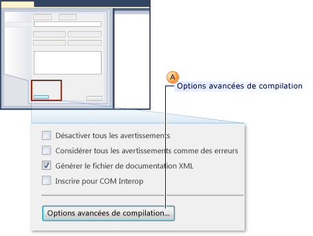
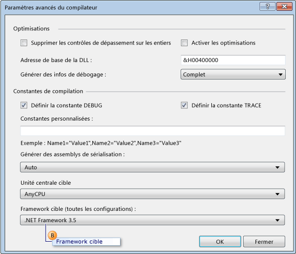
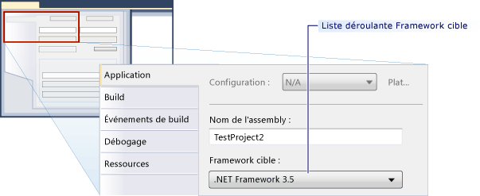

# Comment&#160;: configurer des tests unitaires pour cibler une version ant&#233;rieure du .NET Framework
[!INCLUDE[vs2017banner](../code-quality/includes/vs2017banner.md)]

Lorsque vous créez un projet de test dans Microsoft Visual Studio, la dernière version du .NET Framework est définie comme cible, par défaut.  En outre, si vous mettez à niveau des projets de tests des versions antérieures de Visual Studio, ils sont mis à niveau pour cibler la version du .NET Framework.  Vous pouvez modifier les propriétés du projet et cibler de nouveau le projet de manière explicite sur les anciennes versions du .NET Framework.  
  
 Vous pouvez créer des projets de tests unitaires qui ciblent des versions spécifiques du .NET Framework.  La version ciblée doit être de 3.5 ou version ultérieure, et ne peut pas être une version du client.  Visual Studio assure la prise en charge de base suivante pour les tests unitaires qui ciblent des versions spécifiques :  
  
-   Vous pouvez créer des projets de tests unitaires et les cibler une version spécifique du .NET Framework.  
  
-   Vous pouvez exécuter des tests unitaires qui ciblent une version spécifique du .NET Framework à partir de Visual Studio sur votre ordinateur local.  
  
-   Vous pouvez exécuter des tests unitaires qui ciblent une version spécifique du .NET Framework en utilisant MSTest.exe à partir de l'invite de commandes.  
  
-   Vous pouvez exécuter des tests unitaires sur un agent de build dans le cadre d'une génération.  
  
 **Test des applications SharePoint**  
  
 Les fonctions répertoriées ci\-dessus permettent également d'écrire des tests unitaires et des tests d'intégration pour les applications SharePoint à l'aide de Visual Studio.  [!INCLUDE[crabout](../test/includes/crabout_md.md)] sur le mode de développement des applications SharePoint à l'aide de Visual Studio, consultez [Créer des solutions SharePoint](/office-dev/office-dev/create-sharepoint-solutions) et [Génération et débogage de solutions SharePoint](/office-dev/office-dev/building-and-debugging-sharepoint-solutions), [Vérification et débogage du code SharePoint](/office-dev/office-dev/verifying-and-debugging-sharepoint-code)  
  
 **Limitations**  
  
 Les limitations suivantes s'appliquent lorsque vous reciblez vos projets de test de manière à utiliser des versions plus récentes du .NET Framework :  
  
-   Dans le .NET Framework 3.5, le multi\-ciblage est pris en charge pour les projets de test qui contiennent uniquement des tests unitaires.  Le .NET Framework 3.5 ne prend pas en charge d'autre type de test, tel que le test codé de l'interface utilisateur ou le test de charge.  Le re\-ciblage est bloqué pour les types de test autres que les tests unitaires.  
  
-   L'exécution des tests qui sont ciblés sur une version antérieure du .NET Framework est prise en charge uniquement dans l'adaptateur hôte par défaut.  Elle n'est pas prise en charge dans l'adaptateur hôte ASP.NET.  Les applications ASP .NET qui doivent fonctionner dans le contexte du serveur de développement ASP .NET doit être compatible avec la version actuelle du .NET Framework.  
  
-   La prise en charge de la collecte de données est désactivée lorsque vous exécutez des tests qui prennent en charge le multi\-ciblage de .NET Framework 3.5.  Vous pouvez exécuter la couverture du code à l'aide des outils en ligne de commande Visual Studio.  
  
-   Les tests unitaires qui utilisent le .NET Framework 3.5 ne peuvent pas s'exécuter sur un ordinateur distant.  
  
-   Vous ne pouvez pas cibler des tests unitaires à des versions du client antérieure de l'infrastructure.  
  
### Reciblage vers une version spécifique du .NET Framework pour les projets de tests unitaires Visual Basic  
  
1.  Créer un projet de test unitaire Visual Basic.  Dans le menu **Fichier**, choisissez **Nouveau**, puis **Projet**.  
  
     La boîte de dialogue **Nouveau projet** s'affiche.  
  
2.  Sous **Modèles installés**, développez **Visual Basic**.  Sélectionnez **Test**, puis sélectionnez le modèle **Projet de test**.  
  
3.  Dans la zone de texte **Nom**, tapez un nom pour votre projet de test Visual Basic, puis choisissez **OK**.  
  
4.  Dans l'Explorateur de solutions, choisissez **Propriétés** dans le menu contextuel du nouveau projet Visual Basic.  
  
     Les propriétés de votre projet de test Visual Basic s'affichent.  
  
5.  Sous l'onglet **Compiler** choisissez **options avancées de compilation** comme indiqué dans l'illustration suivante.  
  
       
  
6.  Utilisez la liste déroulante **Framework cible \(toutes les configurations\)** pour remplacer la version cible de .NET Framework,  **.NET Framework 3.5** ou plus récente, comme le montre la légende B dans l'illustration suivante.  Vous ne devez pas spécifier une version du client.  
  
       
  
### Reciblage vers une version spécifique du .NET Framework pour les projets de tests unitaires Visual C\#  
  
1.  Créer un projet de test unitaire Visual C\#.  Dans le menu **Fichier**, choisissez **Nouveau**, puis **Projet**.  
  
     La boîte de dialogue **Nouveau projet** s'affiche.  
  
2.  Sous **Modèles installés**, développez **Visual C\#**.  Sélectionnez **Test**, puis sélectionnez le modèle **Projet de test**.  
  
3.  Dans la zone de texte **Nom**, tapez un nom pour votre projet de test Visual C\#, puis choisissez **OK**.  
  
4.  Dans l'Explorateur de solutions, cliquez avec le bouton droit sur le nom de votre projet Visual C\# Projet de Test, puis choisissez **Propriétés** dans le menu contextuel.  
  
     Les propriétés de votre projet de test Visual C\# s'affichent.  
  
5.  Sélectionnez l'onglet **Application** et utilisez la liste déroulante **Framework cible**, puis choisissez  **.NET Framework 3.5** ou supérieur depuis la liste déroulante pour changer le framework cible, comme le montre l'illustration suivante.  Vous ne devez pas spécifier une version du client.  
  
       
  
### Reciblage vers une version spécifique du .NET Framework pour les projets de test unitaire C\+\+\/CLI  
  
1.  Créer un projet de test unitaire C\+\+.  Dans le menu **Fichier**, sélectionnez **Nouveau**, puis cliquez sur **Projet**.  
  
     La boîte de dialogue **Nouveau projet** s'affiche.  
  
    > [!WARNING]
    >  Pour générer des tests unitaires de C\+\+\/CLI pour une version antérieure du .NET Framework pour Visual C\+\+, vous devez utiliser la version correspondante de Visual Studio.  Par exemple, pour cibler .NET Framework 3.5, vous devez installer [!INCLUDE[vs_orcas_long](../debugger/includes/vs_orcas_long_md.md)] et le Service Pack 1 de [!INCLUDE[vs_orcas_long](../debugger/includes/vs_orcas_long_md.md)].  
  
2.  Sous **Modèles installés**, développez **Visual C\+\+**.  Sélectionnez **Test**, puis sélectionnez le modèle **Projet de test**.  
  
3.  Dans la zone de texte **Nom**, tapez un nom pour votre projet de test Visual C\+\+, puis cliquez sur **OK**.  
  
4.  Dans l'Explorateur de solutions, cliquez avec le bouton droit sur le nouveau projet de test Visual C\+\+ et sélectionnez **Décharger le projet**.  
  
5.  Dans l'Explorateur de solutions, choisissez le projet de test déchargé de Visual C\+\+ et choisissez **Modifier \<nom du projet\>.vcxproj**.  
  
     Le fichier .vcxproj s'ouvre dans l'éditeur.  
  
6.  Définissez `TargetFrameworkVersion` à la version 3.5 ou ultérieure dans `PropertyGroup` a étiqueté `"Globals"`.  Vous ne devez pas spécifier une version du client :  
  
    ```  
    <PropertyGroup Label="Globals">  
        <TargetName>DefaultTest</TargetName>  
        <ProjectTypes>{3AC096D0-A1C2-E12C-1390-A8335801FDAB};{8BC9CEB8-8B4A-11D0-8D11-00A0C91BC942}</ProjectTypes>  
        <ProjectGUID>{CE16D77A-E364-4ACD-948B-1EB6218B0EA3}</ProjectGUID>  
        <TargetFrameworkVersion>3.5</TargetFrameworkVersion>  
        <Keyword>ManagedCProj</Keyword>  
        <RootNamespace>CPP_Test</RootNamespace>  
      </PropertyGroup>  
  
    ```  
  
7.  Enregistrez e fermez le fichier .vcxproj.  
  
8.  Dans l'explorateur de solutions, sélectionnez **Recharger le projet** sélectionnez dans le menu contextuel de votre projet de test Visual C\+\+.  
  
## Voir aussi  
 [Creating and Running Unit Tests for Existing Code](http://msdn.microsoft.com/fr-fr/e8370b93-085b-41c9-8dec-655bd886f173)   
 [Créer des solutions SharePoint](/office-dev/office-dev/create-sharepoint-solutions)   
 [Génération et débogage de solutions SharePoint](/office-dev/office-dev/building-and-debugging-sharepoint-solutions)   
 [Paramètres avancés du compilateur, boîte de dialogue \(Visual Basic\)](../ide/reference/advanced-compiler-settings-dialog-box-visual-basic.md)