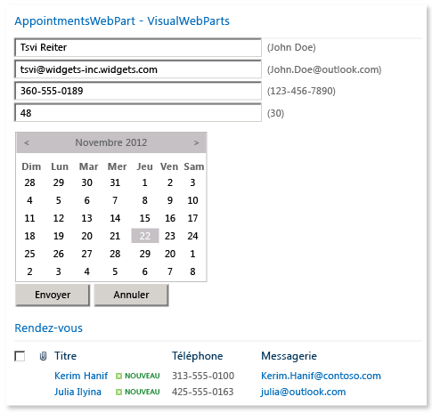
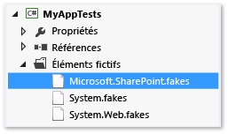
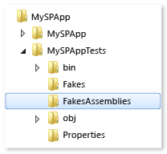

# <a name="using-emulators-to-isolate-unit-tests-for-sharepoint-2010-applications"></a>Utilisation d'émulateurs pour isoler des tests unitaires pour des applications Sharepoint 2010
Le package Microsoft.SharePoint.Emulators fournit un jeu de bibliothèques qui vous aide à créer des tests unitaires isolés pour les applications Microsoft SharePoint 2010. Les émulateurs utilisent des [shims](../test/using-shims-to-isolate-your-application-from-other-assemblies-for-unit-testing.md) du framework d’isolation [Microsoft Fakes](../test/isolating-code-under-test-with-microsoft-fakes.md) pour créer des objets en mémoire légers qui imitent les objets et les méthodes les plus courants de l’API SharePoint. Quand une méthode SharePoint n'est pas émulée, ou que vous voulez modifier le comportement par défaut d'un émulateur, vous pouvez créer des shims Fakes pour fournir les résultats souhaités.  
  
 Les classes et méthodes de test existantes peuvent facilement être converties pour s'exécuter dans le contexte d'émulateur. Cette fonction vous permet de créer des tests à double utilisation. Un test à double utilisation peut basculer entre des tests d'intégration sur la véritable API SharePoint et des tests unitaires isolés qui utilisent les émulateurs.  
  
##  <a name="BKMK_In_this_topic"></a> Dans cette rubrique  
 [Requirements](#BKMK_Requirements)  
  
 [Exemple d’AppointmentsWebPart](#BKMK_The_AppointmentsWebPart_example)  
  
 [Conversion d’un test existant](#BKMK_Converting_an_existing_test)  
  
-   [Ajout du package des émulateurs à un projet de test](#BKMK_Adding_the_Emulators_package_to_a_test_project)  
  
-   [Exécuter une méthode de test avec l’émulation](#BKMK__Running_a_test_method_in_the_emulation_context)  
  
 [Création de classes et de méthodes à double utilisation](#BKMK_Creating_dual_use_classes_and_methods)  
  
 [Utilisation des attributs TestInitialize et TestCleanup pour créer une classe de tests à double utilisation](#BKMK_Using_TestInitialize_and_TestCleanup_attributes_to_create_a_dual_use_test_class)  
  
 [Gestion des méthodes SharePoint non émulées](#BKMK_Handling_non_emulated_SharePoint_methods)  
  
 [Écriture des tests d’émulation à partir de zéro, et d’un résumé](#BKMK_Writing_emulation_tests_from_scratch__and_a_summary)  
  
 [Exemple](#BKMK_Example)  
  
 [Types SharePoint émulés](#BKMK_Emulated_SharePoint_types)  
  
##  <a name="BKMK_Requirements"></a> Configuration requise  
  
-   Microsoft SharePoint 2010 (SharePoint Server 2010 ou SharePoint Foundation 2010)  
  
-   Microsoft Visual Studio Enterprise  
  
-   Package NuGet des émulateurs Microsoft SharePoint  
  
 Vous devez également être familiarisé avec les [notions de base des tests unitaires dans Visual Studio](../test/unit-test-basics.md) et avoir quelques connaissances de [Microsoft Fakes](../test/isolating-code-under-test-with-microsoft-fakes.md).  
  
##  <a name="BKMK_The_AppointmentsWebPart_example"></a> Exemple d’AppointmentsWebPart  
 AppointmentsWebPart vous permet d'afficher et de gérer une liste SharePoint de vos rendez-vous.  
  
   
  
 Nous testerons deux méthodes du composant WebPart dans cet exemple :  
  
-   La méthode `ScheduleAppointment` valide les valeurs d'élément de liste passées à la méthode et crée une entrée dans une liste d'un site web SharePoint spécifié.  
  
-   La méthode `GetAppointmentsForToday` retourne les détails des rendez-vous du jour.  
  
 [Dans cette rubrique](#BKMK_In_this_topic)  
  
##  <a name="BKMK_Converting_an_existing_test"></a> Conversion d’un test existant  
 Dans un test classique d'une méthode dans un composant SharePoint, la méthode de test crée un site temporaire dans SharePoint Foundation et y ajoute les composants SharePoint requis par le code testé. La méthode de test crée et teste alors une instance du composant. À la fin du test, le site est détruit.  
  
 La méthode `ScheduleAppointment` de notre code en cours de test est probablement l'une des premières méthodes écrites pour le composant :   
  
```  
// method under test  
public bool ScheduleAppointment(SPWeb web, string listName, string name,   
    string phone, string email, string age, DateTime date, out string errorMsg)  
{  
    errorMsg = string.Empty;  
    var badFormat = this.checkInput(name, phone, email, age);  
    if (badFormat)  
    {  
        errorMsg = "Bad Format";  
        return false;  
    }  
    var exists = this.CheckDuplicate(listName, web, name, phone, email, age, date);  
    if (exists)  
    {  
        errorMsg = "Item already exists";  
        return false;  
    }  
    SPListItemCollection items = web.Lists[listName].Items;  
    // create item and populate fields  
    SPListItem item = items.Add();  
    item["Name"] = name;  
    item["Phone"] = phone;  
    item["Email"] = email;  
    item["Age"] = age;  
    item["Date"] = date.ToString("D");  
    item.Update();  
    return true;  
}  
  
```  
  
 Le premier test de la fonctionnalité dans la méthode `ScheduleAppointment` peut se présenter comme suit :  
  
```csharp  
  
[TestMethod]  
public void ScheduleAppointmentReturnsTrueWhenNewAppointmentIsCreated()  
{  
    using( var site = new SPSite("http://localhost"))  
    using (var webPart = new BookAnAppointmentWebPart())  
    {  
        // Arrange  
        string errorMsg = string.Empty;  
        DateTime date = DateTime.Now;  
        SPList list = AddListToSiteHelper(site);  
  
        // Act  
        bool success = webPart.ScheduleAppointment(site.RootWeb, list.Title,  
            "Raisa Pokrovskaya", "425-555-0163", "raisa@outlook.com", "55", date,   
            out errorMsg);  
        list.Delete();  
  
        // Assert  
        Assert.IsTrue(success);  
    }  
}  
```  
  
 Bien que cette méthode de test vérifie que la méthode `ScheduleAppointment` ajoute correctement une nouvelle entrée à la liste, elle est plus un test d'intégration du composant WebPart qu'un test du comportement spécifique de votre code. Les dépendances externes à SharePoint et l'API SharePoint peuvent provoquer l'échec du test pour des raisons autres que le code utilisateur dans la méthode `ScheduleAppointment`. La surcharge lors de la création et de la destruction du site SharePoint peut également trop ralentir l'exécution du test en tant que partie normale du processus de codage. L'exécution de la configuration et de la destruction du site pour chaque méthode de test aggrave uniquement le problème de création de tests unitaires de développeur efficaces.  
  
 Les émulateurs Microsoft SharePoint vous fournissent un ensemble de « doubles » d'objet et de méthode qui reproduisent le comportement des API SharePoint les plus courantes. Les méthodes émulées sont des implémentations légères de l'API SharePoint qui ne requièrent pas l'exécution de SharePoint. En utilisant Microsoft Fakes pour détourner les appels à l'API SharePoint vers les doubles de méthode des émulateurs SharePoint, vous isolez vos tests et veillez à tester le code que vous souhaitez. Quand vous appelez les méthodes SharePoint qui ne sont pas émulées, vous pouvez utiliser directement Fakes pour créer le comportement souhaité.  
  
 [Dans cette rubrique](#BKMK_In_this_topic)  
  
###  <a name="BKMK_Adding_the_Emulators_package_to_a_test_project"></a> Ajout du package des émulateurs à un projet de test  
 Pour ajouter les émulateurs SharePoint à un projet de test :  
  
1.  Sélectionnez le projet de test dans l'Explorateur de solutions.  
  
2.  Dans le menu contextuel, sélectionnez **Gérer des packages NuGet**.  
  
3.  Recherchez la catégorie **En ligne** pour `Microsoft.SharePoint.Emulators`, puis choisissez **installer**.  
  
   
  
 [Dans cette rubrique](#BKMK_In_this_topic)  
  
###  <a name="BKMK__Running_a_test_method_in_the_emulation_context"></a> Exécution d’une méthode de test avec l’émulation  
 L'installation du package ajoute des références aux bibliothèques requises à vos projets. Pour rendre les émulateurs faciles à utiliser dans une classe de test existante, ajoutez les espaces de noms `Microsoft.SharePoint.Emulators` et `Microsoft.QualityTools.Testing.Emulators`.  
  
 Pour activer l'émulation dans vos méthodes de test, encapsulez le corps de la méthode dans une instruction `using` qui crée un objet `SharePointEmulationScope`. Exemple :  
  
```csharp  
  
[TestMethod]  
public void ScheduleAppointmentReturnsTrueWhenNewAppointmentIsCreated()  
{  
    // create the emulation scope with a using statement  
    using (new SharePointEmulationScope())  
    using( var site = new SPSite("http://localhost"))  
    using (var webPart = new BookAnAppointmentWebPart())  
    {  
        // Arrange  
        string errorMsg = string.Empty;  
        DateTime date = DateTime.Now;  
        SPList list = AddListToSiteHelper(site);  
  
        // Act  
        bool success = webPart.ScheduleAppointment(site.RootWeb, list.Title,  
            "Raisa Pokrovskaya", "425-555-0163", "raisa@outlook.com", "55", date,   
            out errorMsg);  
        list.Delete();  
  
        // Assert  
        Assert.IsTrue(success);  
    }  
}  
  
```  
  
 Quand la méthode de test est exécutée, le runtime de l'émulateur appelle Microsoft Fakes pour injecter dynamiquement du code dans les méthodes SharePoint afin de détourner les appels à ces méthodes vers les délégués déclarés dans Microsoft.SharePoint.Fakes.dll. Microsoft.SharePoint.Emulators.dll implémente les délégués des méthodes émulées, en reproduisant fidèlement le comportement SharePoint réel. Quand la méthode de test ou le composant testé appelle une méthode SharePoint, le comportement qui en résulte est celui de l'émulation.  
  
   
  
 [Dans cette rubrique](#BKMK_In_this_topic)  
  
##  <a name="BKMK_Creating_dual_use_classes_and_methods"></a> Création de classes et de méthodes à double utilisation  
 Pour définir des méthodes qui peuvent être utilisées pour les deux tests d'intégration sur la véritable API SharePoint et les tests unitaires isolés qui utilisent des émulateurs, utilisez le constructeur surchargé `SharePointEmulationScope(EmulationMode)` pour encapsuler votre code de méthode de test. Les deux valeurs de l'enum `EmulationMode` spécifient si la portée utilise des émulateurs (`EmulationMode.Enabled`) ou l'API SharePoint (`EmulationMode.Passthrough`).  
  
 Par exemple, voici comment modifier le test précédent pour une double utilisation :  
  
```csharp  
  
// class level field specifies emulation mode  
private const EmulationMode emulatorMode = EmulationMode.Enabled;  
  
[TestMethod]  
public void ScheduleAppointmentReturnsTrueWhenNewAppointmentIsCreated()  
{  
    // emulation scope determined by emulatorMode  
    using( SharePointEmulationScope(emulatorMode))  
    using( var site = new SPSite("http://localhost"))  
    using (var webPart = new BookAnAppointmentWebPart())  
    {  
        // Arrange  
        string errorMsg = string.Empty;  
        DateTime date = DateTime.Now;  
        SPList list = AddListToSiteHelper(site);  
  
        // Act  
        bool success = webPart.ScheduleAppointment(site.RootWeb, list.Title,  
            "Raisa Pokrovskaya", "425-555-0163", "raisa@outlook.com", "55", date,   
            out errorMsg);  
        list.Delete();  
  
        // Assert  
        Assert.IsTrue(success);  
    }  
}  
```  
  
 [Dans cette rubrique](#BKMK_In_this_topic)  
  
##  <a name="BKMK_Using_TestInitialize_and_TestCleanup_attributes_to_create_a_dual_use_test_class"></a> Utilisation des attributs TestInitialize et TestCleanup pour créer une classe de tests à double utilisation  
 Si vous exécutez la plupart ou la totalité des tests dans une classe à l'aide de `SharePointEmulationScope`, vous pouvez utiliser les techniques de niveau classe pour définir le mode d'émulation.  
  
-   Les méthodes de classe de test attribuées avec <xref:Microsoft.VisualStudio.TestTools.UnitTesting.TestInitializeAttribute> et <xref:Microsoft.VisualStudio.TestTools.UnitTesting.TestCleanupAttribute> peuvent créer et détruire la portée.  
  
-   La définition d'`EmulationMode` au niveau de la classe vous permet d'automatiser le changement de mode entre `EmulationMode.Enabled` et `EmulationMode.Passthrough`.  
  
 Une méthode de classe qui est attribuée avec `[TestInitialize]` est exécutée au début de chaque méthode de test et une méthode qui est attribuée avec `[TestCleanup]` est exécutée à la fin de chaque méthode de test. Vous pouvez déclarer un champ privé pour l'objet `SharePointEmulationScope` au niveau de la classe, l'initialiser dans la méthode `TestInitialize` attribuée, puis supprimer l'objet dans la méthode `TestCleanup` attribuée.  
  
 Vous pouvez utiliser toute méthode de votre choix pour automatiser la sélection d'`EmulationMode`. Vous pouvez, par exemple, vérifier l'existence d'un symbole en utilisant les directives de préprocesseur. Par exemple, pour exécuter les méthodes de test dans une classe à l'aide d'émulateurs, vous pouvez définir un symbole comme `USE_EMULATION` dans le fichier projet de test ou sur la ligne de commande de génération. Si le symbole est défini, une constante `EmulationMode` de niveau classe est déclarée et prend la valeur `Enabled`. Dans le cas contraire, la constante a la valeur `Passthrough`.  
  
 Voici un exemple de la classe de test qui montre comment utiliser les directives de préprocesseur et les méthodes attribuées `TestInitialize` et `TestCleanup` pour définir le mode d'émulation.  
  
```csharp  
//namespace declarations  
...  
  
namspace MySPAppTests   
{  
    [TestClass]  
    public class BookAnAppointmentWebPartTests  
    {  
  
        // emulationScope is a class level field  
        private SharePointEmulationScope emulationScope;  
  
        // preprocessor directives determine the value of emulatorMode  
        #if USE_EMULATIONprivate const EmulationMode emulatorMode = EmulationMode.Enabled;#elseprivate const EmulationMode emulatorMode = EmulationMode.Passthrough;#endif  
  
        // InitializeTest sets the emulation scope at the beginning of each test method  
        [TestInitialize]public void InitializeTest(){this.emulationScope = new SharePointEmulationScope(emulatorMode);}  
  
        // CleanupTest disposes the emulation scope at the end of each test method  
        [TestCleanup]public void CleanupTest(){this.emulationScope.Dispose();}  
  
        [TestMethod]  
        public void ScheduleAppointmentReturnsTrueWhenNewAppointmentIsCreated()  
        {  
            // remove the SharePointEmulationScope using statement from the method  
            using( var site = new SPSite("http://localhost"))  
            using (var webPart = new BookAnAppointmentWebPart())  
            {  
                // Arrange  
                string errorMsg = string.Empty;  
                DateTime date = DateTime.Now;  
                SPList list = AddListToSiteHelper(site);  
  
                // Act  
                bool success = webPart.ScheduleAppointment(site.RootWeb, list.Title,  
                    "Raisa Pokrovskaya", "425-555-0163", "raisa@outlook.com", "55", date,   
                    out errorMsg);  
                list.Delete()  
  
                // Assert  
                Assert.IsTrue(success);  
            }  
        }  
  
        ...// More tests  
  
    }  
}  
  
```  
  
 [Dans cette rubrique](#BKMK_In_this_topic)  
  
##  <a name="BKMK_Handling_non_emulated_SharePoint_methods"></a> Gestion des méthodes SharePoint non émulées  
 Certains types SharePoint sont émulés, et certaines méthodes de certains types émulés sont émulées. Si le code testé appelle une méthode SharePoint qui n'est pas émulée, la méthode lève une exception `NotSupportedException`. Quand une exception se produit, vous ajoutez un shim Fakes pour la méthode SharePoint.  
  
 **Configuration de Fakes Sharepoint**  
  
 Pour appeler explicitement des shims Microsoft Fakes :  
  
1.  Si vous souhaitez effectuer un shim sur une classe SharePoint qui n'est pas émulée, modifiez le fichier Microsoft.SharePoint.fakes et ajoutez la classe à la liste des classes ayant fait l'objet d'un shim. Consultez la section [Configuration de la génération du code des stubs et shims](http://msdn.microsoft.com/library/hh708916.aspx#bkmk_configuring_code_generation_of_stubs) de [Génération et compilation de code et conventions d’affectation de noms dans Microsoft Fakes](../test/code-generation-compilation-and-naming-conventions-in-microsoft-fakes.md).  
  
       
  
2.  Régénérez le projet de test au moins une fois après avoir installé le package d'émulateurs Microsoft SharePoint et si vous avez modifié le fichier Microsoft.SharePoint.Fakes. La génération du projet crée et remplit un dossier **FakesAssembly** dans votre dossier racine de projet sur disque.  
  
       
  
3.  Ajoutez une référence à l’assembly **Microsoft.SharePoint.14.0.0.0.Fakes.dll** situé dans le dossier **FakesAssembly**.  
  
4.  (Facultatif) Ajoutez une directive d'espace de noms à la classe de test pour `Microsoft.QualityTools.Testing.Fakes`, `Microsoft.SharePoint.Fakes` et tout espace de noms imbriqué de `Microsoft.SharePoint.Fakes` que vous souhaitez utiliser.  
  
 **Implémentation du délégué shim pour une méthode SharePoint**  
  
 Dans notre exemple de projet, la méthode `GetAppointmentsForToday` appelle la méthode de l’API SharePoint [SPList.GetItems(SPQuery)](http://msdn.microsoft.com/library/ms457534.aspx).  
  
```csharp  
// method under test  
public string GetAppointmentsForToday(string listName, SPWeb web)  
{  
    SPList list = web.Lists[listName];  
    DateTime today = DateTime.Now;  
    var listQuery = new SPQuery{Query = String.Format("<Where><Eq><FieldRef Name='Date'/>" +"<Value Type='Text'>{0}</Value>" +"</Eq></Where>", today.ToString("D"))};  
    var result = new System.Text.StringBuilder();  
    foreach (SPListItem item in list.GetItems(listQuery))  
    {  
        result.AppendFormat("Name: {0}, Phone: {1}, Email: {2}, Age: {3}, Date: {4}\n",   
            item["Name"], item["Phone"], item["Email"], item["Age"], item["Date"]);  
    }  
    return result.ToString();  
}  
  
```  
  
 La version `SPList.GetItems(SPQuery)` de la méthode `GetItems` surchargée n'est pas émulée. Par conséquent, la simple inclusion dans un wrapper d'un test existant pour `GetAppointmentsForToday` dans `SharePoint.Emulation.Scope` échoue. Pour créer un test de travail, vous devez écrire une implémentation du délégué Fakes `ShimSPList.GetItemsSPQuery` qui retourne les résultats que vous souhaitez tester.  
  
 Voici une modification d'une méthode de test existante, `GetAppointmentsForTodayReturnsOnlyTodaysAppointments`, qui implémente un délégué Fakes. Les modifications obligatoires sont appelées dans des commentaires :  
  
> [!IMPORTANT]
>  Les méthodes de test qui créent explicitement des shims Fakes lèvent une exception `ShimNotSupported` quand le test est exécuté dans le contexte `EmulationMode.Passthrough`. Pour éviter ce problème, utilisez une variable pour définir la valeur `EmulationMode` et encapsuler tout code Fakes dans une instruction `if` qui teste la valeur.  
  
```csharp  
// class level field to set emulation mode  
private const EmulationMode emulatorMode = EmulationMode.Enabled  
  
[TestMethod]  
public void GetAppointmentsForTodayReturnsOnlyTodaysAppointments()  
{  
  
    // create the emulation scope with a using statement  
    using (var emulationScope = new SharePointEmulationScope(emulatorMode))  
    using( var site = new SPSite("http://localhost"))  
    using (var webPart = new BookAnAppointmentWebPart())  
    {  
        // Arrange  
        DateTime date = DateTime.Now;  
        SPList list = AddListToSiteHelper(site);  
        // insert 2 items into list  
        AddItemsToListHelper(list, new string[] {"Raisa Pokrovskaya", "425-555-0163",  
            "raisa@outlook.com", "55", date.ToString("D") });  
        AddItemsToListHelper(list, new string[] {"Francis Totten", "313-555-0100",  
            "francis@contoso.com", "42", date.AddDays(1).ToString("D") });  
  
        // use Fakes shims only if emulation is enabled  
        if (emulatorMode == EmulationMode.Enabled){var sList = new ShimSPList(list);sList.GetItemsSPQuery = (query) =>{var shim = new ShimSPListItemCollection();shim.Bind(new[] { list.Items[0] });return shim.Instance;}}  
  
        // Act  
        string result = webPart.GetAppointmentsForToday(list.Title, site.RootWeb);  
        list.Delete();  
  
        // Assert  
        Assert.IsTrue(result.Contains(String.Format(  
            "Name: Raisa Pokrovskaya, Phone: 425-555-0163, Email: raisa@outlook.com," +  
            "Age: 55, Date: {0}", date.ToString("D"))));  
        Assert.IsFalse(result.Contains("Name: Francis Totten"));  
    }  
}  
  
```  
  
 Dans cette méthode, nous testons d'abord si l'émulation est activée. Si tel est le cas, nous créons un objet shim Fakes pour notre liste `SPList`, puis créons et assignons une méthode à son délégué `GetItemsSPQuery`. Le délégué utilise la méthode Fakes `Bind` pour ajouter l'élément de liste correct à `ShimSPListItemCollection` qui est retourné à l'appelant.  
  
 [Dans cette rubrique](#BKMK_In_this_topic)  
  
##  <a name="BKMK_Writing_emulation_tests_from_scratch__and_a_summary"></a> Écriture des tests d’émulation à partir de zéro, et d’un résumé  
 Bien que les techniques de création de tests à double utilisation et d'émulation décrites dans les sections précédentes partent du principe que vous convertissez des tests existants, vous pouvez également utiliser les techniques pour écrire des tests à partir de zéro. La liste suivante résume ces techniques :  
  
-   Pour utiliser des émulateurs dans un projet de test, ajoutez le package NuGet Microsoft.SharePoint.Emulators au projet.  
  
-   Pour utiliser des émulateurs dans une méthode de test, créez un objet `SharePointEmulationScope` au début de la méthode. Toutes les API SharePoint prises en charge seront émulées jusqu'à la suppression de la portée.  
  
-   Écrivez votre code de test comme si vous l'écriviez sur la véritable API SharePoint. Le contexte d'émulation détourne automatiquement les appels aux méthodes SharePoint vers leurs émulateurs.  
  
-   Certains objets SharePoint sont émulés, et certaines méthodes de certains objets émulés sont émulées. Une exception `NotSupportedException` est levée quand vous utilisez une méthode ou un objet non émulé. Quand cela se produit, créez explicitement un délégué shim Fakes pour que la méthode retourne le comportement requis.  
  
-   Pour créer des tests à double utilisation, utilisez le constructeur `SharePointEmulationScope(EmulationMode)` pour créer l'objet de portée d'émulation. La valeur `EmulationMode` spécifie si les appels SharePoint sont émulés ou exécutés sur un site SharePoint réel.  
  
-   Si la totalité ou la plupart de vos méthodes de test dans une classe de test s'exécutent dans le contexte d'émulation, vous pouvez utiliser une méthode attribuée `TestInitialize` de niveau classe pour créer l'objet `SharePointEmulationScope` et un champ de niveau classe pour définir le mode d'émulation. Cela vous aidera à automatiser la modification du mode d'émulation. Utilisez ensuite une méthode attribuée `TestCleanup` pour supprimer l'objet de portée.  
  
 [Dans cette rubrique](#BKMK_In_this_topic)  
  
##  <a name="BKMK_Example"></a> Exemple  
 Voici un exemple final qui incorpore les techniques d'émulateur SharePoint décrites ci-dessus :  
  
```csharp  
using System;   
//other namespace declarations  
...   
// code under test  
using MySPApps;  
using Microsoft.SharePoint;  
// unit testing and emulators  
using Microsoft.VisualStudio.TestTools.UnitTesting;  
using Microsoft.QualityTools.Testing.Emulators;  
using Microsoft.SharePoint.Emulators;  
// explicit Fakes shims  
using Microsoft.QualityTools.Testing.Fakes;  
using Microsoft.SharePoint.Fakes  
  
namspace MySPAppTests   
{  
    [TestClass]  
    public class BookAnAppointmentWebPartTests  
    {  
  
        // emulationScope is a class level field  
        private SharePointEmulationScope emulationScope;  
  
        // preprocessor directives determine the value of emulatorMode  
        #if USE_EMULATION  
            private const EmulationMode emulatorMode = EmulationMode.Enabled;  
        #else  
            private const EmulationMode emulatorMode = EmulationMode.Passthrough;  
        #endif  
  
        // InitializeTest sets the emulation scope at the beginning of each test method  
        [TestInitialize]  
        public void InitializeTest()  
        {  
            this.emulationScope = new SharePointEmulationScope(emulatorMode);  
        }  
  
        // CleanupTest disposes the emulation scope at the end of each test method  
        [TestCleanup]  
        public void Cleanup()  
        {  
            this.emulationScope.Dispose();  
        }  
  
        [TestMethod]  
        public void ScheduleAppointmentReturnsTrueWhenNewAppointmentIsCreated()  
        {  
            // remove the SharePointEmulationScope using statement from the method  
            using( var site = new SPSite("http://localhost"))  
            using (var webPart = new BookAnAppointmentWebPart())  
            {  
                // Arrange  
                string errorMsg = string.Empty;  
                DateTime date = DateTime.Now;  
                SPList list = AddListToSiteHelper(site);  
  
                // Act  
                bool success = webPart.ScheduleAppointment(site.RootWeb, list.Title,  
                    "Raisa Pokrovskaya", "425-555-0163", "raisa@outlook.com", "55", date,   
                    out errorMsg);  
                list.Delete()  
  
                // Assert  
                Assert.IsTrue(success);  
            }  
        }  
  
        [TestMethod]  
        public void GetAppointmentsForTodayReturnsOnlyTodaysAppointments()  
        {  
  
            // remove the SharePointEmulationScope using statement from the method  
            using( var site = new SPSite("http://localhost"))  
            using (var webPart = new BookAnAppointmentWebPart())  
            {  
                // Arrange  
                DateTime date = DateTime.Now;  
                SPList list = AddListToSiteHelper(site);  
                // insert 2 items into list  
                AddItemsToListHelper(list, new string[] {"Raisa Pokrovskaya", "425-555-0163",  
                    "raisa@outlook.com", "55", date.ToString("D") });  
                AddItemsToListHelper(list, new string[] {"Francis Totten", "313-555-0100",  
                    "francis@contoso.com", "42", date.AddDays(1).ToString("D") });  
  
                // use Fakes shims only if emulation is enabled  
                if (emulatorMode == EmulationMode.Enabled)  
                {  
                    var sList = new ShimSPList(list);  
  
                    sList.GetItemsSPQuery = (query) =>  
                    {  
                        var shim = new ShimSPListItemCollection();  
                        shim.Bind(new[] { list.Items[0] });  
                        return shim.Instance;  
                    }  
                }  
  
                // Act  
                string result = webPart.GetAppointmentsForToday(list.Title, site.RootWeb);  
                list.Delete();  
  
                // Assert  
                Assert.IsTrue(result.Contains(String.Format(  
                    "Name: Raisa Pokrovskaya, Phone: 425-555-0163, Email: raisa@outlook.com," +  
                    "Age: 55, Date: {0}", date.ToString("D"))));  
                Assert.IsFalse(result.Contains("Name: Francis Totten"));  
            }  
        }  
  
        ...// More tests  
  
    }  
}  
  
```  
  
##  <a name="BKMK_Emulated_SharePoint_types"></a> Types SharePoint émulés  
 [Microsoft.SharePoint.SPField](http://msdn.microsoft.com/library/Microsoft.SharePoint.SPField)  
  
 [Microsoft.SharePoint.SPFieldIndex](http://msdn.microsoft.com/library/Microsoft.SharePoint.SPFieldIndex)  
  
 [Microsoft.SharePoint.SPFieldIndexCollection](http://msdn.microsoft.com/library/Microsoft.SharePoint.SPFieldIndexCollection)  
  
 [Microsoft.SharePoint.SPFieldLink](http://msdn.microsoft.com/library/Microsoft.SharePoint.SPFieldLink)  
  
 [Microsoft.SharePoint.SPFieldLinkCollection](http://msdn.microsoft.com/library/Microsoft.SharePoint.SPFieldLinkCollection)  
  
 [Microsoft.SharePoint.SPFieldUrlValue](http://msdn.microsoft.com/library/Microsoft.SharePoint.SPFieldUrlValue)  
  
 [Microsoft.SharePoint.SPFile](http://msdn.microsoft.com/library/Microsoft.SharePoint.SPFile)  
  
 [Microsoft.SharePoint.SPFileCollection](http://msdn.microsoft.com/library/Microsoft.SharePoint.SPFileCollection)  
  
 [Microsoft.SharePoint.SPFolder](http://msdn.microsoft.com/library/Microsoft.SharePoint.SPFolder)  
  
 [Microsoft.SharePoint.SPFolderCollection](http://msdn.microsoft.com/library/Microsoft.SharePoint.SPFolderCollection)  
  
 [Microsoft.SharePoint.SPItem](http://msdn.microsoft.com/library/Microsoft.SharePoint.SPItem)  
  
 [Microsoft.SharePoint.SPItemEventDataCollection](http://msdn.microsoft.com/library/Microsoft.SharePoint.SPItemEventDataCollection)  
  
 [Microsoft.SharePoint.SPItemEventProperties](http://msdn.microsoft.com/library/Microsoft.SharePoint.SPItemEventProperties)  
  
 [Microsoft.SharePoint.SPList](http://msdn.microsoft.com/library/Microsoft.SharePoint.SPList)  
  
 [Microsoft.SharePoint.SPListCollection](http://msdn.microsoft.com/library/Microsoft.SharePoint.SPListCollection)  
  
 [Microsoft.SharePoint.SPListEventProperties](http://msdn.microsoft.com/library/Microsoft.SharePoint.SPListEventProperties)  
  
 [Microsoft.SharePoint.SPListItem](http://msdn.microsoft.com/library/Microsoft.SharePoint.SPListItem)  
  
 [Microsoft.SharePoint.SPListItemCollection](http://msdn.microsoft.com/library/Microsoft.SharePoint.SPListItemCollection)  
  
 [Microsoft.SharePoint.SPQuery](http://msdn.microsoft.com/library/Microsoft.SharePoint.SPQuery)  
  
 [Microsoft.SharePoint.SPRoleAssignment](http://msdn.microsoft.com/library/Microsoft.SharePoint.SPRoleAssignment)  
  
 [Microsoft.SharePoint.SPRoleAssignmentCollection](http://msdn.microsoft.com/library/Microsoft.SharePoint.SPRoleAssignmentCollection)  
  
 [Microsoft.SharePoint.SPSecurableObject](http://msdn.microsoft.com/library/Microsoft.SharePoint.SPSecurableObject)  
  
 [Microsoft.SharePoint.SPSecurity](http://msdn.microsoft.com/library/Microsoft.SharePoint.SPSecurity)  
  
 [Microsoft.SharePoint.SPSite](http://msdn.microsoft.com/library/Microsoft.SharePoint.SPSite)  
  
 [Microsoft.SharePoint.SPUser](http://msdn.microsoft.com/library/Microsoft.SharePoint.SPUser)  
  
 [Microsoft.SharePoint.SPUserCollection](http://msdn.microsoft.com/library/Microsoft.SharePoint.SPUserCollection)  
  
 [Microsoft.SharePoint.SPView](http://msdn.microsoft.com/library/Microsoft.SharePoint.SPView)  
  
 [Microsoft.SharePoint.SPViewCollection](http://msdn.microsoft.com/library/Microsoft.SharePoint.SPViewCollection)  
  
 [Microsoft.SharePoint.SPViewContext](http://msdn.microsoft.com/library/Microsoft.SharePoint.SPViewContext)  
  
 [Microsoft.SharePoint.SPWeb](http://msdn.microsoft.com/library/Microsoft.SharePoint.SPWeb)  
  
 [Microsoft.SharePoint.SPWebCollection](http://msdn.microsoft.com/library/Microsoft.SharePoint.SPWebCollection)  
  
 [Dans cette rubrique](#BKMK_In_this_topic)  
  
## <a name="see-also"></a>Voir aussi  
 [Tests unitaires sur votre code](../test/unit-test-your-code.md)   
 [Test des applications SharePoint 2010 avec des tests codés de l’interface utilisateur](../test/testing-sharepoint-2010-applications-with-coded-ui-tests.md)   
 [Test de performances web et tests de charge des applications SharePoint 2010 et 2013](/devops-test-docs/test/web-performance-and-load-testing-sharepoint-2010-and-2013-applications)   
 [Développement de solutions SharePoint](/office-dev/office-dev/developing-sharepoint-solutions)

