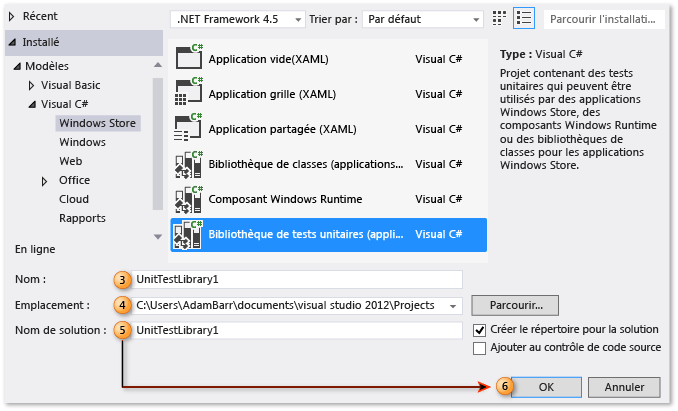
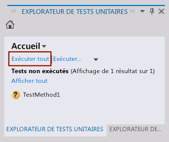
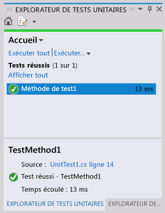

# Procédure pas à pas : création et exécution de tests unitaires pour les applications Windows Store
Visual Studio inclut la prise en charge des tests unitaires des applications [!INCLUDE[win8_appname_long](../debugger/includes/win8_appname_long_md.md)] gérées et comprend des modèles de bibliothèque de tests unitaires pour Visual C#, Visual Basic et Visual C++.  
  
> [!TIP]
>  Pour plus d’informations sur le développement d’applications [!INCLUDE[win8_appname_long](../debugger/includes/win8_appname_long_md.md)] , consultez [Prise en main des applications du Windows Store](http://go.microsoft.com/fwlink/?LinkID=241410).  
  
 Visual Studio fournit les fonctionnalités de test unitaire suivantes :  
  
-   [Créer des projets de test unitaire](#CreateAndRunUnitTestWin8Tailored_Create)  
  
-   [Modifier le manifeste du projet de test unitaire](#CreateAndRunUnitTestWin8Tailored_Manifest)  
  
-   [Coder le test unitaire](#CreateAndRunUnitTestWin8Tailored_Code)  
  
-   [Exécuter des tests unitaires](#CreateAndRunUnitTestWin8Tailored_Run)  
  
 Les procédures suivantes décrivent les étapes pour créer, exécuter et déboguer des tests unitaires pour l'application [!INCLUDE[win8_appname_long](../debugger/includes/win8_appname_long_md.md)] pour Windows 8.  
  
## Conditions préalables  
 Visual Studio  
  
##   Créer des projets de test unitaire  
  
#### Pour créer un projet de test unitaire pour une application Windows Store  
  
1.  Dans le menu **Fichier** , choisissez **Nouveau projet**.  
  
     La boîte de dialogue Nouveau projet s'affiche.  
  
2.  Sous Modèles, sélectionnez le langage de programmation dans lequel vous souhaitez créer le test unitaire, puis choisissez la bibliothèque de tests unitaires [!INCLUDE[win8_appname_long](../debugger/includes/win8_appname_long_md.md)] associée. Par exemple, choisissez **Visual C#** , **Windows Store**, puis **Bibliothèque de tests unitaires (applications Windows Store)**.  
  
    > [!NOTE]
    >  Visual Studio inclut des modèles de bibliothèque de tests unitaires pour Visual C#, Visual Basic et Visual C++.  
  
3.  (Facultatif) Dans la zone de texte **Nom** , entrez le nom à utiliser pour le projet de test unitaire [!INCLUDE[win8_appname_long](../debugger/includes/win8_appname_long_md.md)].  
  
4.  (Facultatif) Modifiez le chemin d'accès où vous souhaitez créer le projet en le saisissant dans la zone de texte **Emplacement** , ou en choisissant le bouton **Parcourir** .  
  
5.  (Facultatif) Dans la zone de texte **Nom de la solution** , entrez le nom à utiliser pour votre solution.  
  
6.  Laissez l'option **Créer le répertoire pour la solution** sélectionnée et choisissez le bouton **OK** .  
  
       
  
     L'Explorateur de solutions est rempli avec votre projet de test unitaire [!INCLUDE[win8_appname_long](../debugger/includes/win8_appname_long_md.md)] et l'éditeur de code affiche le test unitaire par défaut intitulé UnitTest1.  
  
       
  
##   Modifier le manifeste du projet de test unitaire  
 Il peut être nécessaire de modifier le manifeste pour que le projet de test unitaire fournisse les fonctionnalités requises pour exécuter l'application.  
  
#### Pour modifier le fichier manifeste de l’application Windows Store du projet de test unitaire  
  
1.  Dans l'Explorateur de solutions, dans le projet de test unitaire [!INCLUDE[win8_appname_long](../debugger/includes/win8_appname_long_md.md)] , cliquez avec le bouton droit sur le fichier Package.appxmanifest et choisissez **Ouvrir**.  
  
     Le concepteur de manifeste s'affiche pour la modification.  
  
2.  Dans le concepteur de manifeste, choisissez l'onglet **Fonctionnalités** .  
  
3.  Dans la liste sous **Fonctionnalités**, sélectionnez les fonctionnalités dont vous avez besoin pour votre test unitaire et le code qu'il teste. Par exemple, activez la case à cocher **Internet** si le test unitaire est requis et que le code qu'il teste a besoin d'accéder à internet.  
  
    > [!NOTE]
    >  Les fonctionnalités que vous sélectionnez doivent inclure uniquement les fonctionnalités nécessaires pour que le test unitaire [!INCLUDE[win8_appname_long](../debugger/includes/win8_appname_long_md.md)] fonctionne correctement. Les fonctionnalités ne doivent jamais inclure de fonctions qui ne font pas partie de l'application [!INCLUDE[win8_appname_long](../debugger/includes/win8_appname_long_md.md)] testée et doivent en général être un sous-ensemble des fonctionnalités spécifiées pour l'application [!INCLUDE[win8_appname_long](../debugger/includes/win8_appname_long_md.md)] testée.  
  
     Pour plus d’informations sur le concepteur de manifeste, consultez [Configurer un package d’application Windows 8.1 à l’aide du concepteur de manifeste](http://msdn.microsoft.com/Library/24c58b7f-9c6d-41c3-b385-c1e8497d5b2d).  
  
       
  
##   Coder le test unitaire  
  
#### Pour coder le test unitaire pour une application Windows Store  
  
1.  Dans l'Éditeur de code, modifiez le test unitaire et ajoutez les assertions et la logique requises pour votre test.  
  
     Pour plus d’informations, consultez [Utilisation des classes Assert](http://go.microsoft.com/fwlink/?LinkID=224991) dans MSDN Library.  
  
##   Exécuter des tests unitaires  
  
#### Pour générer la solution et exécuter le test unitaire à l'aide de l'Explorateur de tests  
  
1.  Dans le menu **Test** , choisissez **Fenêtres**, puis **Explorateur de tests**.  
  
     L'Explorateur de tests s'affiche et votre test ne figure pas dans la liste.  
  
2.  Dans le menu **Générer** , cliquez sur **Générer la solution**.  
  
     Votre test unitaire figure maintenant dans la liste.  
  
    > [!NOTE]
    >  Vous devez générer la solution pour mettre à jour la liste des tests unitaires dans l'Explorateur de tests.  
  
    > [!WARNING]
    >  Problème connu concernant Visual Studio : vous devez ouvrir l'Explorateur de tests avant de générer le projet de test.  
  
3.  Dans l'Explorateur de tests, sélectionnez le test unitaire que vous avez créé.  
  
    > [!TIP]
    >  L'Explorateur de tests fournit un lien vers le code source en regard de **Source :**.  
  
4.  Choisissez **Exécuter tout**.  
  
       
  
    > [!TIP]
    >  Vous pouvez sélectionner un ou plusieurs tests unitaires répertoriés dans l'explorateur puis cliquer avec le bouton droit et choisir **Exécuter les tests sélectionnés**.  
    >   
    >  De plus, vous pouvez choisir **Déboguer les tests sélectionnés**, **Ouvrir un test**, puis utiliser l'option **Propriétés** .  
    >   
    >    
  
     Le test unitaire s'exécute. Une fois l’opération terminée, l’Explorateur de tests affiche l’état du test, la durée calendaire et fournit un lien vers la source.  
  
       
  
## Ressources externes  
  
### Vidéos  
 [Channel 9 : Unit testing your Windows Store apps built using XAML (Tests unitaires de vos applications du Windows Store en XAML)](http://go.microsoft.com/fwlink/?LinkId=226285)  
  
### Forums  
 [Visual Studio Unit Testing (Tests unitaires Visual Studio)](http://go.microsoft.com/fwlink/?LinkId=224477)  
  
### MSDN Library  
 [MSDN Library - Création et exécution des tests unitaires pour le code existant (Visual Studio 2010)](http://go.microsoft.com/fwlink/?LinkID=223683)  
  
## Voir aussi  
 [Test des applications du Windows Store avec Visual Studio](../test/testing-store-apps-with-visual-studio.md)   
 [Générer et tester une application du Windows Store à l’aide de Team Foundation Build](http://msdn.microsoft.com/Library/d0ca17bb-deae-4f3d-a18d-1a99bebceaa9)

