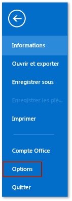
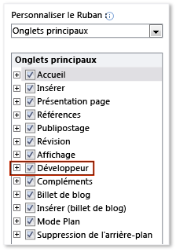

# Comment&#160;: afficher l&#39;onglet D&#233;veloppeur sur le ruban
  Pour accéder à l'onglet **Développeur** sur le ruban d'une application Office, vous devez configurer cette dernière pour afficher l'onglet, car il n'apparaît pas par défaut.  Par exemple, vous devez afficher cet onglet pour ajouter un <xref:Microsoft.Office.Tools.Word.GroupContentControl> à une personnalisation au niveau du document pour Word.  
  
> [!NOTE]  
>  Ces informations d'aide s'appliquent uniquement aux applications Office 2010 ou version ultérieure.  Pour afficher cet onglet dans Microsoft Office System 2007, consultez la version suivante de cette rubrique : [Comment : afficher l'onglet Développeur sur le ruban](http://msdn.microsoft.com/library/bb608625(v=vs.90).aspx).  
  
 [!INCLUDE[appliesto_ribbon](../vsto/includes/appliesto-ribbon-md.md)]  
  
> [!NOTE]  
>  Access n'a pas d'onglet **Développeur**.  
  
### Pour afficher l'onglet Développeur  
  
1.  Démarrez l'une des applications Office prises en charge dans cette rubrique.  Reportez\-vous à la remarque **S'applique à :**, précédemment dans cette rubrique.  
  
2.  Sous l'onglet **Fichier**, choisissez le bouton **Options**.  
  
     L'illustration suivante montre l'onglet **Fichier** et le bouton **Options** dans Office 2010.  
  
       
  
     L'illustration suivante montre l'onglet **Fichier** dans Office 2013.  
  
       
  
     L'illustration suivante montre le bouton **Options** dans Office 2013.  
  
       
  
3.  Dans la boîte de dialogue **Options** *Nom\_application*, choisissez le bouton **Personnaliser le Ruban**.  
  
     L'illustration suivante montre la boîte de dialogue **Options** et le bouton **Personnaliser le Ruban** dans Excel 2010.  L'emplacement de ce bouton est similaire dans toutes les autres applications répertoriées dans la section « S'applique à » au début de cette rubrique.  
  
       
  
4.  Dans la liste des onglets principaux, cochez la case **Développeur**.  
  
     L'illustration suivante montre la case à cocher **Développeur** dans Word 2010 et [!INCLUDE[Word_15_short](../vsto/includes/word-15-short-md.md)].  L'emplacement de cette case à cocher est similaire dans toutes les autres applications répertoriées dans la section « S'applique à » au début de cette rubrique.  
  
       
  
5.  Choisissez le bouton **OK** pour fermer la boîte de dialogue **Options**.  
  
## Voir aussi  
 [Personnalisation de l'interface utilisateur Office](../vsto/office-ui-customization.md)  
  
  