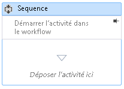

# Proc&#233;dure&#160;: ajouter des commentaires &#224; un workflow dans le Concepteur de flux de travail
Pour faciliter la création de workflows de plus grande taille et plus complexes, [!INCLUDE[net_v45](../ide/includes/net_v45_md.md)] permet au développeur d'ajouter des annotations aux types suivants d'élément dans le concepteur :  
  
-   <xref:System.Activities.Activity>  
  
-   <xref:System.Activities.Statements.State>  
  
-   <xref:System.Activities.Statements.Transition>  
  
-   Classes dérivées de <xref:System.Activities.Statements.FlowNode>.  
  
-   <xref:System.Activities.Variable>  
  
-   <xref:System.Activities.Argument>  
  
> [!IMPORTANT]
>  Le contenu d'une annotation est stocké sous forme de texte brut dans le fichier XAML associé au workflow, et peut être par d'autres utilisateurs.Évitez d'entrer des informations sensibles dans une annotation.  
  
### Ajouter une annotation à une activité dans le concepteur  
  
1.  Dans le concepteur de workflow, cliquez avec le bouton droit sur un élément et sélectionnez **Annotations**, **Ajouter une annotation**.  
  
2.  Ajoutez le texte de l'annotation dans l'espace disponible.  
  
3.  L'élément affiche une icône d'annotation.Lorsque vous placez le pointeur sur l'icône d'annotation, le texte de l'annotation s'affiche.  
  
       
  
### Afficher une annotation dans le concepteur d'une activité  
  
1.  Avec un concepteur d'activités qui a une annotation affichée en dehors de l'activité, cliquez sur l'icône **Épingler** dans l'ornement d'annotation.  
  
2.  L'annotation est affichée dans le concepteur de l'activité.Dans la capture d'écran ci\-dessous, l'annotation « Démarrage de l'activité dans le workflow » s'affiche dans le concepteur de l'activité.  
  
       
  
3.  Pour afficher l'annotation en dehors du générateur de l'activité, pointez sur la zone d'annotation dans le concepteur de l'activité et cliquez sur l'icône **Supprimer**  
  
       
  
### Affichage ou masquage de toutes les annotations  
  
1.  Cliquez avec le bouton droit sur une activité qui a une annotation.Sélectionnez **Annotations**, **Afficher toutes les annotations**.  
  
2.  Toutes les annotations sont affichées dans les concepteurs de l'activité.  
  
3.  Pour afficher toutes les annotations en dehors des concepteurs de l'activité, cliquez avec le bouton droit sur l'activité et sélectionnez **Annotations**, **Masquer toutes les annotations**.  
  
### Modification ou suppression d'une annotation pour une activité  
  
1.  Cliquez avec le bouton droit sur une activité qui a une annotation.  
  
2.  Sélectionnez **Annotations**, **Modifier une annotation** ou **Supprimer l'annotation**.  
  
3.  L'annotation est ouverte pour modification ou supprimée.  
  
4.  Pour supprimer toutes les annotations immédiatement, cliquez avec le bouton droit sur le concepteur de workflow et sélectionnez **Annotation**, **Supprimer toutes les annotations**.  
  
### Ajout, modification et suppression d'une annotation pour une variable ou un argument  
  
1.  Cliquez avec le bouton droit sur une variable ou un argument et sélectionnez Ajouter une annotation.  
  
2.  Entrez le texte de l'annotation.La variable ou l'argument affiche une icône d'annotation.  
  
3.  Cliquez avec le bouton droit sur une variable ou un argument qui a une annotation.Sélectionnez Modifier une annotation.  
  
4.  L'annotation est ouverte pour modification.  
  
5.  Cliquez avec le bouton droit sur une variable ou un argument qui a une annotation.Sélectionnez Supprimer l'annotation.  
  
6.  L'annotation sera supprimée.