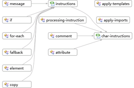

# Proc&#233;dure&#160;: obtenir une vue d&#39;ensemble d&#39;un jeu de sch&#233;mas &#224; l&#39;aide de la vue du graphique
[!INCLUDE[vs2017banner](../code-quality/includes/vs2017banner.md)]

Cette rubrique décrit comment utiliser la [vue du graphique](../xml-tools/graph-view.md) pour afficher une vue de haut niveau des nœuds dans un jeu de schémas et les relations entre les nœuds.  
  
### Pour créer un fichier XSD et afficher l'élément racine dans la vue de modèle de contenu  
  
1.  Créez un fichier de schéma XML et enregistrez le fichier sous Relationships.xsd.  
  
2.  Cliquez sur le lien **Utiliser l'Éditeur XML pour afficher et modifier le fichier de schéma XML sous\-jacent** dans la vue de départ.  
  
3.  Copiez le code de l'exemple de schéma XML à partir de [Exemple de schéma XML : relations](../Topic/Sample%20XSD%20File:%20Relationships.md), puis collez\-le pour remplacer le code qui a été ajouté par défaut au nouveau fichier XSD.  
  
4.  Cliquez avec le bouton droit n'importe où dans l'Éditeur XML et sélectionnez **Concepteur de vues**.  
  
5.  Sélectionnez la vue du graphique dans la barre d'outils XSD.  
  
6.  Sélectionnez le nœud **Jeu de schémas** dans l'Explorateur de schémas XML, puis faites glisser le nœud sur l'aire de conception de la vue du graphique.Tous les nœuds globaux doivent apparaître, ainsi que les flèches connectant les nœuds qui ont des relations.  
  
       
  
7.  Cliquez sur n'importe quel nœud sur l'aire de conception, puis examinez la barre de fil d'Ariane \(breadcrumb\) pour déterminer l'emplacement du nœud sélectionné dans le jeu de schémas.  
  
8.  Cliquez avec le bouton droit sur n'importe quel nœud d'élément sur l'aire de conception, puis sélectionnez **Générer un exemple de code XML** pour consulter le document de l'instance XML.