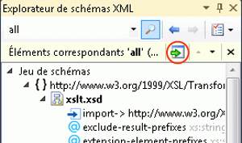

# Recherche dans le jeu de sch&#233;mas
[!INCLUDE[vs2017banner](../code-quality/includes/vs2017banner.md)]

L'Explorateur de schémas XML vous permet d'effectuer les recherches suivantes dans le jeu de schémas :  
  
-   Recherche par mot clé  
  
-   Recherche spécifique au schéma  
  
## Recherche par mot clé  
 Vous effectuez des recherches par mot clé en entrant une sous\-chaîne dans la zone de texte **Rechercher le jeu de schémas** de la barre d'outils Explorateur de schémas XML.  
  
   
  
 L'Explorateur de schémas XML recherche les éléments suivants dans le jeu de schémas :  
  
-   Tout attribut `name` ou `ref` qui correspond au mot clé spécifié.Vous pouvez ainsi rechercher des éléments, des attributs, des types, etc. par nom.  
  
-   Attributs `schemaLocation` d'instructions d'inclusion.  
  
-   Attributs `namespace` d'instructions d'importation.  
  
## Recherche spécifique au schéma  
 Vous pouvez également accéder aux recherches prédéfinies de l'Explorateur de schémas XML via son menu contextuel.Pour plus d'informations sur les menus contextuels disponibles, consultez [Menus contextuels](../xml-tools/context-menus-xml-schema-explorer.md).Vous pouvez également effectuer une recherche spécifique au schéma à partir de la vue de départ ; pour plus d'informations, consultez la section « Détails du jeu de schémas » dans la rubrique [vue de départ](../xml-tools/start-view.md).  
  
## Affichage et navigation des résultats de la recherche  
 Une fois la recherche terminée, le volet de synthèse des résultats est ajouté à la barre d'outils avec les résultats de la recherche.Les résultats de la recherche sont aussi mis en surbrillance dans l'Explorateur de schémas XML et sont marqués par des graduations dans la barre de défilement verticale.Vous pouvez naviguer parmi les résultats de la recherche en utilisant les boutons **Aller au résultat de la recherche suivant** et **Aller au résultat de la recherche précédent** du volet de synthèse des résultats de la barre d'outils de l'Explorateur de schémas XML, en utilisant les touches du clavier F3 et Maj\+F3 ou en cliquant sur les graduations de la barre de défilement.  
  
 Vous pouvez ajouter les résultats de la recherche à l'espace de travail en cliquant sur le bouton **Ajouter les nœuds en surbrillance à l'espace de travail** dans le volet de synthèse des résultats.  
  
   
  
## Effacement des résultats de la recherche  
 Pour effacer les résultats de la recherche, cliquez sur le bouton **x** dans le volet de synthèse des résultats de la barre d'outils de recherche de l'Explorateur de schémas XML.  
  
## Voir aussi  
 [Explorateur de schémas XML](../xml-tools/xml-schema-explorer.md)