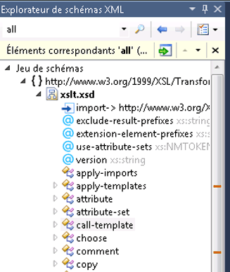

# Explorateur de sch&#233;mas XML
[!INCLUDE[vs2017banner](../code-quality/includes/vs2017banner.md)]

L'Explorateur de schémas XML est intégré à Microsoft Visual Studio et l'Éditeur XML pour vous permettre d'utiliser les schémas en langage XSD \(XML Schema Definition\).Lorsque vous ouvrez un fichier de schéma XML, le nœud **Jeu de schémas** s'affiche dans l'Explorateur de schémas XML.Tous les schémas inclus, importés ou redéfinis pour votre fichier cible, ainsi que tous les fichiers référencés via une instruction `include` ou `import`, s'affichent également dans l'Explorateur de schémas XML.  
  
 L'Explorateur de schémas XML vous permet d'effectuer les opérations suivantes :  
  
-   Obtenir une vue d'ensemble rapide du jeu de schémas.  
  
-   Parcourir et naviguer l'arborescence.  
  
-   Effectuer des recherches par mot clé et spécifiques au schéma.Pour plus d'informations, consultez [Recherche dans le jeu de schémas](../xml-tools/searching-the-schema-set.md).  
  
-   Ajouter les résultats de la recherche à la vue du graphique ou du modèle de contenu.  
  
-   Trier l'arborescence par ordre des documents, par type ou par nom.Pour plus d'informations, consultez [Tri, filtrage et regroupement](../xml-tools/sorting-filtering-and-grouping-xml-schema-explorer.md).  
  
-   Ouvrir l'éditeur XML et accéder aux emplacements de code dans le fichier XSD.Pour plus d'informations, consultez [Intégration à l'Éditeur XML](../xml-tools/integration-with-xml-editor.md).  
  
-   Générer un exemple de code XML pour les éléments globaux.  
  
 L'Explorateur de schémas XML fournit une vue hiérarchique du jeu de schémas à travers une arborescence.L'Explorateur de schémas XML fournit également des fonctionnalités de recherche, de filtrage, de navigation et de tri.Pour accéder à l'Explorateur de schémas XML, effectuez l'une des opérations suivantes :  
  
-   Si vous êtes dans la [vue de départ](../xml-tools/start-view.md), cliquez sur le lien **Explorateur de schémas XML**.  
  
-   Si vous êtes dans la [vue du graphique](../xml-tools/graph-view.md) ou la [vue de modèle de contenu](../xml-tools/content-model-view.md) et que votre espace de travail comprend des nœuds, utilisez le menu contextuel pour sélectionner l'Explorateur de schémas XML.  
  
-   Vous pouvez également sélectionner l'Explorateur de schémas XML dans le menu **Affichage**.  
  
-   Vous pouvez accéder à l'Explorateur de schémas XMLà partir d'un fichier .vb contenant un littéral XML Visual Basic associé à un fichier .xsd.Pour afficher le jeu de schémas dans l'Explorateur de schémas XML, cliquez avec le bouton droit sur un nœud XML dans un littéral XML ou une importation d'espace de noms XML, puis sélectionnez la commande **Afficher dans l'Explorateur de schémas XML**.Pour plus d'informations, consultez [Intégration de littéraux XML à l'Explorateur de schémas XML](../xml-tools/integration-of-xml-literals-with-xml-schema-explorer.md).  
  
## arborescence  
 L'Explorateur de schémas XML affiche des informations sur le jeu de schémas précompilés dans une arborescence.L'arborescence est organisée comme suit :  
  
-   Au niveau supérieur se trouve le nœud de jeu de schémas.  
  
-   Le deuxième niveau contient les espaces de noms.  
  
-   Le troisième niveau contient les fichiers.  
  
-   Le quatrième niveau contient les nœuds globaux.Ceci peut inclure les éléments, les groupes, les types complexes, les types simples, les attributs, les groupes d'attributs, et les instructions `include`, `import` et `redefine`.  
  
 Voici un exemple d'arborescence :  
  
   
  
## Sélection et activation  
 Pour mettre en surbrillance et sélectionner un nœud, cliquez une fois dans l'Explorateur de schémas.  
  
 Pour activer un nœud, double\-cliquez dessus ou appuyez sur **Entrée** lorsque le nœud est sélectionné.  
  
-   L'activation d'un nœud ouvre le fichier dans lequel ce nœud est défini \(si le fichier n'est pas déjà ouvert\) et sélectionne le nœud dans le fichier.  
  
-   L'activation d'un nœud de fichier ouvre le fichier sélectionné \(s'il n'est pas déjà ouvert\) et met en surbrillance le nœud `<schema>`.  
  
-   L'activation d'un jeu de schémas ou d'un nœud d'espace de noms n'aboutit à rien.  
  
## Déplacement de nœuds par glisser\-déplacer  
 Vous pouvez déplacer des nœuds, des nœuds de fichier et des nœuds d'espace de noms par glisser\-déplacer dans une vue du concepteur XSD.Si la vue actuelle est la [vue de départ](../xml-tools/start-view.md), le fait de faire glisser un nœud sur la vue ouvre la [vue du graphique](../xml-tools/graph-view.md).Si la vue actuelle est la [vue de modèle de contenu](../xml-tools/content-model-view.md) ou la vue du graphique, la vue ne change pas lorsque vous déplacez un nœud sur celle\-ci.  
  
 Le déplacement de fichiers sur la vue ajoute tous les nœuds globaux dans le fichier à l'[espace de travail du concepteur XSD](../xml-tools/xml-schema-designer-workspace.md).Le déplacement d'espaces de noms sur la vue ajoute tous les nœuds globaux dans l'espace de noms à l'espace de travail.L'espace de travail est partagé entre toutes les vues.  
  
 Vous ne pouvez pas faire glisser\-déplacer des importations ou des nœuds locaux.  
  
## Dans cette section  
  
-   [Recherche dans le jeu de schémas](../xml-tools/searching-the-schema-set.md)  
  
-   [Tri, filtrage et regroupement](../xml-tools/sorting-filtering-and-grouping-xml-schema-explorer.md)  
  
-   [Menus contextuels](../xml-tools/context-menus-xml-schema-explorer.md)  
  
-   [Intégration de littéraux XML à l'Explorateur de schémas XML](../xml-tools/integration-of-xml-literals-with-xml-schema-explorer.md)  
  
## Voir aussi  
 [Procédure : ajouter des nœuds à l'espace de travail à partir de l'Explorateur de schémas XML](../Topic/How%20to:%20Add%20Nodes%20to%20the%20Workspace%20from%20the%20XML%20Schema%20Explorer.md)